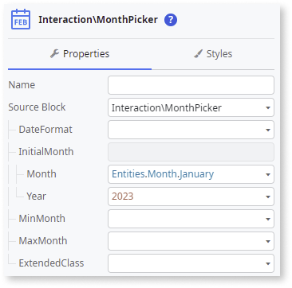

# Month Picker

You can use the Month Picker UI Pattern to allow users input a month of the year. The Month Picker Pattern is based on the [flatpickr library](https://flatpickr.js.org/) For more advanced options, you can refer to this library.

## How to use the Month Picker UI Pattern

1. In ODC Studio, in the Toolbox, search for `Month Picker`.
    
    The Month Picker widget is displayed.

    

1. From the Toolbox, drag the Month Picker widget into the Main Content area of your application's screen.

    

    By default, the Month Picker contains an **Input** widget (type Text).

1. Create a local variable by selecting the Input widget, and, on the **Properties** tab, select **New Local Variable** from the **Variable** dropdown.

    This variable stores any value entered into or received by the input widget.

    

1. Enter a name for the variable (in this example **MonthVar**) and select **Text** as the **Data Type**.

    

1. Right-click your main screen and add another local variable.

    This variable stores the month selected by the user.

    

1. Enter a name for the variable (in this example **MonthPicked**) and select **MonthYear** as the **Data Type**.

    

1. To create an **OnSelect** event for the Month Picker, select the Month Picker widget, and on the **Properties** tab, from the **Handler** dropdown, select **New Client Action**.

    

1. To access the month selected by the user, create an **Assign** and set the **MonthPicked** to **SelectedMonth**.

    

1. You can configure the Month Picker by selecting the pattern, and on the **Properties** tab, set the relevant (optional) properties.

    

After following these steps and publishing the app, you can test the pattern in your app.

## Properties

| Property  | Description  | 
|---|---|
|  DateFormat (Text): Optional | Set the input date format. If empty, the date is the same as the server format. | 
|  InitialMonth (MonthYear): Optional | The initial selected month and year for the Month Picker. If not set, no initial month is selected. | 
| MinMonth (MonthYear): Optional  |  Set the minimum month that can be selected. Any month before this is disabled and cannot be selected. | 
| MaxMonth (MonthYear): Optional  | Set the maximum month that can be selected. Any month after this is disabled and cannot be selected.  | 
| ExtendedClass (Text): Optional  | Adds custom style classes to the Pattern. You define your custom style classes in your application using CSS. 
Examples <ul><li>Blank - No custom styles are added (default value).</li><li>"myclass" - Adds the ``myclass`` style to the UI styles being applied.</li><li>"myclass1 myclass2" - Adds the ``myclass1`` and ``myclass2`` styles to the UI styles being applied.</li></ul>
You can also use the classes available on the OutSystems UI. |

