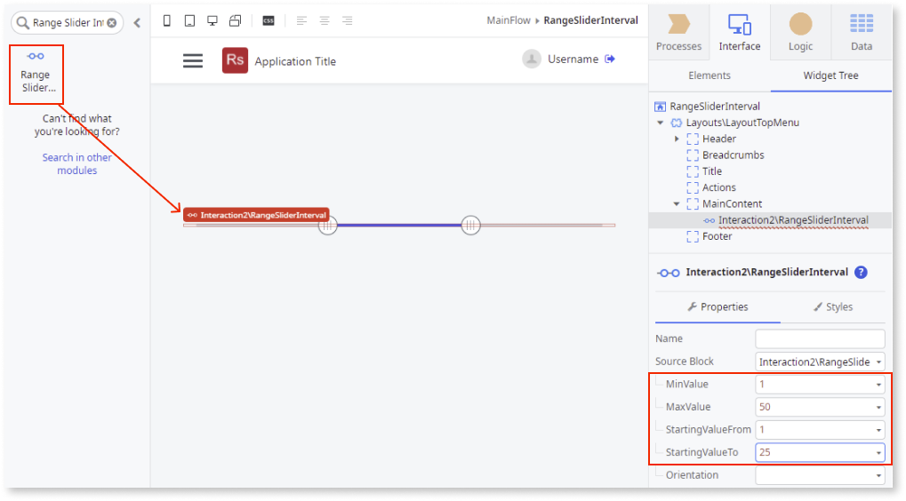
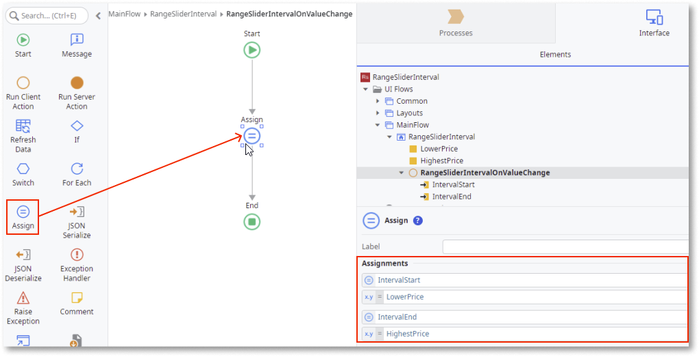

---
tags:
summary: Explore the Range Slider Interval Pattern in OutSystems Developer Cloud (ODC) for selecting values within a defined range using the noUiSlider library.
locale: en-us
guid: aa015998-a6e2-48bb-a0cc-2c53b4df2832
app_type: mobile apps, reactive web apps
figma: https://www.figma.com/file/6G4tyYswfWPn5uJPDlBpvp/Building-apps?type=design&node-id=3203%3A16886&t=ZwHw8hXeFhwYsO5V-1
platform-version: odc
---
# Range Slider Interval

You can use the Range Slider Interval Pattern to allow users select a single value between two range values. This pattern enables the adjustment of content by predetermined intervals and within a chosen range. Moving the slider along the track increases or decreases the value.

 
The Range Slider Interval Pattern is based on the [noUiSlider library](https://refreshless.com/nouislider/) (v15.5.1). For more information about the Range Slider Interval’s behaviors and extensibility methods, see the provider’s documentation.  
 

## How to use the Range Slider Interval UI Pattern

In this example, we create a Range Slider Interval that allows the user to select a price range between 1-50.

1. In ODC Studio, in the Toolbox, search for `Range Slider Interval`.

    The Range Slider Interval widget is displayed.

    

1. From the Toolbox, drag the **Range Slider Interval** widget into the Main Content area of your application's screen, and on the **Properties** tab, enter the **MinValue**, **MaxValue**, **StartingValueFrom**, and **StartingValueTo** values. 

    In this example, we add static values.

    

1. To create a new client action, from the **OnValueChange** drop-down, select **New Client Action**.

    

    By default, the **IntervalStart** and **IntervalEnd** input parameters are created.

    

1. From the Toolbox, drag the **Container** widget into the Main Content area of your application's screen, and add your content to the Container placeholder. 

    In this example, we add some text and an expression for each of the input parameters.

    

1. To create a variable for each of the expressions, right-click your screen name, select **Add Local Variable**, and on the **Properties** tab, enter a name and data type. In this example we create the **LowerPrice** and **HighestPrice** variables with the **Currency** data type.

    

1. To bind the **IntervalStart** variable to the expression, double-click the expression widget, and in the **Expression Value** editor, select the variable you just have created, and click **Close**.

    

1. Repeat step 6 for the **IntervalEnd** input parameter.

1. So that the parameters read the range slider selections, double-click your client action, and from the Toolbox, add the **Assign** action to the client action and set the variable and value assignments.

    

1. You can configure the  Range Slider Interval by selecting the pattern, and on the **Properties** tab, set the relevant (optional) properties, for example, the orientation. For more configurations, expand the **OptionalConfigs** property.   

    

After following these steps and publishing the app, you can test the pattern in your app.

## Properties

| Property                                              | Description                                                                                                                                                                                                                                                                                                                                                                                                                                                                                                                                                                                                                                 |
|-------------------------------------------------------|---------------------------------------------------------------------------------------------------------------------------------------------------------------------------------------------------------------------------------------------------------------------------------------------------------------------------------------------------------------------------------------------------------------------------------------------------------------------------------------------------------------------------------------------------------------------------------------------------------------------------------------------|
| MinValue (Decimal): Mandatory                         | Slider's minimum value.  Examples: <ul><li>0 - The slider's minimum value is 0.</li><li>12 - The slider's minimum value is 12</li></ul>                                                                                                                                                                                                                                                                                                                                                                                                                                                                                                 |
| MaxValue (Decimal): Mandatory                         | Slider's maximum value.  Examples: <ul><li>100 - The slider's maximum value is 100.</li></ul>                                                                                                                                                                                                                                                                                                                                                                                                                                                                                                                                           |
| StartingValueFrom (Decimal): Mandatory                | Slider's default start value. Must be between min and max values.  Examples: <ul><li>10 - Slider's default start value when the page is rendered is 10.</li></ul>                                                                                                                                                                                                                                                                                                                                                                                                                                                                       |
| StartingValueTo (Decimal): Mandatory                  | Slider's default end value. Must be between min and max values.  Examples: <ul><li>10 - Slider's default end value when the page is rendered is 10.</li></ul>                                                                                                                                                                                                                                                                                                                                                                                                                                                                           |
| Orientation (Orientation Identifier): Optional        | Set the direction of the Range Slider Interval. Default value is horizontal.                                                                                                                                                                                                                                                                                                                                                                                                                                                                                                                                                                |
| Size (Text): Optional                                 | Set the size of the Range Slider Interval. If the slider's orientation is horizontal, the size you set will be the width of the Range Slider Interval. Otherwise (vertical), the size you set will be the height. Accepts any kind of unit (px, %, vw). Default value is 100% .                                                                                                                                                                                                                                                                                                                                                             |
| ExtendedClass (Text): Optional                        | Adds custom style classes to the Pattern. You define your custom style classes in your application using CSS.  Examples: <ul><li>Blank - No custom styles are added (default value).</li><li>"myclass" - Adds the ``myclass`` style to the UI styles being applied.</li><li>"myclass1 myclass2" - Adds the ``myclass1`` and ``myclass2`` styles to the UI styles being applied.</li></ul> You can also use the classes available on the OutSystems UI. |
| OptionalConfigs.ShowFloatingLabel (Boolean): Optional | Set to True to add a floating label above the handler.                                                                                                                                                                                                                                                                                                                                                                                                                                                                                                                                                                                      |
| OptionalConfigs.Step (Decimal): Optional              | Slider moves in increments of steps. If the step is set to 10, the slider increases or decreases in units of 10, for example, 0 to 10, to 20, to 30, and so on.                                                                                                                                                                                                                                                                                                                                                                                                                                                                             |
| OptionalConfigs.ShowTickMarks (Boolean): Optional     | Set to True to display tick marks below the slider. Default value is False. To generate the tick marks, you must set the TickMarksInterval to True.                                                                                                                                                                                                                                                                                                                                                                                                                                     |
| OptionalConfigs.TickMarksInterval (Integer): Optional | Range interval after which a tick mark is displayed (when ShowTickMarks is set to True). For example, if TickMarksInterval = 5, a tick mark is shown for each 5 steps. The value can not be less than 0 (library restraint).                                                                                                                                                                                                                                                                                                                                                                                                                |
| OptionalConfigs.IsDisabled (Boolean): Optional        | Set as True to disable the Range Slider Interval. Default value is True.build                                                                                                                                                                                                                                                                                                                                                                                                                                                                                                                                                               |

