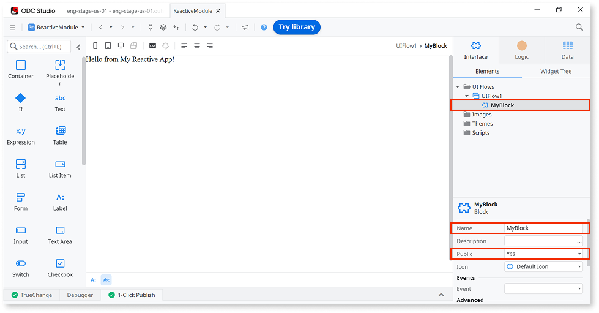
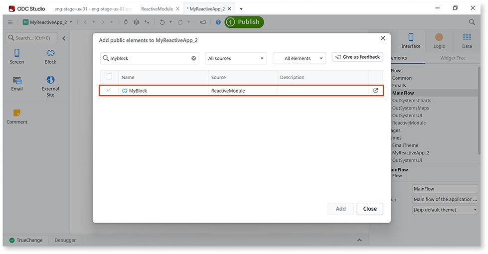
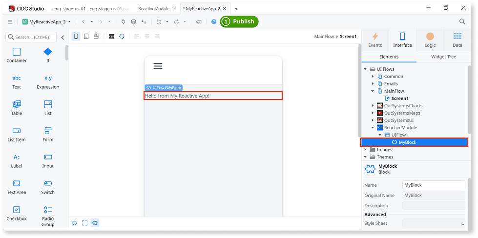

# Create and Reuse Screen Blocks

Applies to the OutSystems UI framework only.

With Blocks, you can have part of the UI in one place, so changes to the Blocks are automatically visible in all Screens that use it.

Here are notes about reusing Block across **different apps**:

* Reusable blocks can only be created by libraries.
* Blocks must be public.
* You can reuse Blocks in Web Apps and Mobile Apps.

## Using Blocks

Here is an example, with two sample apps, of how you can reuse a Block from library in a Mobile App.

**Create a public Block in a library:**

1. Create a new library.
1. In the library, go to **Interface** > **UI Flows** > right-click **Add UI Flow** > select **Add Block**. Name the Block **MyBlock**.
1. Set the **Public** property of Block to **Yes**.
1. Add some content to the Block. In our example we dragged a Text Widget and entered sample text "Hello from My Reactive App!".

    

1. Publish and [release the library](../../libraries/libraries.md#release-a-new-version-of-a-library-release-library).

**Reuse the Block in MyPhoneApp:**

1. Create a new Mobile App.
1. Add a Screen to the app.
1. Open **Manage Dependencies** (CTRL+Q) and search producers for our library. Select the library.
1. In left pane navigate to **UI Flows** > **Main Flow** > select **MyBlock**. Click **Apply** to confirm and close.

    

1. In the Mobile App, navigate to **Interface** > **MyReactiveApp** (name of our example library) > **MainFlow2** > **MyBlock**.
1. Drag MyBlock to the Screen. You should see "Hello from My Reactive App!" in the preview.

    

1. Publish the app.
