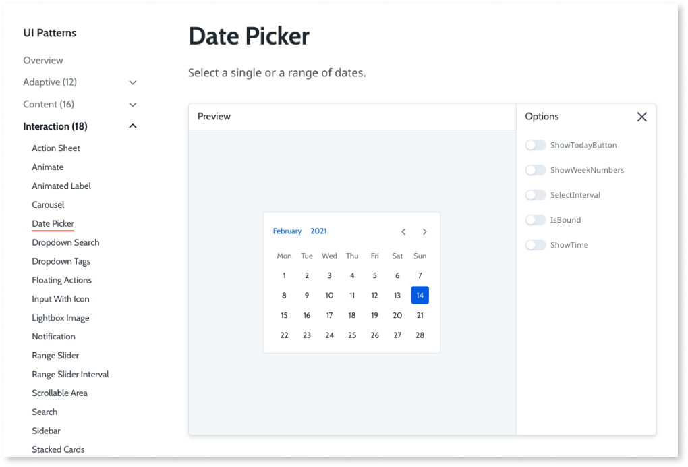

# Screens

A screen is a user interface (UI) element that contains other UI elements (such as fields or labels) that enable users to interact with your app. You can create an empty screen, or from a screen template for a specific use case.

Screen templates come with UI patterns that solve common application use cases. Screen templates help accelerate development by providing common functionalities and consistent look and feel. Screen templates include UI elements, and some include sample data that you can replace. You can immediately publish screens created from a screen template enabling you to see how the screen looks or to use it to show a proof of concept.

When you create an empty screen, you start with a basic layout to which you add data and UI elements. If you want to create a screen with a specific layout, you might want to start with a screen based on a screen template.

OutSystems provides many types of elements that you can add to your screens such as links, tables, and buttons. You can make changes to the UI and logic of the screen using pre-built UI patterns, such as Columns and Lists. UI patterns are available from the ODC (OutSystems Developer Cloud) Studio and are organized by categories such as content and interaction. You can define screen-level attributes that are specific to a screen, for example, screen name, screen title, and user roles. Most of the UI patterns come from the standard OutSystems UI component.

Here is an example of the [Date Picker](https://outsystemsui.outsystems.com/OutsystemsUiWebsite/PatternDetail?PatternId=190) pattern:

To access screen templates and the blank screen layout, go to ODC Studio, select the **Interface tab** > **UI Flows** > then right-click **MainFlow** and click **Add Screen**.

For a **Screen Template**, choose a category (such as Dashboard) and a template (such as Transactions Dashboard) from which you want to start.
For a blank screen with only a layout, select **Empty**.

You can replace sample data using one of the following methods:

* **Automatically** - to replace such things as data in forms, tables, lists, and Gallery elements.
* **Semi-Automatically** - to replace some data automatically and some data manually.
* **Manually** - to replace data by removing elements, and by modifying the data sources, and aggregates. This method gives you more control over screen logic.

## Screen composition

A screen shows to your users as a web page. This makes the screen self-contained and the top-level user interface (UI) element. You can organize parts of the UI in blocks. In the blocks, you can reserve space for content with placeholders and fill in those placeholders later with other elements.

For example, a page can consist of the main content with text, menu, and footer. In ODC Studio, the main content, menu, and footer are part of a common block. Inside of the main content there can be a placeholder for text.

Here is the overview of some UI elements.

| Element     | Location in the IDE   | Description                             | Example                                     |
| ----------- | --------------------- | --------------------------------------- | ------------------------------------------- |
| Screen      | UI flows              | Shows as a page.                        | The sign in page.                           |
| Block       | screens, placeholders | Shows as part of a page.                | The page menu.                              |
| Placeholder | blocks                | Shows content depending on the context. | Text "Welcome, guest!" or "Welcome, Billy!" |

### Block

Here are more details about blocks.

* You can create blocks in UI flows
* Use blocks to organize larger UI sections like a menu or a header
* Blocks can contain input parameters, local variables, logic, scripts, style sheets
* Reuse blocks in different screens

### Placeholder

Here are more details about placeholders.

* You can create placeholders in a block
* Use placeholders to reserve space for content
* Placeholders show in the screen only when they have some content inside
* Useful when you define a part of UI that changes depending of the context

### Built-in blocks and placeholders

ODC comes with everything you need for developing UI. You can create new blocks and add placeholders while developing your app.

ODC Studio groups the default layouts in the **Layouts** flow. A new empty screen uses the **LayoutTopMenu** block. The **LayoutTopMenu** block consists of the following placeholders:

* **Header**. Contains logic to sign in to the app 
* **Breadcrumbs**. Reserves space for you to add cues about the location in the app
* **Title**. Reserves space for you to enter the title
* **Actions**. Reserves space for a primary action, usually as a button or a link
* **MainContent**. Reserves the largest portion of the screen for the main content
* **Footer**. Reserves space for content that's usually at the bottom of a page, like copyright or an about link 

Screens you create from screen templates can have different layout blocks than what you see in an empty screen.

