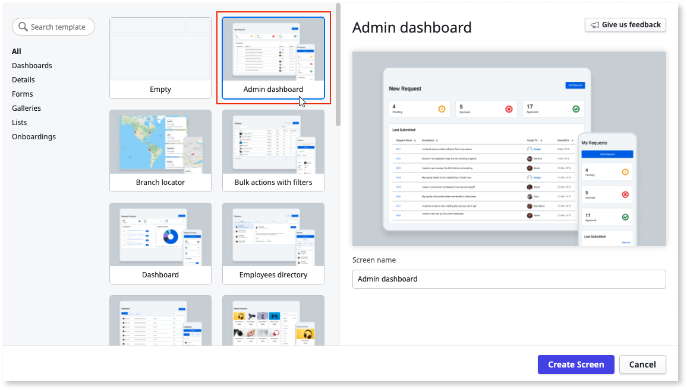

# Screen Templates

Screen Templates enable you to create [Screens](../screen-about.md) with predefined layouts, widgets, components, styles, and logic. The Screens you create from the built-in Screen Templates have sample data. Having sample data in the Screen is a good way to see how the Screen is designed and to get inspired for developing your app.

Screen Templates help you develop faster. For example, create a work order template and make it onto a Screen that shows the statuses of your project tasks. You can change the Screens by [dropping](replace-data.md) an Entity over the widget. When the Entity changes, ODC Studio updates the user interface.

ODC Studio comes with the default Screen Templates that are based on the OutSystems UI Framework. 

