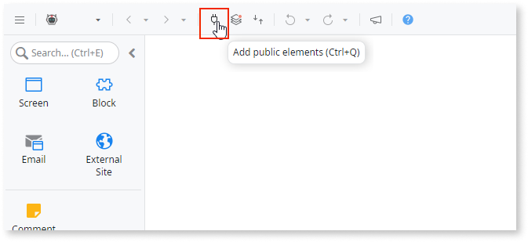
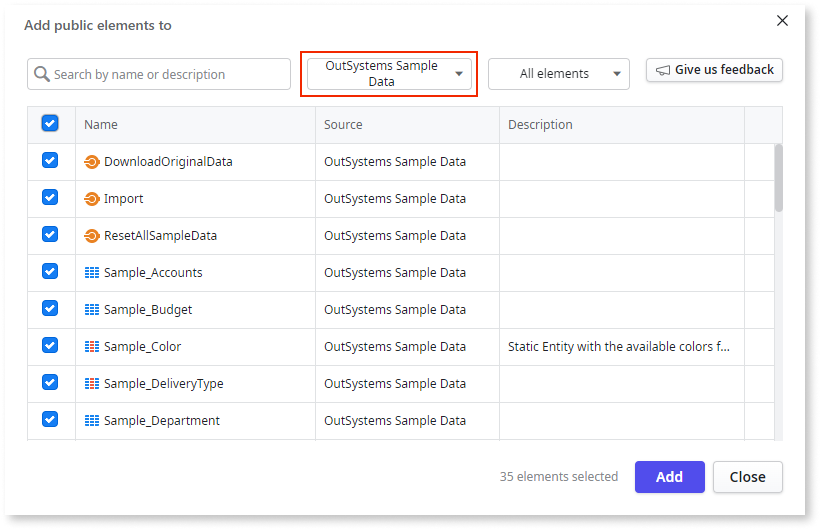
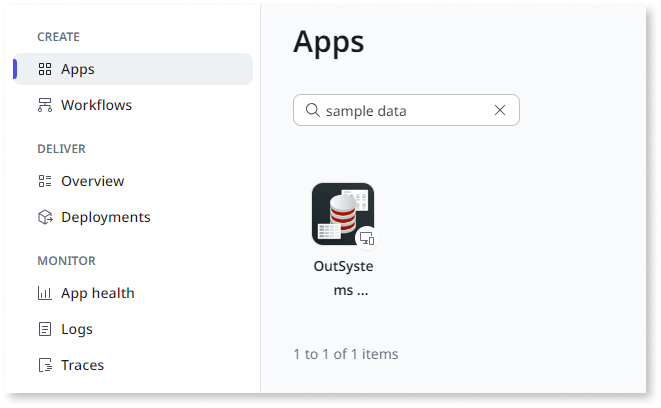
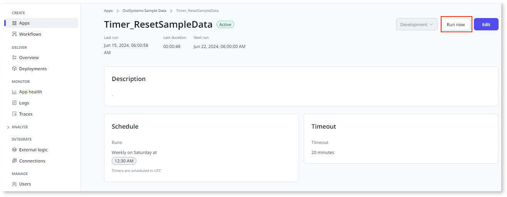
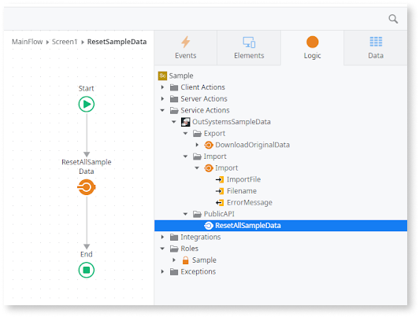

# Sample data

Sample data consists of example records from various domains. **Screen Templates** use this sample data to create screen instances, which help create a prototype, proof of concept, or to follow a tutorial that requires them.

## Referencing sample data in apps

To reference sample data, add the desired public elements from the OutSystems Sample Data app to your app, as described below:

1. Click **Add public elements** icon in the ODC Studio toolbar (or press CTRL+Q) to open the selection window.

    

1. In the selection window, click the **all sources** dropdown and search for OutSystems Sample Data.

    

1. You can select all the public elements available or just the ones you want. Then click **Add** to confirm and close the selection window.

The Entities are available in the **Data** tab, and the Actions are available in the **Logic** tab in ODC Studio.

## Managing OutSystems sample data

The OutSystems Sample Data app provides a collection of public APIs that let you export original data, import your sample data, and reset the sample data.

Sample data entities are public so you can create a custom back office.

### Import your sample data

Changing the sample data in your screen templates allows you to create entities for your business requirements.

1. Build logic for downloading original data and add it to a screen action.

1. Drag **DownloadOriginalData** Service Action into your flow to save source files in a zip archive. Add logic to download the file by including a download element at the end of the flow.

    

1. Edit the source files in the zip archive with your data.

1. Use the Import Service Action to upload the updated file and replace the current data. Add the necessary parameters to import the file.

### Reset the sample data

ODC automatically creates sample data when the app is published. However, you may need to reset it. If any app extends the provided entities, the Foreign Key constraint prevents the timer from running successfully. In this case, delete such references (records) before resetting the sample data.

1. Go to the ODC Portal and click **Apps.** Then, search for **Sample Data** and click it.

    

1. Expand the **Timers** section, and you'll see all the available timers.

1. Click on the **Timer_ResetSampleData** timer and then click **Run now**.

    

Another way to do this is programmatically, using the available API, similar to the Service Actions **DownloadOriginalData** and **Import**:

1. Create your own reset sample data logic and drag and drop the available service action into your logic flow.

    

You can also reset the following timers:

* DailyRefresh: Runs the bootstrap action to make sure sample data is available.
* Timer_BootstrapSampleData Runs when the module is published, bootstrapping the sample data for all entities.
* Timer_DeleteSampleData: Deletes data from all sample data entities.
* Timer_ResetSampleData: Resets data from all sample data entities by deleting sample data and then bootstrapping it.
