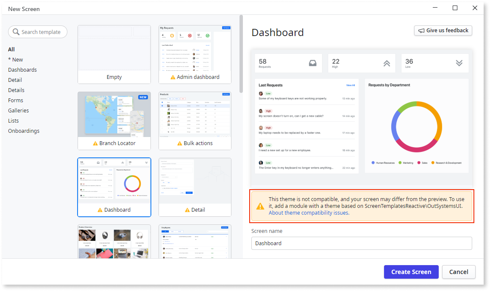

# Theme compatibility in Screen Templates

When working with Screen Templates you may see the following warning message: **The Themes are not compatible. The final Screen may look different than the preview. To use this Screen Template, you need an app with a Theme based on (app name)\(theme name).** This means that your app and Screen Template are not compatible, which may cause the final page not to display correctly.

* Select a compatible Screen Template. The Screen Templates that come with ODC Studio are compatible with the built-in Application Templates.
* [Create your Screen Templates](../creating-screens/create-screen-scratch.md) and use your (custom) Theme as the base.

If the Screen Template was compatible with your app, but now it's not:

* Revert the changes you did to the app Theme.
* Check if you set the correct Theme in the **Default Theme** property field of your app or UI Flow.

