# Create self-registration flow

For many apps it's important to have a screen that lets end-users self-register. At minimum, end-users need to provide their name and email to register.

For the app you want to create a self-registration flow in, open it in ODC Studio and complete the steps under the following sections:

1. [Create screen for users to self-register](#create-screen-for-users-to-self-register)
1. [Create logic to register a user](#create-logic-to-register-a-user)
1. [Create email to send verification code](#create-email-to-send-verification-code)
1. [Create form to validate verification code and password](#create-form-to-validate-verification-code-and-password)

Use the [provided OML](images/PatientPortal.oml) to follow along with the steps or directly copy elements. The OML is an example app with the self-registration flow implemented in full. The example app uses the branding of a fictional "Healthcare Patient Lab".

You can then take the self-registration flow you've implemented using this article and improve it. For example, if you want to use SMS to send a verification code to users check the Forge component **VonageMessaging**.

## Create screen for users to self-register

Click the **Interface** tab, then expand the **UI Flows** > **Common** folder. Now follow these steps.

1. Create a copy of the **Login** screen by copy and pasting it to the **Common** folder. There is now a copy of the screen called **Login2**.

    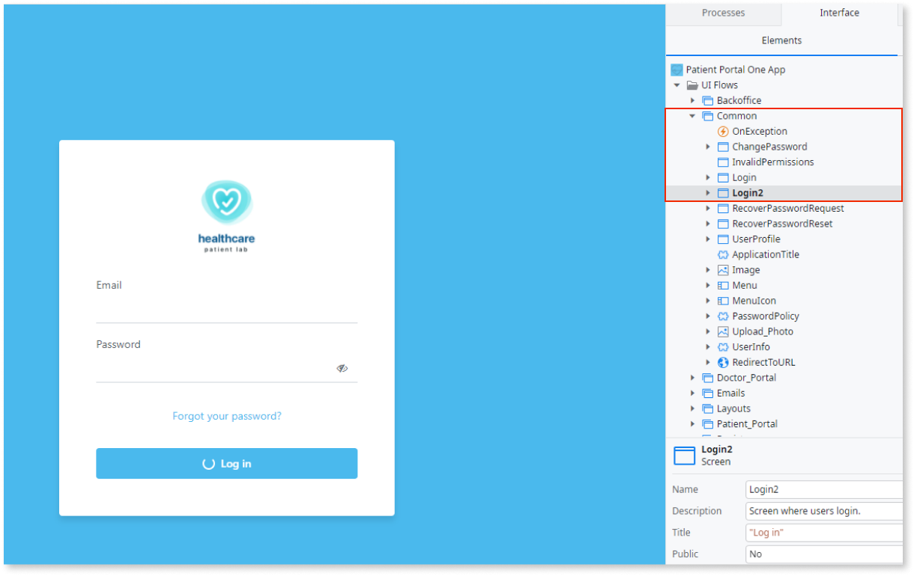

1. Click **Login2** to bring the settings into view. Change **Name** to `Signup`, **Title** to `"Signup"`, and **Description** to `Screen where users sign up`.

1. Click the **Widget Tree** tab and under **Content** > **Container** rename `"LoginForm"` to `"SignUpForm"`.

1. Copy the container with the email label and input field. Paste a copy of the container immediately above the original. Set the **Style Classes** property of the new container to `"margin-bottom-base"`.
    
    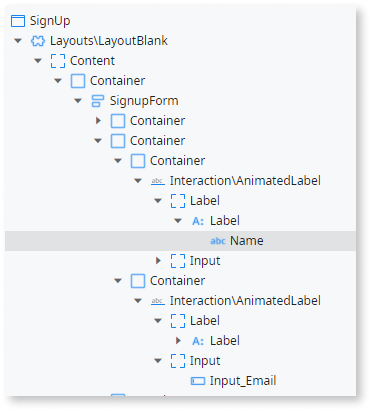

1. Set the **Name** of the Label to `Name` and the **Name** of the field in the **Input** placeholder to `Input_Name`. Under **Variable**, select **New Local Variable** in the dropdown. Set the **Name** of the new variable as `Name` the **Data Type** as `Text`.

    

1. In the widget tree for the **Signup** screen, delete the container with the password label and input field. Also delete the client action **OnTogglePasswordVisibility** and local variable **MakePasswordVisible**.

1. On the **Signup** canvas click the login button and change the text from `Log in` to `Sign-up`. Delete the **LoginOnClick** client action and **Password** local variable.

    <div class="info" markdown="1">
    The sign-up button shows an error you solve in the next section.
    </div>

1. Drag a button onto the canvas just after the **Sign-up** button. Set the **Name** `Cancel`. For the **On Click** event select **Common\Login** from the dropdown. 

1. In the **Style Classes** property, replace the class `"btn btn-primary"` with `"btn margin-top-base"` and change the value of **Is Form Default** to `No`. Under **Styles** > **Layout**, set the Width property to set `Fill`.

    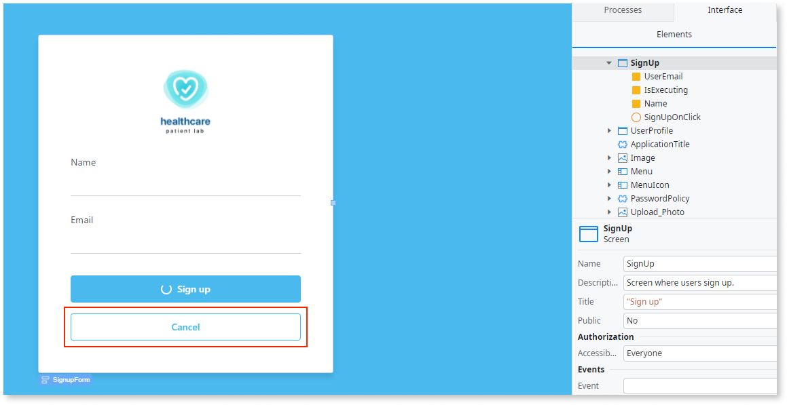

## Create logic to register a user

You now create the logic to underpin the screen you created. Load the **Signup** screen onto the main canvas. Now follow these steps.

1. Click the **Sign-up** button. For the **On Click** event select **New Client Action** from the dropdown. 

1. Drag an **Assign** widget from the toolbox to after the **SignupForm.valid** assign element in the True branch. Under the **Assignments** pane, assign a variable `IsExecuting` as `True`.

    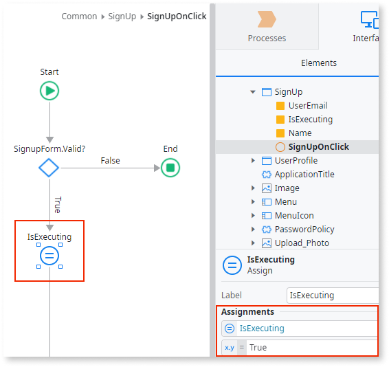

1. Drag an **Run Server Action** widget from the toolbox to after the **IsExecuting** assign element. In the **Select Action** window that displays, click the **New Server Action** button. Rename the action `DoSignup`.

1. Click the **Add public elements** icon on the top toolbar or use the **Ctrl+Q** shortcut. Search for the [**StartUserRegistration** server action](../../reference/system-actions/user.md#StartUserRegistration), select it, and click **Add**.

    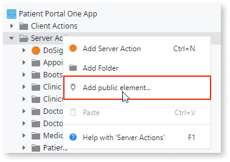

1. On the **DoSignup** canvas drag the newly added **StartUserRegistration** server action between the **Start** and **End** elements.

    

1. Right-click the **DoSignup** server action and select **Add Input Paramater**. Set **Name** as `User` and **Data Type** as `User`.

1. On the **DoSignup** canvas single-click the **StartUserRegistration** action to bring up the properties pane. Click **+** to expand the **User** input. Set **Name** as `User.Name` and **Email** as `User.Email`.

    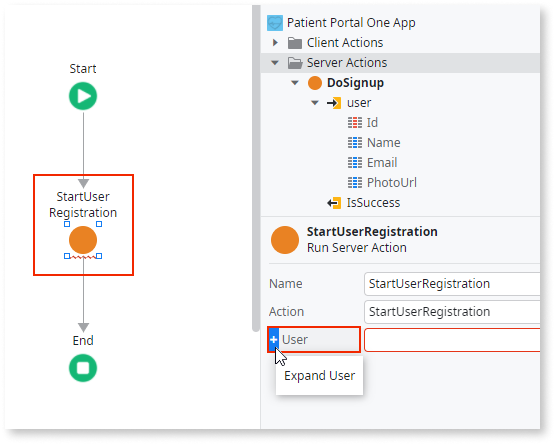

1. Right-click the **DoSignup** server action and select **Add Output Paramater**. Set **Name** as `IsSuccess` and **Data Type** as `Boolean`. Add two more output paramaters: `ErrorMessage` with data type `Text` and `VerificationCode` with data type `Text`.

    

1. On the **DoSignup** canvas drag an **Assign** element after the **StartUserRegistration** action. Under the **Assignments** pane, assign a variable `IsSuccess` as `StartUserRegistration.UserRegistrationResult.Success`. Assign a second variable `VerificationCode` as  `StartUserRegistration.UserRegistrationResult.VerificationCode`.

    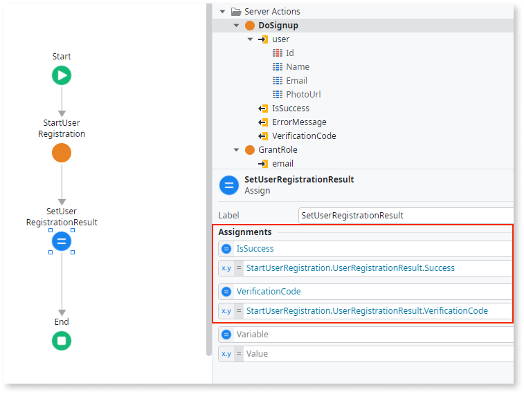

1. Drag an **If** widget from the toolbox to after the **IsSuccess** assign element. Set the **Label** as `IsInvalidEmail?` and the **Condition** as `StartUserRegistration.UserRegistrationResult.StartUserRegistrationFailureReason.InvalidEmail`
    * Drag an **Assign** element to the True branch. Under the **Assignments** pane assign a variable `ErrorMessage` as `Invalid Email`. 

1. As a second validation in the False branch drag another **If** element. Set the **Label** as `IsInvalidName?` and **Condition** as `StartUserRegistration.UserRegistrationResult.StartUserRegistrationFailureReason.InvalidName`
    * Drag an **Assign** element to the True branch. Under the **Assignments** pane assign a variable `ErrorMessage` as `Invalid Name`

1. As a third validation in the False branch drag another **If** element. Set the **Label** as `UsernameAlreadyExists?` and **Condition** as `StartUserRegistration.UserRegistrationResult.StartUserRegistrationFailureReason.UsernameAlreadyExists`
    * Drag an **Assign** element to the True branch. Under the **Assignments** pane, assign a variable `ErrorMessage` as `User already exists. Try to recover your password`.

    The validation logic of the **DoSignup** action should look like the screenshot below.

    

1. As a final validation in the False branch drag another **If** element. Set the **Label** as `IsUserRegistered?` and **Condition** as `StartUserRegistration.UserRegistrationResult.Success`
    * In the True branch, drag an **Send Email** widget. Set **Name** as `UserRegistration` and **To** as `User.Email`. In the Email setting select **New Email** option from the dropdown.

    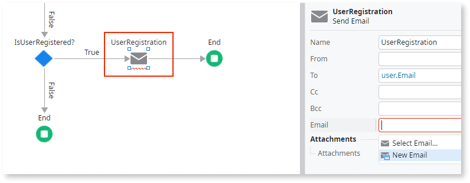

## Create email to send verification code

<div class="info" markdown="1">

Before you begin you need to have an [email provider configured](../../configuration-management/configure-emails.md).

</div>

To confirm the email of the user registering you send an email with a verification code. From the **New Email** window that displayed in the last step select the empty template. Now follow these steps.

1. In the email settings, set the **Subject** as required, for example `"Welcome to Healthcare Patient Lab"`.

1. Click the ellipsis of the **Style Sheet** setting. Copy the text below and paste it into the input box.

    ```
    /*OutSystems Email Template*/
    html{color:#202327;font-family:-apple-system,BlinkMacSystemFont,"Segoe UI",Roboto,Helvetica,Arial,sans-serif,"Apple Color Emoji","Segoe UI Emoji","Segoe UI Symbol";-moz-osx-font-smoothing:grayscale;-ms-text-size-adjust:100%;-webkit-font-smoothing:antialiased;-webkit-text-size-adjust:100%}
    body{background-color:#f1f3f5;font-size:16px;line-height:1.5;margin:0;min-height:100%;min-width:100%}
    [class*=heading],h1,h2,h3,h4,h5,h6{font-weight:600;line-height:1.25;margin:0}
    .heading1,h1{font-size:32px}.heading2,h2{font-size:28px}.heading3,h3{font-size:26px}.heading4,h4{font-size:22px}.heading5,h5{font-size:20px}.heading6,h6{font-size:12px}
    a{color:#1068eb;text-decoration:none}
    .btn{background-color:#fff;border:0;border-radius:4px;color:#1068eb;cursor:pointer;font-weight:600;margin:0;padding:8px 16px;text-align:center}.btn-primary{background-color:#1068eb;border:1px solid #1068eb;color:#fff}

    /* Utility Classes */
    .font-size-xs{font-size:12px}.font-size-s{font-size:14px}.font-light{font-weight:300}.font-regular{font-weight:400}.font-semi-bold{font-weight:600}.font-bold{font-weight:700}
    .background-primary{background-color:#1068eb}.text-primary{color:#1068eb}
    .background-neutral-0{background-color:#fff}.background-neutral-1{background-color:#f8f9fa}.background-neutral-2{background-color:#f1f3f5}.background-neutral-3{background-color:#e9ecef}.background-neutral-4{background-color:#dee2e6}.background-neutral-5{background-color:#ced4da}.background-neutral-6{background-color:#adb5bd}.background-neutral-7{background-color:#6a7178}.background-neutral-8{background-color:#4f575e}.background-neutral-9{background-color:#272b30}.background-neutral-10{background-color:#101213}
    .text-neutral-0{color:#fff}.text-neutral-1{color:#f8f9fa}.text-neutral-2{color:#f1f3f5}.text-neutral-3{color:#e9ecef}.text-neutral-4{color:#dee2e6}.text-neutral-5{color:#ced4da}.text-neutral-6{color:#adb5bd}.text-neutral-7{color:#6a7178}.text-neutral-8{color:#4f575e}.text-neutral-9{color:#272b30}.text-neutral-10{color:#101213}
    .padding-xs{padding:4px}.padding-s{padding:8px}.padding-base{padding:16px}.padding-m{padding:24px}.padding-l{padding:32px}.padding-top-xs{padding-top:4px}.padding-top-s{padding-top:8px}.padding-top-base{padding-top:16px}.padding-top-m{padding-top:24px}.padding-top-l{padding-top:32px}.padding-right-xs{padding-right:4px}.padding-right-s{padding-right:8px}.padding-right-base{padding-right:16px}.padding-right-m{padding-right:24px}.padding-right-l{padding-right:32px}.padding-bottom-xs{padding-bottom:4px}.padding-bottom-s{padding-bottom:8px}.padding-bottom-base{padding-bottom:16px}.padding-bottom-m{padding-bottom:24px}.padding-bottom-l{padding-bottom:32px}.padding-left-xs{padding-left:4px}.padding-left-s{padding-left:8px}.padding-left-base{padding-left:16px}.padding-left-m{padding-left:24px}.padding-left-l{padding-left:32px}
    .margin-xs{margin:4px}.margin-s{margin:8px}.margin-base{margin:16px}.margin-m{margin:24px}.margin-l{margin:32px}.margin-auto{margin:0 auto}.margin-top-xs{margin-top:4px}.margin-top-s{margin-top:8px}.margin-top-base{margin-top:16px}.margin-top-m{margin-top:24px}.margin-top-l{margin-top:32px}.margin-right-xs{margin-right:4px}.margin-right-s{margin-right:8px}.margin-right-base{margin-right:16px}.margin-right-m{margin-right:24px}.margin-right-l{margin-right:32px}.margin-bottom-xs{margin-bottom:4px}.margin-bottom-s{margin-bottom:8px}.margin-bottom-base{margin-bottom:16px}.margin-bottom-m{margin-bottom:24px}.margin-bottom-l{margin-bottom:32px}.margin-left-xs{margin-left:4px}.margin-left-s{margin-left:8px}.margin-left-base{margin-left:16px}.margin-left-m{margin-left:24px}.margin-left-l{margin-left:32px}
    .border-radius-soft{border-radius:4px}.border-radius-rounded{border-radius:100px}.border-radius-circle{border-radius:100%}
    .text-align-left{text-align:left}.text-align-center{text-align:center}.text-align-right{text-align:right}
    .email-max-width{max-width:650px}
    ```

    

1. Open the widget tree for **UserRegistration** email element. Right-click on the top element of the tree and click **Insert** > **Container**. Set **Style Classes** as `"email-max-width margin-auto"`.

1. Right-click the new container and click **Insert** > **Container**. Set **Style Classes** as `"background-neutral-2 padding-l"`

1. Right-click the new container and click **Insert** > **Container**. This is the email header, set the **Name** as `Header` and **Style Classes** as `"margin-bottom-m text-align-center"`.

1. Right-click the **Header** container and click **Insert** > **Container**. This is the email logo, set the **Name** as `Logo` and **Style Classes** as `"text-align-center"`. Drag an image of your company logo inside the container. Under the **Attributes** pane for the image, assign a variable `alt` as `"Company Logo Placeholder"`.

    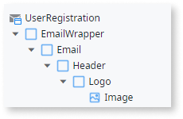 

1. Right-click the **Header** container and click **Insert** > **Container**. This is the body of the email, set the **Name** as `Content` and **Style Classes** as `"background-neutral-0 padding-l"`.

1. Right-click the **Content** container and click **Insert** > **Container**. This is the title of the email, set the **Name** property as `Title` and  **Style Classes** property as `"margin-bottom-base heading1"`. 

1. Right-click on the **Title** container and click **Insert** > **Expression**. Set the **Value** property as `"Welcome " + Name + "!"`. Switch to the **Elements** tab, right-click  **UserRegistration** and select **Add Input Paramater**. Set **Name** as `Name` and **Data Type** as `Text`.

1. Right-click the **Content** container and click **Insert** > **Container**. This is the message of the email, set the **Name** as `Message` and **Style Classes** as `"margin-bottom-base"`. Click the container in the **UserRegistration** canvas and paste in the following text.

    ```
    Thank you for joining us. We’re glad to have you on board.
    You're receiving this email because you have registered in our Patient Portal. You now have a verification code.
    This verification code is only valid for the next 15 minutes. 
    ```

1. Right-click on the **Content** container and click **Insert** > **Container**. This is the verification code of the email, set **Name** as `VerificationCode` and **Style Classes** property as `"margin-bottom-base"`. 

1. Right-click the **VerificationCode** container and click **Insert** > **Container**. Set **Style Classes** as `"background-neutral-1 padding-s heading1"`. Under **Styles** > **Layout**, set the **Width** property to `8 columns` and **Align** property to `center`.

1. Right-click the **VerificationCode** container and click **Insert** > **Expression**. Set **Value** as `VerificationCode`. Switch to the **Elements** tab, right-click  **UserRegistration** and select **Add Input Paramater**. Set **Name** as `VerificationCode` and **Data Type** as `Text`.

1. Right-click the **Content** container and click **Insert** > **Container**. Set **Name** as `Thank you`. Click the container in the **UserRegistration** canvas and paste in the following text.

    ```
    Thank you,
    Heathcare Patient Lab
    ```

    The email widget tree should look like the screenshot below.

    

1. Right-click the **Email** container and click **Insert** > **Container**. This is the email footer, set **Name** property as `Footer` and **Style Classes** as `"margin-top-m"`.

1. Right-click the **Footer** container and click **Insert** > **Container**. This is the email footer, set **Name** as `Footer` and  **Style Classes** as `"margin-top-m"`.

1. Right-click the **Footer** container and click **Insert** > **Container**. Set **Name** as `Copyright` and **Style Classes** as `"font-size-xs text-align-center"`. Click the container in the **UserRegistration** canvas and paste in the following text.

    ```
    © 2021 Healthcare Patient Lab
    All Rights Reserved
    ```

    The footer widget tree should look like the screenshot below.

    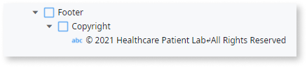

    The **UserRegistration** canvas should display a preview of the email that looks like the screen below.

    

1. Load the **DoSignup** action onto the canvas. Click the **UserRegistration** element and set **Email** > **Name** as `user.Name` and **Email** > **VerificationCode** as `StartUserRegistration.UserRegistrationResult.VerificationCode`.

    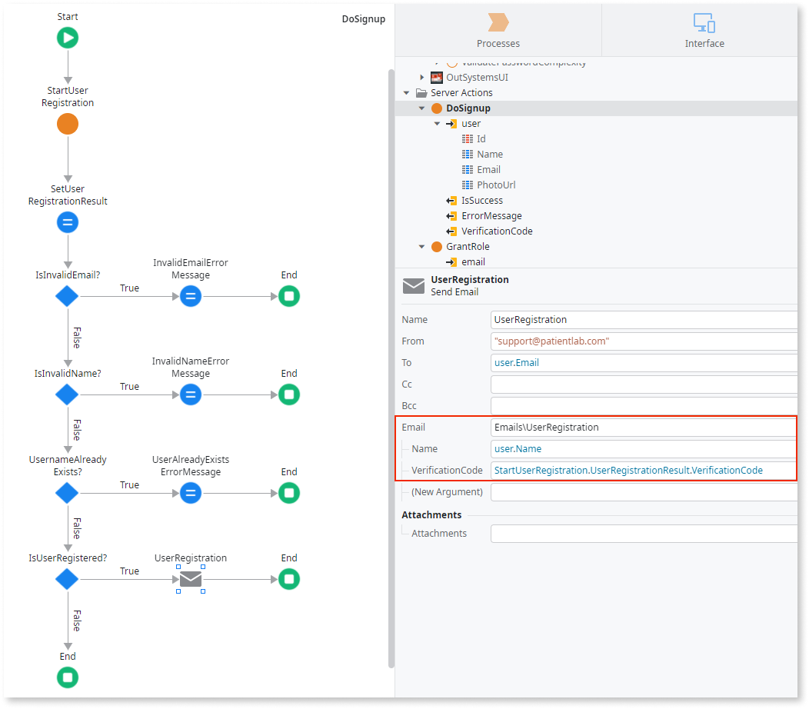

1. Load the **SignUp** screen onto the canvas. Click the **SignUpOnClick** element and click **+** to expand the **user** input under the **DoSignup** action. Define **Id** as `NullIdentifier()`, **Name** as `Name`, and **Email** as `UserEmail`.

    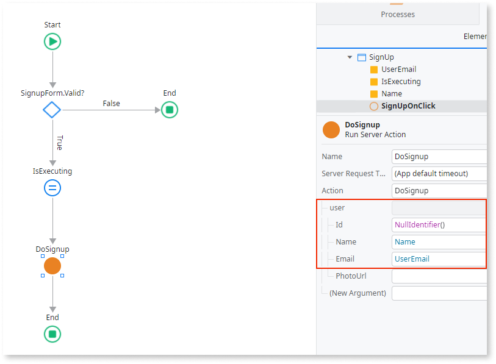

1. Drag an **Assign** widget from the toolbox to after the **DoSignup** action in the True branch. Under the **Assignments** pane, assign a variable `IsExecuting` as `False`.

1. Drag an **If** widget to after the previously added **IsExecuting** assign element. Set **Condition** as `DoSignup.IsSuccess`. Drag a **Message** widget to the True branch. Set **Type** as `Info` in **Message** paste the following text.

    ```
    Please check your email to copy the verification code.
    ```

1. End the True branch with an **End** element. Drag a **Message** widget to the False branch. Set **Type** `Error` and in **Message** paste the following text.

    ```
    DoSignup.ErrorMessage
    ```

## Create form to validate verification code and password

You now create a form to validate the user's verifiction code and password. Click the Interface tab, right-click **Common** > **SignUp** and select **Add Local Variable**. Now follow these steps.

1. Set **Name** as `IsVerificationCodeVisible`, **Data Type** as `Boolean` and **Default Value** as `False`.

1. Load the **SignUp** screen onto the canvas. Click the **Widget Tree** tab, right-click the **SignupForm** and select **Enclose in If**. Set the Condition property as `IsVerificationCodeVisible`. Then right-click the **If** element as select **Swap Content**.

    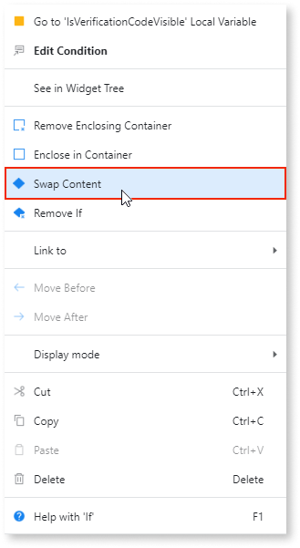

1. Load the **SignUpOnClick** action onto the canvas. Drag an **Assign** widget from the toolbox to after the **Message** element in the True branch. Under the **Assignments** pane, assign a variable `IsVerificationCodeVisible` as `True`.

    

1. Load **SignUp** screen to the canvas. Click the widget, right-click the True condition and select **Insert Widget** > **Form**. Set **Name** as `VerificationCodeForm` and **Style Classes** as `"login-form"`.

1. Right-click the **VerificationCodeForm** form and click **Insert** > **Container**. This is the header of the form, set **Name** as `Header`. 

1. Right-click on the **Header** container and click **Insert** > **HTML Element**. Replace the `span` tag with `h3`. Click the `h3` tag in the **SignUp** screen canvas and add the text `Welcome!`.

    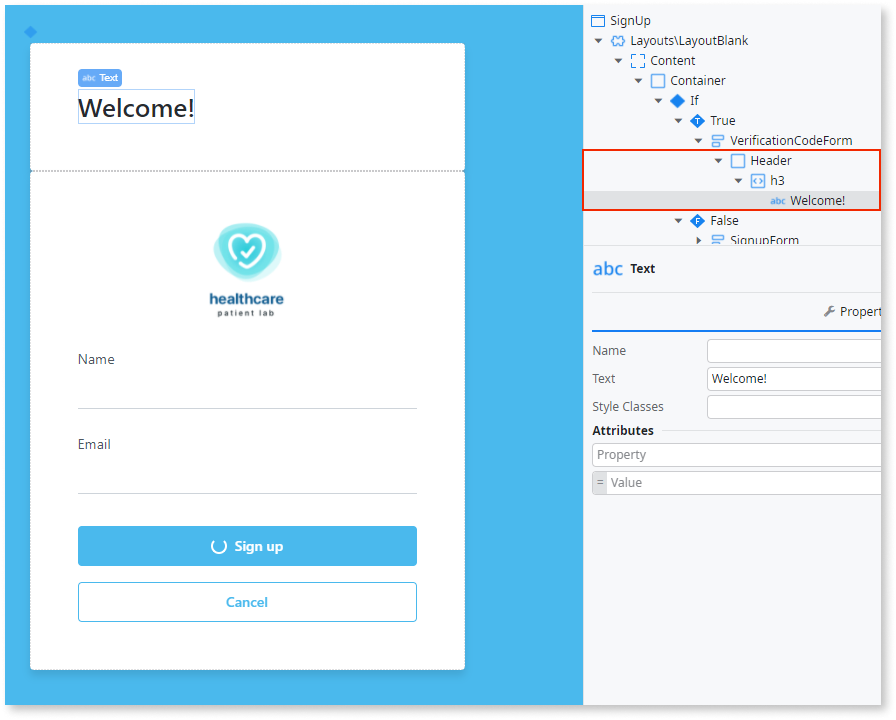

1. Right-click the **VerificationCodeForm** form and click **Insert** > **Container**. Set the **Name** as `Content` and  **Style Classes** as `"login-inputs margin-top-m"`.

1. Right-click the **Content** container and click **Insert** > **Container**. Set  **Name** as `Subtitle` and  **Style Classes** as `"margin-top-m margin-bottom-m"`. Click the container in the **SignUp** canvas and paste in the following text.

    ```
    Thank you for joining us. We’re glad to have you on board.
    You have received an email with a verification code.
    ```

1. Right-click the **Content** container and click **Insert** > **Block**. In the **Source Block Window** that displays search for "AnimatedLabel", highlight the result and click **Select**.

    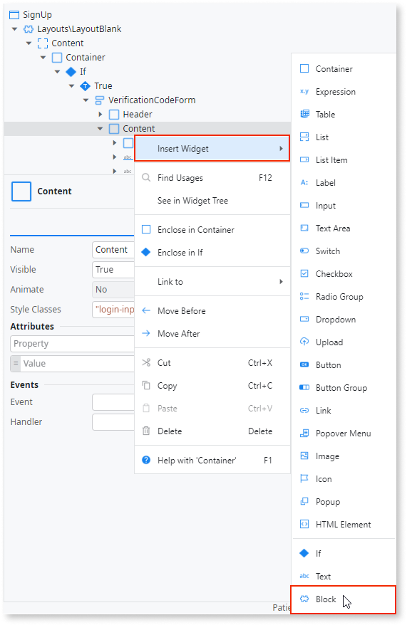

1. Expand the **Interaction\AnimatedLabel** block. In the **Label** widget set the **Input Widget** property as `Input1`. Replace the label text with `Verification Code`. Rename the **Input** widget to `Input_VerificationCode` and set **Mandatory** to `True`. In the **Variable** property select **New Local Variable** from the dropdown. Name the new local variable `VerificationCode` with data type `Text`.

    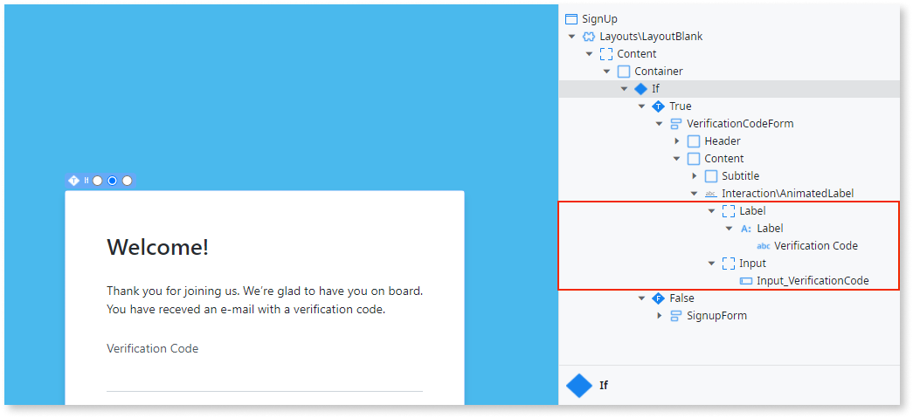

1. Right-click the **Content** container and click **Insert** > **Block**. In the **Source Block Window** that displays search for "AnimatedLabel", highlight the result and click **Select**. Set the **ExtendedClass** property as `"margin-top-base password-input"`. In the **Label** widget set the **Input Widget** property as `Input1`. Replace the label text with `Set password`.

1. Rename the **Input** widget to `Input_Password` and set the **Mandatory** property to `True`. Change the **Input Type** to `Password` and **Style Classes** to `"form-control login-password"`. In the **Variable** property select **New Local Variable** from the dropdown. Name the new local variable `Password` with data type `Text`.

1. To ensure that the user follows the password policy you need to validate the password. Right-click the **Content** container and click **Insert** > **Block**. In the **Source Block Window** that displays search for "PasswordPolicy", highlight the result and click **Select**. Set the **Password** property as `Password`.

1. In the **Handler** property select **New Client Action** from the dropdown. Drag an **Assign** widget from the toolbox to the canvas of the new client action. Under the **Assignments** pane, assign a variable `Input_Password.valid` as `IsValid`.

    

1. Navigate to the **SignUp** form widget tree. Copy the **Interaction\AnimatedLabel** block that contains the **Set password** label text and paste as a copy to the **Content** container. Change the label text from `Set password` to `Confirm password`.

1. Rename the **Input** widget to `Input_ConfirmPassword` and set **Mandatory** to `True`. Change **Input Type** to `Password`. In the **Variable** property select **New Local Variable** from the dropdown. Name the new local variable `ConfirmPassword` with data type `Text`.

    
        
1. In the **Events** > **OnChange** property select **New Client Action** from the dropdown. Drag an **Assign** widget from the toolbox to the canvas of the new action. Change the **Name** property to `ValidatePassword`. Under the **Assignments** pane, assign a variable `Input_ConfirmPassword.Valid` as `Password = ConfirmPassword` and a variable `Input_ConfirmPassword.ValidationMessage` as `If(Password = ConfirmPassword, "", "Passwords don't match")`.

    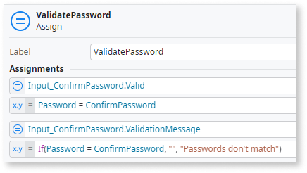

1. Right-click the **VerificationCodeForm** form and click **Insert** > **Container**. Set the **Name** as `Footer` and **Style Classes** as `"login-button margin-top-l"`

1. Right-click the **Footer** container and click **Insert** > **Block**. In the **Source Block Window** that displays search for "ButtonLoading", highlight the result and click **Select**. Set **IsLoading** as `IsExecuting` and **ExtendedClasses** as `"full-width"`.

1. Expand **ButtonLoading** > **Button** > **Button** and set **Enable** to `VerificationCodeForm.Valid`. Replace the text inside the button to `Set Password`. For the **On Click** event select **New Client Action** from the dropdown and name it `FinishRegistration`.

1. Delete the **If** element from the new **FinishRegistration** action. Drag an **Assign** widget from the toolbox to replace it. Under the **Assignments** pane, assign a variable `IsExecuting` as `True`

1. Click the **Add public elements** icon on the top toolbar or use the **Ctrl+Q** shortcut. Search for the [**FinishUserRegistration** client action](../../reference/system-actions/user.md#FinishUserRegistration), select it, and click **Add**.

1. Drag an **Run Client Action** widget from the toolbox in place after the **Assign** widget. Search for FinishUserRegistration, select it and click **Select**. Set the **Email** `UserEmail`, **Password** as `Password`, and  **VerificationCode** as `VerificationCode`.
        
    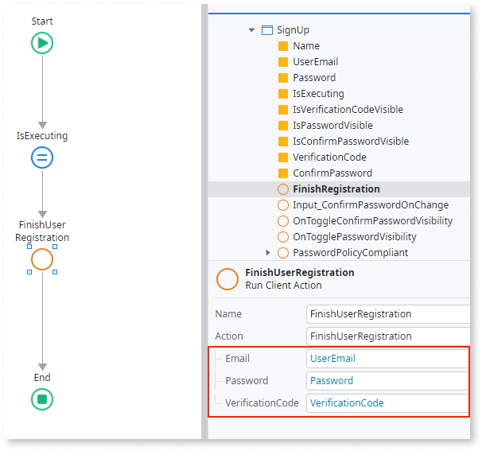

1. Drag an **Assign** widget from the toolbox to after the **FinishUserRegistration** client action. Under the **Assignments** pane, assign a variable `IsExecuting` as `False`.

1. Drag an **If** widget to validate **FinishUserRegistration** ran without error. Set **Condition** as `FinishUserRegistration.RegistrationResult.Success`. Drag a **Run Server Action** widget to the True branch, select **New Server Action** and name it `FinishUserRegistration`.

1. Right-click the new **FinishUserRegistration** server action and select **Add Input Paramater**. Set **Name** as `Email` and **Data Type** as `Email`.

1. On the new **FinishUserRegistration** server action canvas use the AI assistant to select the option **Get Data**. Input the `User` entity and click the **Get Data** button.

1. Click the **No Filters** tab and then click the **Add Filter** button. Inside the **Filter Condition** window, set `User.Email = Email`.

    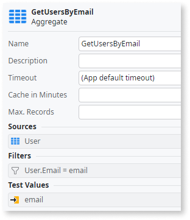
                    
1. Navigate back to the **FinishUserRegistration** server action canvas. Drag an **If** widget after newly added aggregate widget. Set **Condition** as `GetUsersByEmail.List.Empty`.

1. Click the **Add public elements** icon on the top toolbar or use the **Ctrl+Q** shortcut. Search for the **LogMessage** server action action, select it, and click **Add**.

1. In the True branch add a **LogMessage** system action and set the **Message** to guide the user there is a problem with the registration. In the False branch drag a **Run Server Action** widget and search for Grant&lt;YOUR_ROLE_NAME&gt;Role. Set  **UserId** as `GetUsersByEmail.List.Current.User.Id`.

    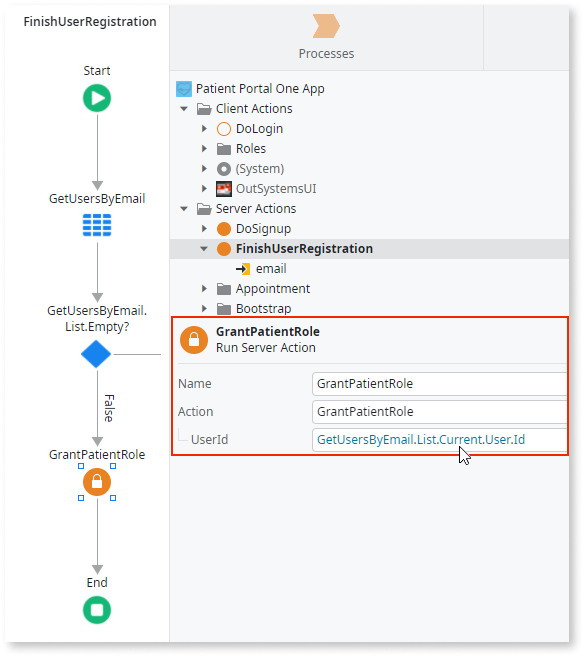

1. Drag a **Destination** element from the toolbox bar to the True branch. A **Select Destination** popup screen displays. Expand the **UI Flows** > **Common** folder and select **Login**.

1. Drag a **Message** widget from the toolbox to the False branch. Set **Type** as `Error` and in **Message** paste the following text:

    ```
    If (FinishUserRegistration.RegistrationResult.FinishUserRegistrationFailureReason.InvalidVerificationCode, "Invalid verification code", 
    If (FinishUserRegistration.RegistrationResult.FinishUserRegistrationFailureReason.PasswordComplexityPolicyFailed, 
            "Password not complex enough", "Something went wrong"))
    ```

    

1. Load the **Signup** screen onto the canvas and drag a new **Button** widget just after the **Set Password** button. Set the **On Click** event for the button as the **Common\Login** screen. Set **Style Classes** as `"btn margin-top-base"` and **Is Form Default** as **No**. Under **Styles** > **Layout**, set the **Width** property to `fill`.

    

1. Open the widget tree for the **Login** screen. Right-click the **LoginForm** and click **Insert** > **Container**. Click the container in the **Login** screen canvas and add the text `New Account? `. Drag a **Link** widget in position just after the text and set the **On Click** property as the **SignUp** screen. Set the text as `Sign up here!`.

    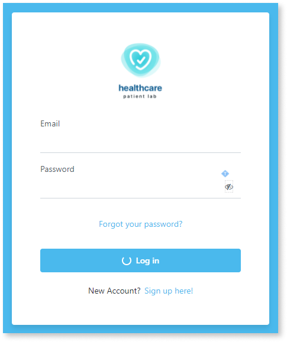
