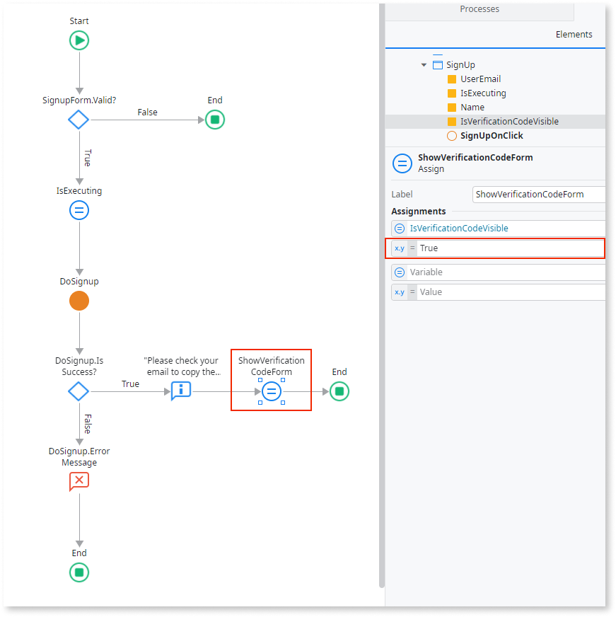
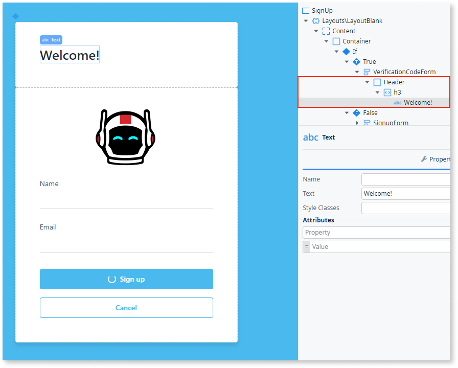
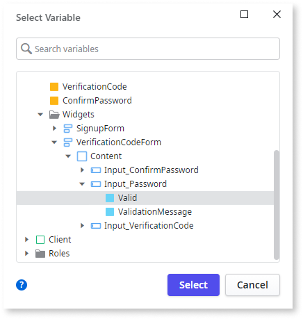
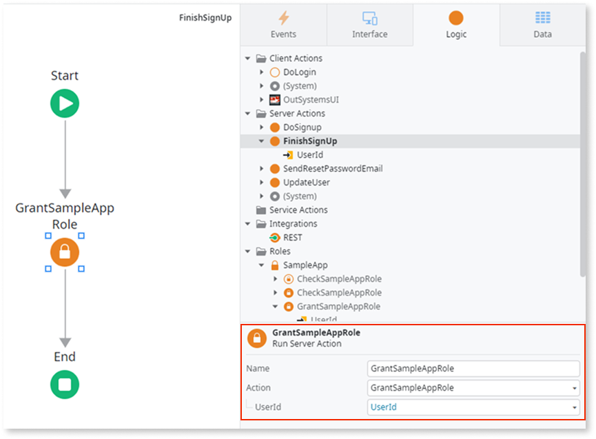
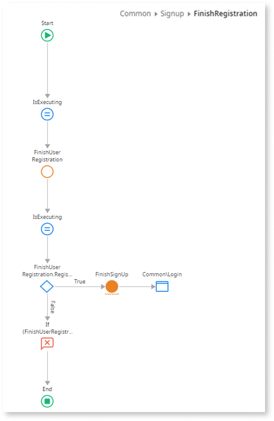
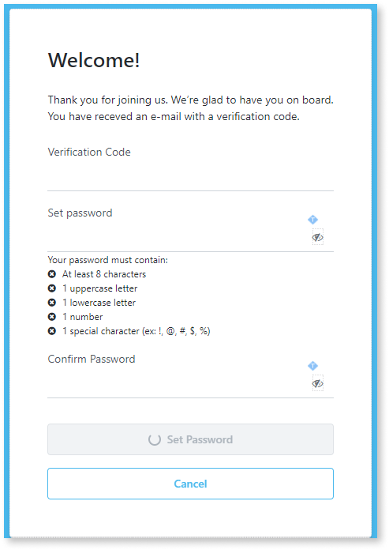
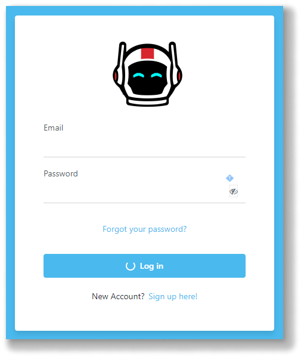

# Create a verification code and password verification form

<div class="info" markdown="1">

Before you begin creating the validation form, create the email to send the verification code and password.

</div>

This article describes how to create a form to validate a user's verification code and password. The procedure is divided into the sections and should be completed in the following.

## Create a container

1. From ODC Studio, click the **Interface** tab, click **Common** > right-click **SignUp** and then select **Add Local Variable**.

1. In the Local Variable fields, enter the following:
   1. In the **Name** field, enter `IsVerificationCodeVisible`.
   2. In the **Data Type** field, enter `Boolean`.
   3. In the  **Default Value**field, enter  `False`.

1. On the Canvas, load the **SignUp** screen, then click the **Widget Tree** tab >  right-click the **SignupForm**, and select **Enclose in If**.
1. In the Properties panel, set the **Condition** property as `IsVerificationCodeVisible`. Then right-click the **If** element and select **Swap Content**.

    

1. From the **Interface** tab, load **SignUpOnClick** onto the canvas.
1. From the Toolbox, drag an **Assign**  and place it in the True branch. In the **Assignment** Properties pane, in the variable field, enter  `IsVerificationCodeVisible` and set the value to  `True`.

    

## Insert the header on the form

1. Load **SignUp** screen onto the canvas.
1. On the canvas, click the **widget**, right-click the **True** condition and select **Insert Widget** > **Form** and then do the following:
1. In the Properties pane, in the **Name**field, enter `VerificationCodeForm` and in the **Style Classes** field enter `"login-form"`.
1. On the canvas, right-click the **VerificationCodeForm** form and click **Insert** > **Container**. This is the header of the form, set **Name** as `Header`.
1. On the canvas, right-click on the **Header** container and do the following:
   1. Click **Insert** > **HTML Element**.
   1. Replace the `span` tag with `h3`.
   1. Click the `h3` tag in the **SignUp** screen canvas and add the text `Welcome!`.

    

1. From the canvas, right-click the **VerificationCodeForm** form and click **Insert** > **Container**.
1. Set the **Name** as `Content` and  **Style Classes** as `"login-inputs margin-top-m"`. Then right-click the **Content** container and do the following:
    1. click **Insert** > **Container**.
    1. Set **Name** as `Subtitle`.
    1. Set  **Style Classes** as `"margin-top-m margin-bottom-m"`.
    1. Click the container in the **SignUp** canvas and paste in the following text.

    ```
    Thank you for joining us. We’re glad to have you on board.
    You have received an email with a verification code.
    ```

1. From the **Interface** tab, right-click the **Content** container and click **Insert** > **Block**.
1. In the **Source Block Window** that displays search for "AnimatedLabel", highlight the result and click **Select**.

    

## Add the verification code

1. From the **Interface** tab, expand the **Interaction\AnimatedLabel** block. In the **Label** widget, do the following:
    1. Set the **Input Widget** property as `Input1`.
    1. Replace the label text with `Verification Code`.
    1. Rename the **Input** widget to `Input_VerificationCode`.
    1. Set **Mandatory** to `True`.
    1. In the **Variable** property, from the dropdown, select **New Local Variable**.
    1. Name the new local variable `VerificationCode` and the data type as `Text`.

    

1. From the **Interface** tab, right-click the **Content** container and click **Insert** > **Block**. In the **Source Block Window** that displays search for "AnimatedLabel",and do the following:
    1. Highlight the result and click **Select**.
    1. Set the **ExtendedClass** property as `margin -top-base password-input"`.
    1. In the **Label** widget, set the **Input Widget** property as `Input1`.
    1. Replace the label text with `Set password`.

1. Rename the **Input** widget to `Input_Password` and do the following:
    1. Set the **Mandatory** property to `True`.
    1. Change the **Input Type** to `Password`.
    1. In  **Style Classes** enter  `"form-control login-password"`.
    1. In the **Variable** property,from the dropdown, select **New Local Variable**.
    1. Name the new local variable `Password` with data type `Text`.

## Validate the password

To ensure users follow the password policy you need to validate the password.

1. From the **Interface** tab, right-click the **Content** container, then click **Insert** > **Block**.
1. In the **Source Block Window** that displays search for "PasswordPolicy", highlight the result and click **Select**. Set the **Password** property as `Password`.
1. In the **Handler** property, from the dropdown, select **New Client Action**.
1. From the Toolbox, drag an **Assign** widget to the canvas of the new client action.
1. Under the **Assignments** pane, assign a variable `Input_Password.valid` as `IsValid`.

    

1. Navigate to the **SignUp** form **Widget tree** and do the following:
    1. Copy the **Interaction\AnimatedLabel** block that contains the **Set password** label text and paste it to the **Content** container.
    2. Change the label text from `Set password` to `Confirm password`.
1. Rename the **Input** widget to `Input_ConfirmPassword` and do the following:
    1. Set **Mandatory** to `True`.
    2. Change **Input Type** to `Password`.
    3. In the **Variable** property, from the dropdown, select **New Local Variable**
    4. Name the new local variable `ConfirmPassword` with data type `Text`.

    

1. From the dropdown in the **Events** > **OnChange** property, select **New Client Action** and do the following:
    1. From the Toolbox, drag an **Assign** widget to the canvas of the new action.
    2. Change the **Name** property to `ValidatePassword`.
    3. Under the **Assignments** pane, assign a variable `Input_ConfirmPassword.Valid`. as `Password = ConfirmPassword` and a variable `Input_ConfirmPassword.ValidationMessage` as `If(Password = ConfirmPassword, "", "Passwords don't match")`.

    

## Modify the verification form

Now lets update the verification form to improve it.

1. From the **Interface** tab, right-click the **VerificationCodeForm** form and click **Insert** > **Container**. Then set the **Name** as `Footer` and **Style Classes** as `"login-button margin-top-l"`.

1. Right-click the **Footer** container and click **Insert** > **Block**. In the **Source Block Window** that displays search for "ButtonLoading" and do the following:
    1. Highlight the result and click **Select**.
    1. Set **IsLoading** as `IsExecuting` and **ExtendedClasses** as `"full-width"`.

1. Expand **ButtonLoading** > **Button** > **Button** and set **Enable** to `VerificationCodeForm.Valid` and then replace the text inside the button to `Set Password`.
1. For the **On Click** event, from the dropdown, select **New Client Action**  and name it `FinishRegistration`.

1. From the new **FinishRegistration** action, delete the **If** element and do the following:
    1. From the Toolbox, drag an **Assign** widget and place it under the **Assignments** pane,
    1. Assign the variable `IsExecuting` as `True`.

1. From the top toolbar, click the **Add public elements** icon  or use the **Ctrl+Q** shortcut.
1. Search for the [**FinishUserRegistration** client action](../../../reference/system-actions/user.md#FinishUserRegistration), select it, and click **Add**.

1. From the Toolbox, drag a **Run Client Action** widget nd place it after the **Assign** widget, then do the following:
    1. Search for FinishUserRegistration, select it, and then click **Select**.
    1. Set the **Email** `UserEmail`, **Password** as `Password`, and  **VerificationCode** as `VerificationCode`.

    

## Create the finishing logic

 1. From the Toolbox, drag an **Assign** widget and place it below the **FinishUserRegistration** client action. Under the **Assignments** pane, assign a variable `IsExecuting` as `False`.
 1. Drag an **If** widget to the canvas, to validate **FinishUserRegistration** runs without errors and then do the following:  
    1. Set the **Condition** as `FinishUserRegistration.RegistrationResult.Success`.
    1. Drag a **Run Server Action** widget to the True branch.
    1. Select **New Server Action** and name it `FinishUserRegistration`.
    1. Right-click the new **FinishUserRegistration** server action and select **Add Input Parameter**.
    1. Set **Name** as `Email` and the **Data Type** as `Email`.
 1. On the new **FinishUserRegistration** server action canvas, use the AI assistant to select the option **Get Data**, then do the following:
    1. Input the `User` entity and click the **Get Data** button.
    1. Click the **No Filters** tab and then click the **Add Filter** button.
    1. Inside the **Filter Condition** window, set `User.Email = Email`.

    

 1. Navigate back to the **FinishUserRegistration** server action canvas.
 1. Drag an **If** widget and place it after the newly added aggregate widget and set the **Condition** as `GetUsersByEmail.List.Empty`.
 1. On the top toolbar, click the **Add public elements** icon or use the **Ctrl+Q** shortcut. Search for the **LogMessage** server action action, select it, and click **Add**.
 1. On the canvas, in the True branch, add a **LogMessage** system action and set the **Message** to guide the user if there is a problem with the registration.
 1. On the canvas, in the False branch, drag a **Run Server Action** widget, and search for Grant&lt;YOUR_ROLE_NAME&gt;Role. Set  the **UserId** as `GetUsersByEmail.List.Current.User.Id`.

    

 1. From the Toolbox bar, drag a **Destination** element to the True branch. A **Select Destination** popup screen displays. Expand the **UI Flows** > **Common** folder and select **Login**.
 1. From the Toolbox, drag a **Message** widget to the False branch. Set **Type** as `Error` and in the **Message** paste the following text:

    ```
    If (FinishUserRegistration.RegistrationResult.FinishUserRegistrationFailureReason.InvalidVerificationCode, "Invalid verification code",
    If (FinishUserRegistration.RegistrationResult.FinishUserRegistrationFailureReason.PasswordComplexityPolicyFailed,
            "Password not complex enough", "Something went wrong"))
    ```

    

 1. Load the **Signup** screen onto the canvas and do the following:
    1. Drag a new **Button** widget and place it below  the **Set Password** button.
    1. Fon the button, set the **On Click** event as the **Common\Login** screen.
    1. Set **Style Classes** as `"btn margin-top-base"` and **Is Form Default** as **No**.
    1. Under **Styles** > **Layout**, set the **Width** property to `fill`.

    

 1. Open the widget tree for the **Login** screen. and do the following:
    1. Right-click the **LoginForm** and click **Insert** > **Container**.
    1. Click the container in the **Login** screen and add the text `New Account?`.
    1. From the Toolbox, drag a **Link** widget, and place it after the text.
    1. Set the **On Click** property as the **SignUp** screen and the text as `Sign up here!`.

    

You have successfully built a self-registration app and can now improve it.