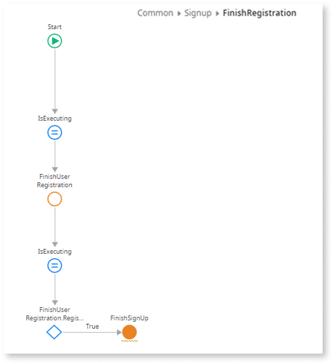

# Create a verification code and password verification form

This article explains how to create a form to validate a user's verification code and password. Complete each section in order.

<div class="info" markdown="1">

You can save time by installing the [User Self Registration Flow](https://www.outsystems.com/forge/component-overview/17017/user-self-registration-flow-odc) asset from the **Forge** in the ODC Portal, which already implements the flow described in this article.

</div>

## Prerequisites

Before you begin creating the verification code and password verification form, you must create the [email to send the verification code](email.md).

## Create a verification code condition

To create a verification code condition in ODC Studio, follow these steps:

1. Go to the **Interface** > **Elements** tab, expand **UI Flows** > **Common**, right-click **SignUp**, and select **Add Local Variable**.
1. Set the new local variable's name to **IsVerificationCodeVisible**, set **Data Type** to `Boolean`, and **Default Value** to `False`.
1. Double-click the **SignUp** screen to open it, click the **Widget Tree** tab, right-click **SignupForm**, and click **Enclose in If**.
1. In the **If** properties, set **Condition** to **IsVerificationCodeVisible**, then right-click the **If** element and select **Swap Content**.

    

1. From the **Interface** > **Elements** tab, open the **SignUpOnClick** action, drag an **Assign** to the **True** branch after the `"Check your email to copy the verification code."` **Message**.
1. In the **Assign** properties, select **IsVerificationCodeVisible** from the variable dropdown, and set its value to **True**.

    

## Insert a header on the verification code form

To insert a header and introductory text on the verification code form in ODC Studio, follow these steps:

1. Open the **SignUp** screen, click the **Widget Tree** tab, right-click the **True** condition, and select **Insert Widget** > **Form**. Name it **VerificationCodeForm** and set **Style Classes** to `"login-form"`.
1. Right-click **VerificationCodeForm**, select **Insert Widget** > **Container**, and name it **Header**.
1. Right-click **Header**, select **Insert Widget** > **HTML Element**, replace the `span` tag with `h3`, and add the text **`Welcome!`**.

    

1. Right-click **VerificationCodeForm**, select **Insert Widget** > **Container**, name it **Content**, and set **Style Classes** to `"login-inputs margin-top-m"`.
1. Right-click **Content**, select **Insert Widget** > **Container**, name it **Subtitle**, and set **Style Classes** to `"margin-top-m margin-bottom-m"`.
1. On the canvas, click the **Subtitle** container, and then paste the following text:

    ```
    Thank you for joining us. We’re glad to have you on board.
    You have received an email with a verification code.
    ```

## Add the verification code

To add verification code and password inputs, follow these steps:

1. Right-click the **Content** container, select **Insert Widget** > **Block**, and add the **AnimatedLabel** block.

    

1. Set the **Label** widget's **Input Widget** property to `Input1` and the Label **Text** to `Verification Code`.
1. Rename the **Input** widget to `Input_VerificationCode` and set **Mandatory** to `True`.

1. In the **Input** widget's **Variable** property, select **New Local Variable** from the dropdown.
1. Name the new local variable `VerificationCode` and set the **Data Type** property to `Text`.

    

1. Right-click the **Content** container, select **Insert Widget** > **Block**, and add an **AnimatedLabel** block for the password. Set its label's **Input Widget** to `Input1`, the Label **Text** to `Set password`, and **ExtendedClass** to `margin-top-base password-input`.

1. Rename the **Input** widget to `Input_Password`, set **Mandatory** to `True`, **Input Type** to `Password`, and add **Style Classes** `form-control login-password`.

1. In the **Input** widget's **Variable** property, select **New Local Variable** from the dropdown. Name it `Password` and set its **Data Type** property to `Text`.

## Validate the password

To ensure users follow the password policy, you must validate the password. Follow these steps:

1. From the **Widget Tree**, right-click the **Content** container, then select **Insert Widget** > **Block**, and add a **PasswordPolicy** block.
1. Set the **Password** property to `Password`.
1. In the **Handler** property, select **New Client Action**, add an **Assign** widget, and assign the `Input_Password.valid` variable to `IsValid`.

    

1. Open the **SignUp** screen, go to the **Widget Tree**, copy the **Interaction\AnimatedLabel** block that contains the **Set password** label text, and paste it to the **Content** container. Change the label text from `Set password` to `Confirm password`.
1. Rename the **Input** widget to `Input_ConfirmPassword`, set **Mandatory** to `True`, change **Input Type** to `Password`, and in the **Variable** property, select **New Local Variable**. Name it `ConfirmPassword`, and set its **Data Type** property to `Text`.

    

1. In the **Events** > **OnChange** property, select **New Client Action** from the dropdown.

1. Drag an **Assign** widget to the canvas of the new action, name it `ValidatePassword`, and assign the `Input_ConfirmPassword.Valid` variable to `Password = ConfirmPassword` and the `Input_ConfirmPassword.ValidationMessage` variable to `If(Password = ConfirmPassword, "", "Passwords don't match")`.

    

## Modify the verification form

To update the verification form, follow these steps:

1. From the **Interface** tab, right-click the **VerificationCodeForm** form and select **Insert Widget** > **Container**. Name it `Footer` and set its **Style Classes** property to `"login-button margin-top-l"`.

1. From the **Widget Tree**, right-click the **Footer** container, then select **Insert Widget** > **Button**.
1. For the new button:
    1. Set the **On Click** event to **Common\\Login** screen, and then replace the text inside the button to `Cancel`.
    1. Set the **Style Classes** property to `"btn margin-top-base"` and the **Is Form Default** property to `No`.
    1. In the **Styles** tab, in the **Layout** section, set the **Width** property to `fill`.

1. From the **Widget Tree**, right-click the **Footer** container, then select **Insert Widget** > **Block**, and add a **ButtonLoading** block.
1. For the new **ButtonLoading** block:
    1. From the **Widget Tree**, right-click the new **ButtonLoading** block, then select **Move before**.
    1. Set the **IsLoading** property to `IsExecuting` and **ExtendedClasses** to `"full-width"`.
    1. Expand **ButtonLoading** > **Button** > **Button**, set **Enable** to `VerificationCodeForm.Valid`, and replace the text inside the button with `Set Password`.

        

    1. For the **On Click** event, select **New Client Action** from the dropdown and name it `FinishRegistration`.
1. In the new **FinishRegistration** action, delete the **If** element. Drag an **Assign** widget after the **Start** element, and assign the `IsExecuting` variable to `True`.
1. Add the **FinishUserRegistration** [public element](../../libraries/use-public-elements.md) after the **Assign** element, and set the **Email** property to `UserEmail`, the **Password** property to `Password`, and the **VerificationCode** property to `VerificationCode`.

    

## Create the finishing logic

To complete the registration process and handle the result, do the following:

1. Add an **Assign** element after the **FinishUserRegistration** client action, and assign the `IsExecuting` variable to `False`.
1. Drag an **If** element after the **IsExecuting** **Assign** element, and set its **Condition** to `FinishUserRegistration.RegistrationResult.Success`.
1. In the **True** branch, drag a **Run Server Action** widget, select **New Server Action**, and name it `FinishSignUp`.

    

1. Right-click the new **FinishSignUp** server action and select **Add Input Parameter**. Name it `UserId` and set the **Data Type** to `User Identifier`.
1. In the new **FinishSignUp** server action, after the **Start** node, drag a **Run Server Action** widget, search for **Grant&lt;YOUR_ROLE_NAME&gt;Role**, and set the **UserId** to `UserId`.

    

1. Back to the  **FinishRegistration** screen client action:
    1. Select the **FinishSignUp** Run Server Action, and set the **UserId** to `FinishUserRegistration.RegistrationResult.UserId`.
    1. In the **True** branch, drag a **Destination** element and select the **Login** screen. In the **False** branch, drag a **Message** widget, set the **Type** property to `Error`, and paste the following in the **Message** property:

        ```
        If (FinishUserRegistration.RegistrationResult.FinishUserRegistrationFailureReason.InvalidVerificationCode, "Invalid verification code",
        If (FinishUserRegistration.RegistrationResult.FinishUserRegistrationFailureReason.PasswordComplexityPolicyFailed,
                "Password not complex enough", "Something went wrong"))
        ```

        

## Add the sign up link to the login screen

To enable users to navigate to sign up, add a link on the **Login** screen:

1. Open the **Login** screen, and select the **Widget Tree**.
1. Add a **Container** into the **LoginForm**.
1. Set **Style Classes** to `"margin-top-base"`.
1. In the **Styles** tab, in the **Layout** section, set the **Align** property to center.
1. Add the text `New Account?` inside the container.
1. Drag a **Link** widget after the text.
1. Set its **On Click** event to the **SignUp** screen and **Text** to `Sign up here!`.

    

1. Publish your app.

You have successfully completed the self-registration flow.
