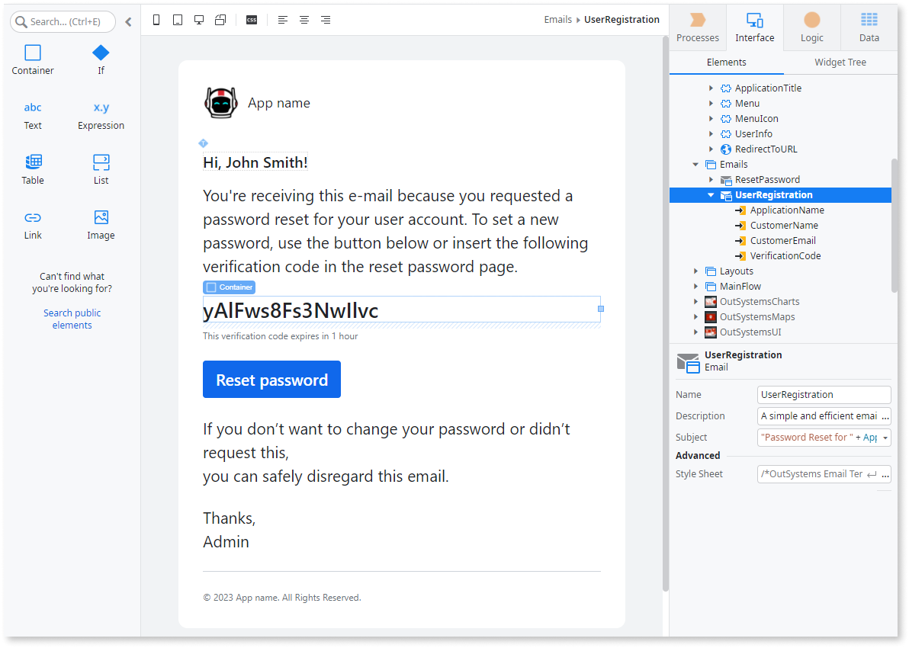
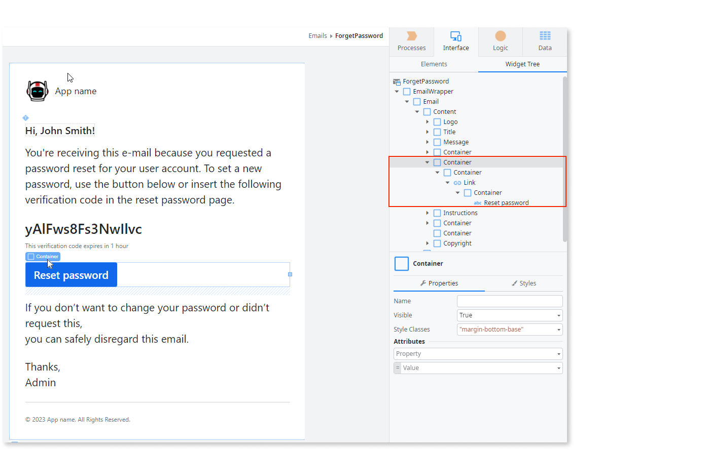
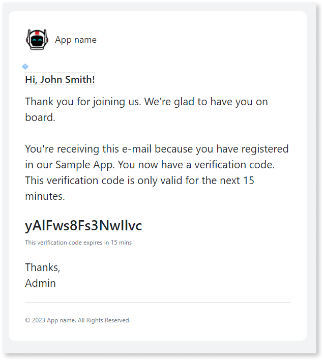
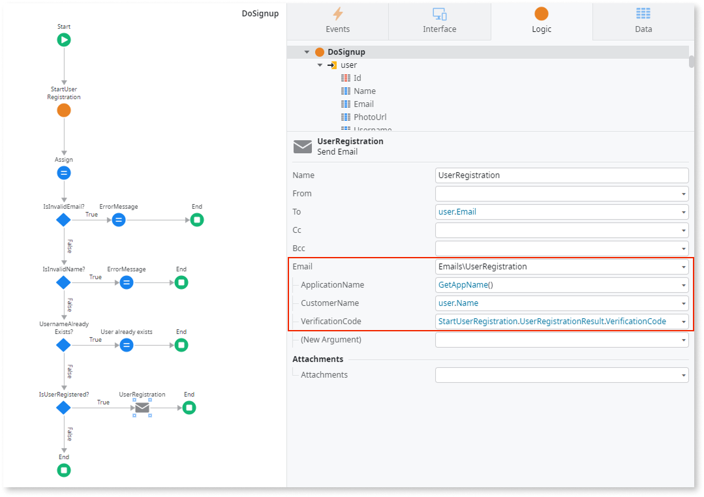

# Create email to send verification code

Before you begin creating your email, make sure you have an [email provider configured](../../../configuration-management/configure-emails.md).

This article describes creating an email to send to the person registering to use your app. First, you start an email with a verification code that the person must enter on the form. To make this task easier and quicker, OutSystems provides you with a sample email. To create your email, copy the email and then make the following updates.

## Creating the email

Follow these steps to create your own email.

1. From the **Elements** tab, copy and paste the **ResetPassword** email into the same folder. It creates a copy of the Reset password in the emails folder.
1. In **Elements** tab, select Emails, and rename the email **ResetPassword2** to `UserRegistration`.
1. From **Emails**, click **UserRegistration**, then modify the **Subject** in properties, for example, `Welcome to Your Sample App `.
1. On canvas, click on the text above the unique verification code. Then in properties, replace the text.

    

    You're receiving this e-mail because you requested a password reset for your user account. To set a new password, use the button below or insert the following verification code in the reset password page.
    
    

    New note text:

    

    Thank you for joining us. We’re glad to have you on board. You're receiving this e-mail because you registered in our _Your Name_ Portal. You now have a verification code.
    
    

1. On canvas, click on the text below the unique verification code. Then in Properties, replace the text.
    
    

    This verification code expires in 1 hour.

    

    
    New note text:

    

    This verification code expires in 15 minutes.

    

    

6. Click on the **Widget** Tree, and remove the following containers:
   1. Click on the **ResetPassword** parent container, to select and delete the container shown in the image above.

   1. Click on the **Instruction** container, to select and delete the container.

    

## Updating the actions

Before updating the actions, delete the input parameter **CustomerEmail** by expanding the **UserRegistration** element in the **Elements** tab, then follow the steps below.

1. From the **Logic** tab, click **server actions** > **DoSignup** action to display logic on canvas.

    

1. From the canvas, click **UserRegistration** element to display Properties panel. Set the following properties:

    1. **CustomerName** to `user.Name`.

    2. **VerificationCode** to `StartUserRegistration.UserRegistrationResult.VerificationCode`.

2. From the **Interface tab**, click  the **SignUp screen** > **SignUpOnClick** action to display **SignUpOnClick** on the canvas.
 
    

1. From the canvas, click the **DoSignup** action to display the Properties panel, and set the following properties:

      1.  **Id** as `NullIdentifier()`
      2.  **Name** as `Name`
      3.  **Email** as `UserEmail` 
      4.  **ApplicationName** as `GetAppName()`

## Completing the DoSignUp flow

1. From the Toolbox, drag an **Assign** widget and place it below **DoSignup** action in the True branch.

1. In the **Assignments** pane, set the assign variable **IsExecuting** to `False`.

1. From the Toolbox, drag an **If** widget, and place it below the previously added **Assign widget**.

1. In the **If** widget, set the **Condition** as `DoSignup.IsSuccess`.

1. From the Toolbox, drag a **Message** widget into the True branch. Set the **Type** as `Info` and paste the following text.

    `Check your email to copy the verification code.`

1. From the Toolbox, drag an **End** element to the bottom of the True branch to complete the flow.

1. From the Toolbox, drag a **Message** widget into the False branch. Set the **Type** as `Error`, and paste the following text in the message.

    `DoSignup.ErrorMessage`

1. From the **SignUp** page, go to **SignUpOnClick**, and in the **ApplicationName** open the dialog and type `GetAppName()`.

You can now [create a form to validate the verification code.](create-validation-form.md)
