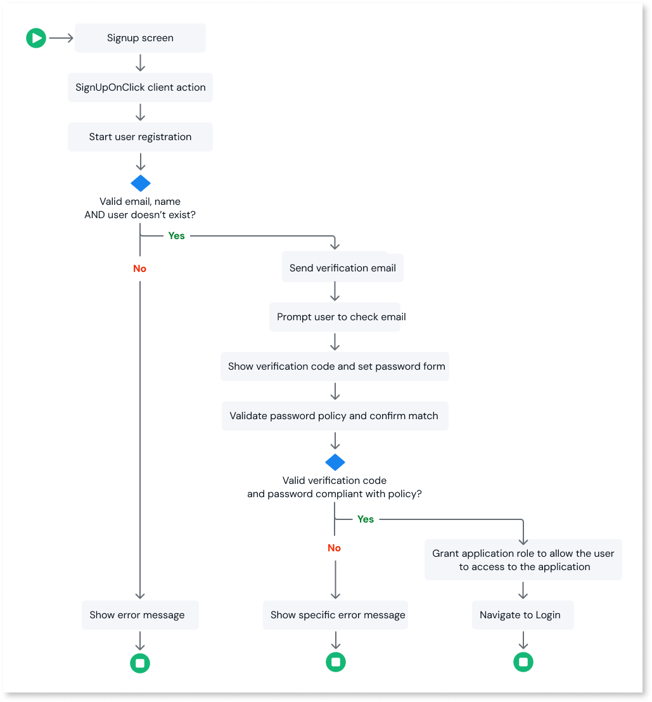

# Self-registration flow

A self-registration flow lets users sign up and access your app without human intervention, making it easier to scale onboarding and reduce manual account provisioning. Users create their own accounts directly from your app or website.

ODC Studio lets you build custom registration logic to address your company's requirements. This includes security rules, for example, user validation and password policies, or other business rules.

As a best practice, confirm the user's email during sign-up by sending a one-time verification code via email.

This flow is available only with the **built-in** identity provider and doesn't apply to external identity providers, such as Google or Facebook.

You can save time by installing the [User Self Registration Flow](https://www.outsystems.com/forge/component-overview/17017/user-self-registration-flow-odc) asset from the **Forge** in the ODC Portal, which implements the flow described in this article.

## Prerequisites

Before you begin, set up an email provider in the ODC Portal to let your app send verification codes during the self-registration flow. For step-by-step guidance, see [Configure SMTP settings for emails](../../../manage-platform-app-lifecycle/configure-emails.md).

## Understand the self-registration flow

The following diagram illustrates the typical steps in a self-registration flow:

To build the self-registration flow in ODC Studio, follow these high-level steps:

1. [Create the Sign up screen](screen.md) with name and email input fields.
1. [Create logic to register a user](logic.md), including:
    * The **SignUpOnClick** client action
    * The **DoSignup** server action with user validation logic
    * Input validation for email, name, and duplicate users
    * Sending the verification email (**Send Email** widget on success)
1. [Create an email to send the verification code](email.md).

    Customize the sample email template provided by OutSystems (subject, message, note text, and body).

1. [Create a verification code and password verification form](create-validation-form.md) that:

    * Shows the verification code input after the user receives the email
    * Validates the verification code
    * Validates the password against your password policy and confirms the passwords match
    * Grants a role after successful registration (see [Secure an app with roles](../../../user-management/secure-app-with-roles.md))
    * Navigates to the appropriate screen after successful sign-in
  
## Related resources

* [Managing authorization and authentication for end-users](../../../user-management/end-users/intro.md)
