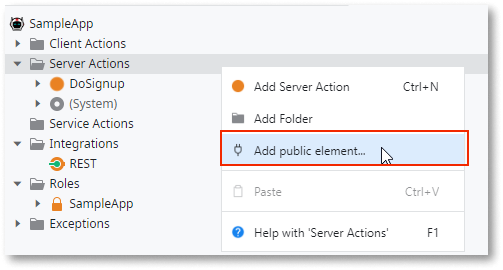
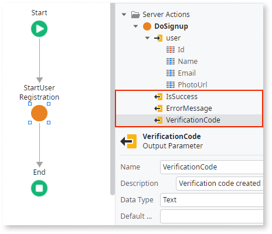
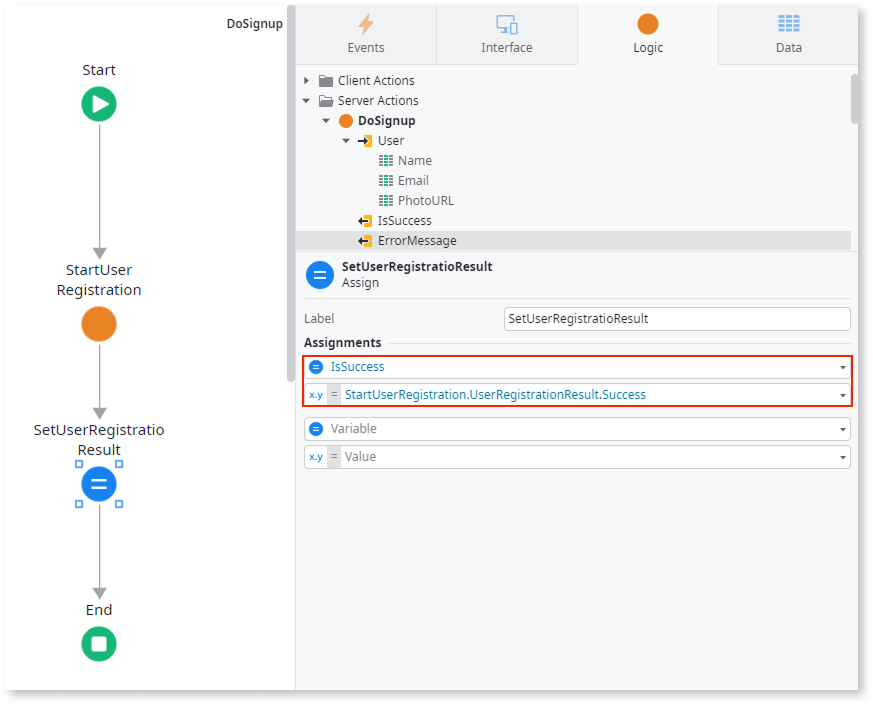
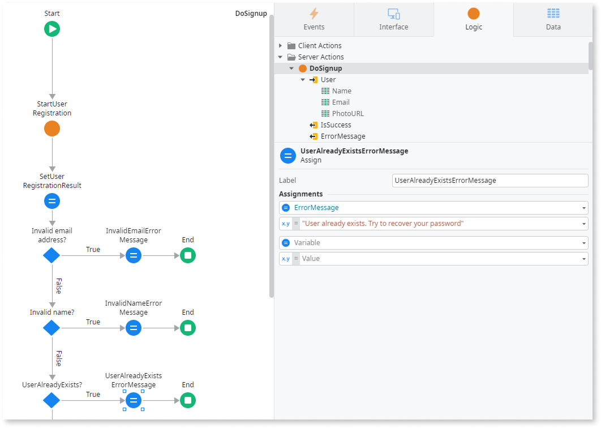

# Create logic to register a user

Once you create a screen for users to sign in, you can add logic to your screen. Logic enables you to validate your user's input and set up actions if the information is true or false.

If this is the first time you are creating the logic for self-registration, then follow all the procedures. If you are making updates to your existing app, jump to the task you want to do.
  
To create logic to register users, follow these procedures. To make it easier, The procedure is divided into sections.

## Setting up the server action

1. From the **Interface** tab, select the **Common** > **Signup**, and then on the canvas, click the **Signup** button to display the Properties and Styles panel.

    

    

    This screenshot shows the parts of the screen you use often. The Toolbox is on the left, the canvas is in the middle, and the logic is on the right. Depending upon what you select, what you see changes.

    

1. From the **Properties** panel, click the dropdown for the on-click event and select **New Client Action**. The **SignUpOnClick** action flow displays on the canvas.

    

1. From the Toolbox, drag the **Assign** widget onto the **True** branch and place it below the **Assign** element. The Assignments pane displays.
1. In the **Assignments** pane, add the **IsExecuting** variable and set it to `True`.
1. From the Toolbox drag a **Run Server Action** widget to the canvas and place it below the **IsExecuting** assign element to display a select action pop-up.
1. From the **Select Action** pop-up, click the **New Server Action** button to display the canvas and the Properties panel.
1. In the **Server Action** Properties panel, in the name field enter `DoSignup`. The DoSignup function handles the user registration and validation inside the SignUpOnClick function.

## Configuring the server action

After setting up the DoSignup action, you need to configure the server action. In the server action, you define what you want to happen next.   

1. From the **Logic** tab, select **Server action**, right-click, and select **Add Public element** to display a pop-up.

    

    

    You can search for the action by pressing **Ctrl+Q** to display a Search bar.

    

1. In the search bar pop-up, search for **StartUserRegistration**, then select it from the dropdown and click **Add**. ODC displays the **StartUserRegistration** action below system actions in the Logic tab.
1. From the Toolbox, drag the **Run Server Action** widget to the canvas and place it between the Start and End elements to display a pop-up. In the search pop up, enter **StartUserRegistration** server action and then click **Select.**
  
    

1. From the **Logic** tab, right-click the **DoSignup** server action and select add input parameter. Set the Name to `User` and the data type to `User`. In the **DoSignup** canvas, click **StartUserRegistration** action to display properties. Click  **+** to expand the user input and enter `User` as the name and `email` as User.Email.

    

1. From the **Server Action**, right-click the **DoSignup** server action and select **Add Output** parameter. Enter the following output parameters:
    1. IsSuccess with data type `Boolean`.
    2. ErrorMessage with data type `Text`.
    3. VerificationCode with data type `Text`.

    

1.  On the **DoSignup** canvas, drag an **Assign** element and place it after the **StartUserRegistration** action. Under the Assignments pane, assign, set the following:
    1.  IsSuccess as `StartUserRegistration.UserRegistrationResult.Success`.
    1.  VerificationCode as `StartUserRegistration.UserRegistrationResult.VerificationCode`.

## Validate the input

As a best practice, OutSystems recommends that you validate the information you are requesting users to input. This helps to ensure you are getting the information you expect from users.

You can check that the data entry fields only allow user data that complies with the app’s terms such as emails, names, and usernames.

### Checking for invalid emails

1. From the Toolbox, drag an **If** widget after the IsSuccess assign element.
1. In the Properties pane, set the Label as IsInvalidEmail? and the Condition as StartUserRegistration.UserRegistrationResult.StartUserRegistrationFailureReason.InvalidEmail
1. From the Toolbox, drag an **Assign** element to the True branch.
1. Under the **Assignments** tab, assign a variable ErrorMessage as `Invalid Email`.

### Checking for invalid names

1. In the False branch, from the Toolbox, drag another **If** element.
1. In the Properties panel, set the Label as IsInvalidName? and the Condition as StartUserRegistration.UserRegistrationResult.StartUserRegistrationFailureReason.InvalidName
1. From the Toolbox, drag an **Assign** element to the True branch.
1. Under the **Assignments** tab, assign a variable ErrorMessage as `Invalid Name`.

### Checking for a unique username

1. In the False branch, from the Toolbox, drag another **If** element.
1. In the Properties panel, set the Label as UsernameAlreadyExists? And the Condition as StartUserRegistration.UserRegistrationResult.StartUserRegistrationFailureReason.UserAlreadyRegistered
1. From the Toolbox, drag an **Assign** element to the True branch.
1. Under the **Assignments** tab, assign a variable ErrorMessage as `User already exists. Try to recover your password`.

Verify the validation logic of the DoSignup action looks like the following screen shot.

As a final validation, you can configure the flow to send an email to the user with the users name. Follow the steps below:

1. In the False branch, from the Toolbox, drag another **If** element. In the Properties panel, set the Label as `IsUserRegistered?` and the Condition as `StartUserRegistration.UserRegistrationResult.Success`.

2. In the True branch, from the Toolbox, drag a **Send Email** widget. In the properties pane, set Name as `UserRegistration` and To as `User.Email`. In the Email setting, select the **New Email** option from the dropdown.

You can now [create an email to send the verification code.](email.md)