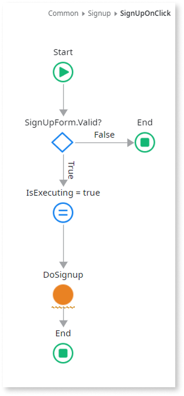
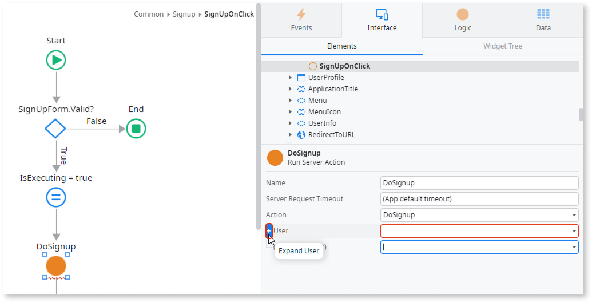
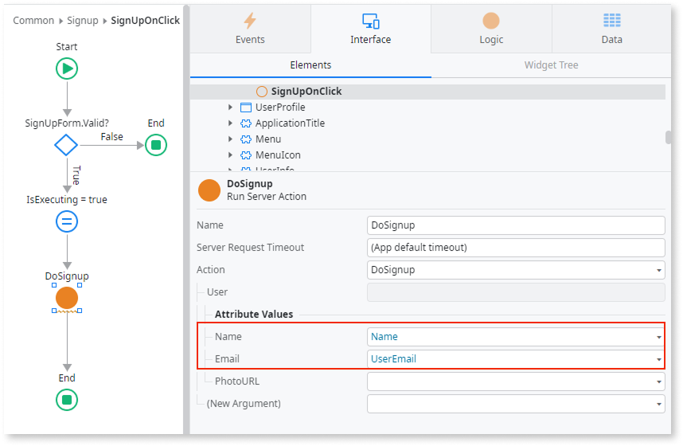
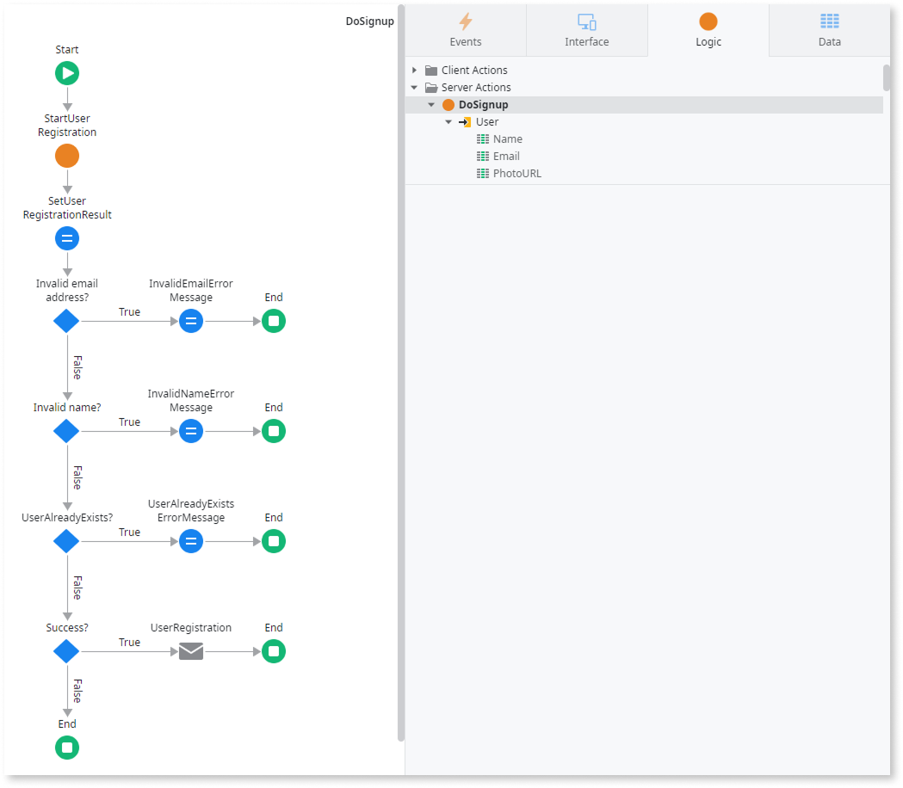

# Create logic to register a user

This article explains how to create the logic for the self-registration flow in ODC. You'll validate user input and configure server actions. You must complete each section in order.

You can save time by installing the [User Self Registration Flow](https://www.outsystems.com/forge/component-overview/17017/user-self-registration-flow-odc) asset from the **Forge** in the ODC Portal, which already implements the flow described in this article.

## Prerequisites

Before you begin, [create the Sign up screen](screen.md).

## Create the Signup client action

The goal of the **SignUpOnClick** client action is to handle the user's request from the Sign up screen to sign up. To create the **SignUpOnClick** client action in ODC Studio, follow these steps:

1. Go to the **Interface** > **Elements** tab, expand **UI Flows** > **Common**, and open the **SignUp** screen.

    

1. On the canvas, select the **Signup** button, and from the **On Click** event dropdown, select **New Client Action**.

    The **SignUpOnClick** action flow opens on the canvas.

    

1. Add an **Assign** element to the **True** branch after the **SignUpForm.Valid** if node, and assign the **IsExecuting** variable to `True`.
1. Add a **Run Server Action** after the **IsExecuting** assign, and in the dialog, choose **New Server Action**. Name it `DoSignup`.
1. Add an **Assign** element to the **True** branch after the **DoSignup** server action, and assign the **IsExecuting** variable to `False`.

    

## Add the beginning logic to the DoSignup server action

Add the beginning logic to the **DoSignup** server action:

1. Double-click the **DoSignup** server action.

1. Add the **StartUserRegistration** [public element](../../libraries/use-public-elements.md) after the **Start** node.

1. Right-click the **DoSignup** server action and select **Add Input Parameter**. Set the name to **User** and the **Data Type** to `UserInfo`.

1. On the canvas, select **StartUserRegistration**, and set **User** to `User`.

    

1. Right-click **DoSignup** and select **Add Output** parameter. Add:
    * **IsSuccess** with data type `Boolean`
    * **ErrorMessage** with data type `Text`

    

1. On the **DoSignup** canvas, drag an **Assign** after **StartUserRegistration** and set:
    * **IsSuccess** to `StartUserRegistration.UserRegistrationResult.Success`

    

1. Back in **SignUpOnClick** action logic, select the **DoSignup** run server action, and then click **+** to expand User.

    

1. Set the following **Attribute Values**:

    * **Name** to `Name`
    * **Email** to `UserEmail`

    

## Validate the user input

To ensure you collect valid user data (email, name, and username), you must add validations to the flow.

### Check email format

To validate the email format, follow these steps:

1. On the **DoSignup** server action logic, drag an **If** after the **IsSuccess** assign.
1. Set the **If** node's **Label** to `IsInvalidEmail?` and **Condition** to `StartUserRegistration.UserRegistrationResult.StartUserRegistrationFailureReason.InvalidEmail`.
1. In the **True** branch, add an **Assign** and set `ErrorMessage` to `"Invalid Email"`.

### Check name format

To validate the name format, follow these steps:

1. On the **DoSignup** server action logic, in the **False** branch, add an **If** element.
1. Set the **If** node's **Label** to `IsInvalidName?` and **Condition** to `StartUserRegistration.UserRegistrationResult.StartUserRegistrationFailureReason.InvalidName`.
1. In the **True** branch, add an **Assign** element and set the `ErrorMessage` variable to `"Invalid Name"`.

### Check if the user already exists

To check if the user already exists, follow these steps:

1. On the **DoSignup** server action logic, in the **False** branch of the last **If**, add an **If** element.
1. Set the **If** node's **Label** to `UserAlreadyExists?` and **Condition** to `StartUserRegistration.UserRegistrationResult.StartUserRegistrationFailureReason.UserAlreadyRegistered`.
1. In the **True** branch, add an **Assign** and set `ErrorMessage` to `"User already exists. Try to recover your password"`.

    

## Send a registration email

To send an email on successful registration, follow these steps:

1. On the **DoSignup** server action logic, in the **False** branch of the last **If**, add another **If** element.
1. Set the **If** node's **Label** to `Success?` and **Condition** to `StartUserRegistration.UserRegistrationResult.Success`.
1. In the **True** branch, add a **Send Email** widget. Set **Name** to `UserRegistration`, **To** to `User.Email`, and from the **Email** dropdown, select **New Email**.

## Next step

The next step of the self-registration flow is to [create the email to send the verification code](email.md).
