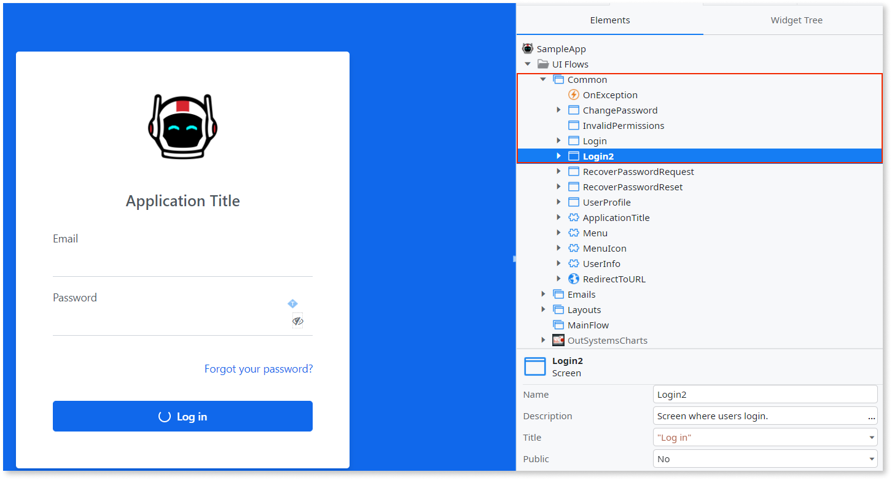
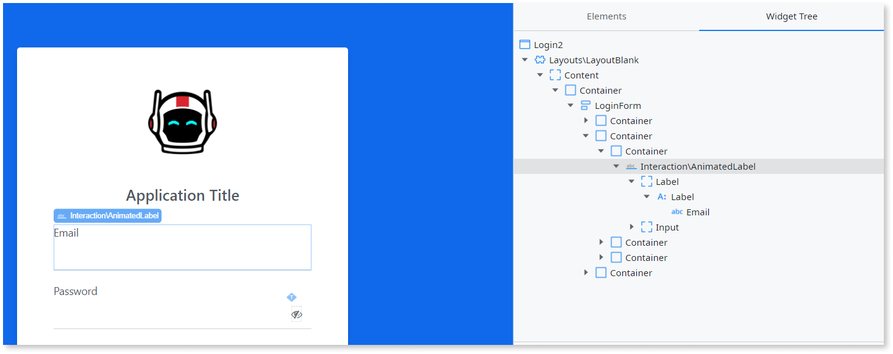
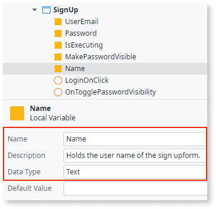

# Create a screen for users to self-register

To enable users to self-register to access your app, you can provide end-users with a login screen requiring them to enter their name and email address.
  
To create a self-registration flow, open ODC studio and follow the steps below:

1. From the **Interface** tab, click **UI Flows**. Then from the Common folder copy and paste the Login screen into the same folder. This creates a copy of Login screen named Login2.

    

1. From the Common folder, click the **Login2** screen to display the form settings

1. On the form, change the name and title field to `Signup`, and for the description enter `screen where users sign up`.

    

1. From the **Interface** tab, click the **Widget Tree** > **Content** > **Container**, then rename LoginForm to `SignUpForm`.

1. From the canvas, click the email label and input the fields container on the screen, then do the following:
    1. Copy and paste the specified container into the same folder.
    1. Set the Style Classes property of the new container to `margin-top-base`.
    1. Rename the text in the old email label as Name.

    

1. From the **Elements** tab, click the **Sign-up screen** > **Under Variable** > **Add Local Variable** and name the new variable as `Name`, and the Data Type as `Text`. Assign the newly created local variable to the widget.

1. From the **Widget Tree**, delete the container with the label password and input field in the Widget tree for the Signup screen.  

1. From the Elements tab, delete these actions; TogglePasswordVisibility and loginOnClick. Then delete these local variables; IsPasswordVisible and Password.

1. In the **Signup** canvas, click the **Login** button and change the text from Log in to `Sign up` .

1. From the Toolbox, drag a button onto the canvas and place it after the **Sign-up** button and then name the button `Cancel`.

1. In the Properties panel for the cancel button, select `Common\Login` from the dropdown for the On Click event.

1. In the Properties panel for the cancel button under the **Style classes** property set the value for **Is Form Default** to No. Replace the class btn btn-primary with `btn margin-top-base` and set the Width property to set Fill.

    

You can now [create logic to register a user.](logic.md)
