# Use Theme Library for app branding

When you share a theme you increase consistency among your organization's apps. Using the same theme helps to increase brand awareness. This article provides guidance on how to create a theme library.

## Create theme library

From ODC Studio, click **Create** and select **Library**. Since this is a library, it's empty without anything inside **Interface**, **Logic**, and **Data**.

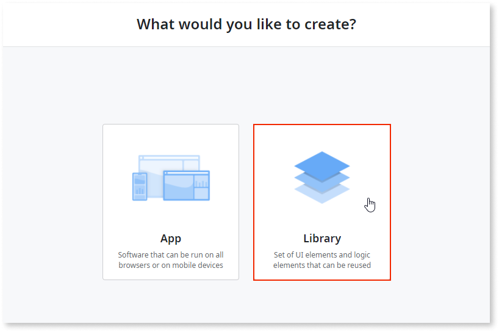

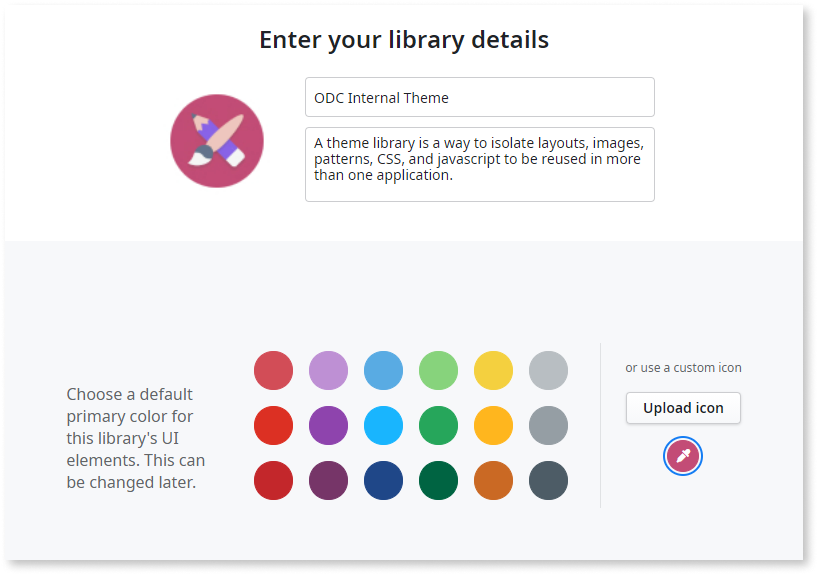

## Name the theme by following the recommended naming convention 

To create a theme, go to ODC Studio and from the **Themes** folder, in the **Interface** tab, create a new theme. Name it with the prefix `Theme_` and then add the name you prefer. For the default base theme, select **OutSystems UI**.

<div class="info" markdown="1">

If the **OutSystems UI** theme is unavailable, add a public element. Search for **OutSystems UI**, select it, and add the element. Then use it as the base theme.

</div>

Since there are no layouts yet, a message displays informing you to select a layout. In the next step add the layouts. Then select which layout will be the default layout for your theme.

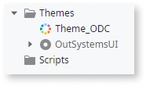

## Create the theme structure

You create the theme structure in ODC Studio. From the **Interface** tab, select **UI Flows**, and then create a new UI flow. From your existing app in the common flow, copy and paste the **Menu_Icon** and the **RedirectToURL** to the new flow in the library.


Now you can copy the layouts from another app to the theme library. Copy and paste the layouts flow from the app you built to the theme library and name it **Theme_layouts**. A few errors display on the **Application_Title** and **Menu_Icon**.

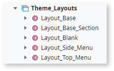

## Create the layout structure to reuse in apps

For the menu icon, go to each error and replace the block with the one available in the **Theme_Common flow**.

For errors related to the app title, add a placeholder instead of a block so you don't limit the app title to be the one from your theme. This lets you build multiple apps with different app logos. The placeholder lets developers add anything inside the area. Depending on the use case, you can use the placeholder or create a block with the app title, if the logo is going to be the same for every app.


If you decide to use a placeholder, from the  **Layout_Top_Menu**, select **LayoutWrapper** > **Header2** > **Container** > **Container** after the **MenuIcon** block drag the placeholder in the block and in the styles property, inside the Layout section, remove one col, and in the margin-left, remove the content inside.

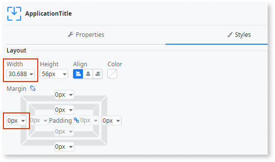

Select all images that are common between apps.

1. Copy and paste to the **Images** folder inside your library. 
1. Add the prefix of your library before each image name to be more accessible, identifying which images are in your apps.

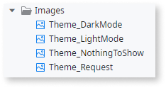

Select all the items that you want to make public and to be used by other apps.

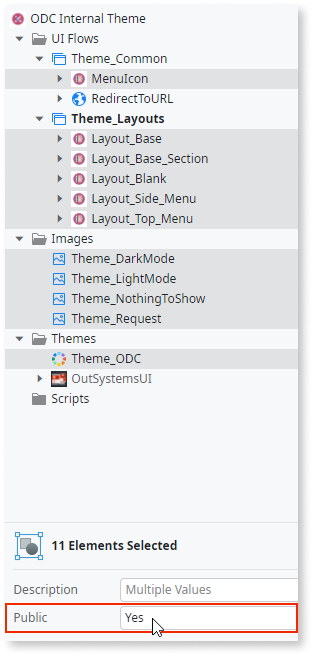

## Use the theme library in your apps

To use available layouts from your library in your apps, build a wrapper around the existing layout.

The wrapper gives you the ability to pre-set a few components in the layout. For example, a menu, app title, or a footer that already has the default content on every page.

By building a wrapper, every time a developer creates a page, this information is automatically on that page. Developers don't need to drag those components to the page.

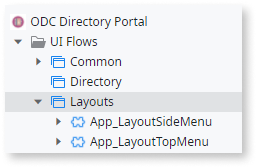

To create a well-configured wrapper, you need to add the same input parameters as the layout and set them inside the layout block. You also need to add the placeholders with the same names as in the layout from the theme.


Depending upon your use case, you have two different options. Use the option most applicable.

* **Option 1:** Adds a placeholder, and inside you add the block. For example if you have the header placeholder add the menu inside. This lets you have the menu on all pages, and if you drag the screen to the menu, you leverage the accelerator by creating a menu item. However, developers can add anything on the placeholder alongside the menu or even delete the menu reference.

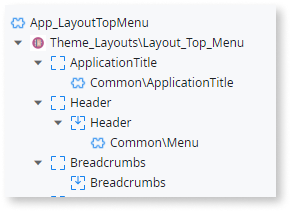

* **Option 2:** You don't need to add the placeholder and the **Menu** block directly. In this way, every time a developer creates a new screen, and the menu is already with the layout, developers can use the accelerator to drag a screen on top of the menu and automatically create the menu item. However, it's more maintainable and bulletproof because developers can change anything in the header. 

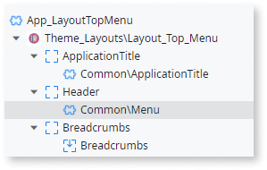

After setting the layouts, you must set the **App_LayoutTopMenu** in the app theme.

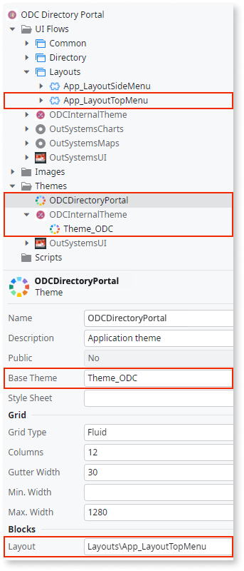

## Extra placeholders

Since you're adding extra placeholders, the default `ph` class to remove `divs` without content won’t work if the placeholder is empty. To make sure you can use the same behavior in the **OnReady** layout event, add the following script:

```
var emptyPh = document.querySelectorAll("ph:empty"); 
emptyPh.forEach(function (a) {
    a.parentNode.remove();
})
```

<div class="info" markdown="1">

This script can be converted to a global client action and used in any layout.

</div>

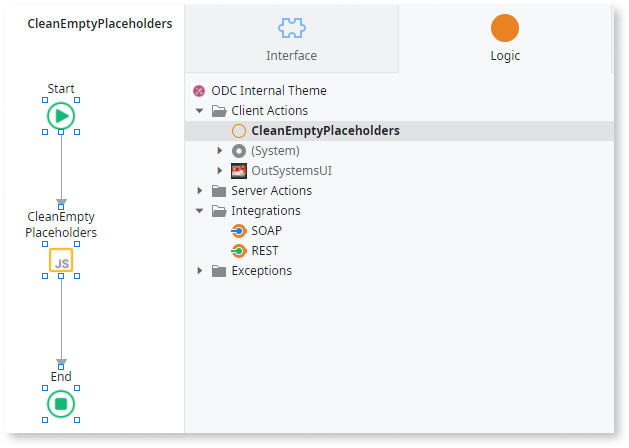


