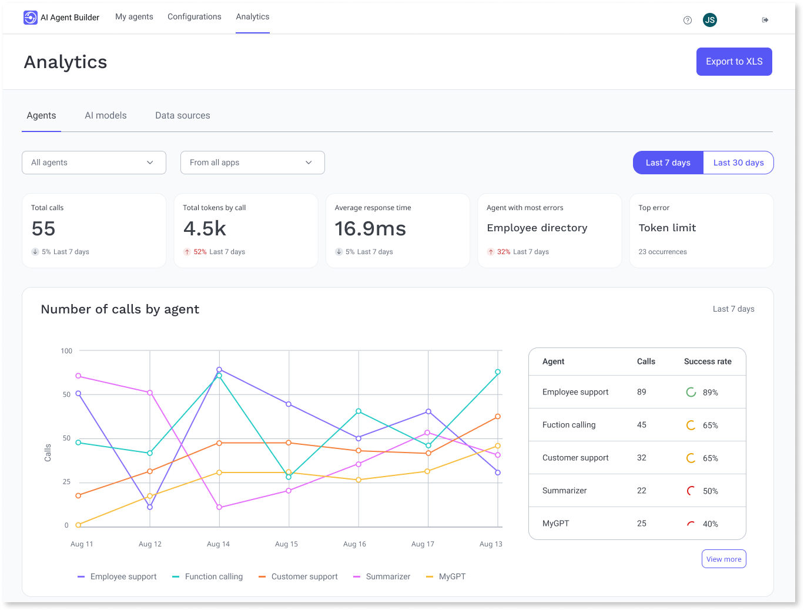

# Analyze agent

AI Agent Builder analytics provides insights into the usage of AI agents, models, and data sources. This helps you understand current costs and predict future allocations based on usage patterns. Additionally, you can troubleshoot latency issues without accessing logs in the ODC Portal.

AI Agent Builder only displays logs for requests to external services made through AI Agent Builder. The log metrics are based on agent requests, not large language model(LLM) requests. The AI Agent builder logs allow you to understand the:

* Costs of AI models and analyze the performance of AI models.
* Usage of AI Agent Builder agents by analyzing volume of requests.

## Optimize usage of agent

To overview the costs, performance, and usage of the available AIAB models, follow these steps:

1. Go to **AI Agent Builder > Analytics** to view your current agents' usage metrics.

1. Click **AI Models** to display your current models' usage metrics.

1. Click **Data Sources** to display your current data source usage metrics.

You can also export usage data of AI agents, models, and data sources for custom analytics.

## Troubleshooting AI agents

When an agent runs, errors can occur during requests to models or search services. To troubleshoot AI Agent Builder agents, use the Logs and Traces. OutSystems samples traces to highlight relevant information. For more information, refer to [Sampling in Traces](../../monitor-and-troubleshoot/traces/intro.md#sampling-in-traces).
