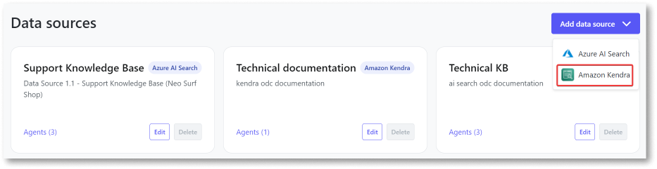

# Add the Amazon Kendra data source to the AI Agent Builder app

You can add an external data source to the AI Agent Builder app and use the Amazon Kendra search service. This allows you to leverage the foundation models to create generative AI-powered search experiences on top of your enterprise data content. This article explains how to add a data source for Amazon Kendra. It is intended for administrators and DevOps engineers responsible for setting up the AI Agent Builder app.

## Prerequisites

Before you add a data source for Amazon Kendra in the AI Agent Builder app, ensure you:

* [Set up Amazon Kendra data source](configure-aws-data-source.md).

* Gain access to the AI Agent Builder app with the **Configurator** role assigned in the ODC portal. 

## Add Amazon Kendra data source

To add a data source for the Amazon Kendra search service, follow these steps:

1. Log into the AI Agent Builder app. 

1. Click **Configurations**. 
A list of all configured AI models and data sources is displayed. 

1. Click **Add data source** and select **Amazon Kendra.** 
The Add data source page displays.

1. Enter the following details:

    * **Name** - An identifiable name for the data source.

    *  **Description** - (Optional) Description of the data source.  

    * **Region** - Choose the geographical[ AWS region](https://docs.aws.amazon.com/accounts/latest/reference/manage-acct-regions.html) the account can use.

        This region must match the region specified when creating the user in the AWS console. 
        
    *  **Index Id** - Index ID retrieved from the AWS console.

    *  **Access key** - The access key ID of the user created while setting up the Amazon Bedrock FMs.

    *  **Secret key** - The secret key of the user created while setting up the Amazon Bedrock FMs. 

        For more information about managing access keys, refer to [Managing access keys for IAM users](https://docs.aws.amazon.com/IAM/latest/UserGuide/id_credentials_access-keys.html).

5. Click **Test connection and save**.

    Now, you can use the data source to create agents and improve the quality of responses by grounding the model on your data. 

   Once you've added the data source, you are redirected to the **Configurations** page. A confirmation message is displayed confirming that the data source has been added successfully. You can also view the newly added data source on the **Configurations** page. If adding the data source fails, an error message is displayed. 

    You can **edit** the fields of the data source and **delete** the data source from the AI Agent Builder app in case you no longer need the data source or have changed providers.

## Next steps

* [Create an agent](../create-agent.md) 

* [Integrate the agent into your app](../integrate-agent.md) 
