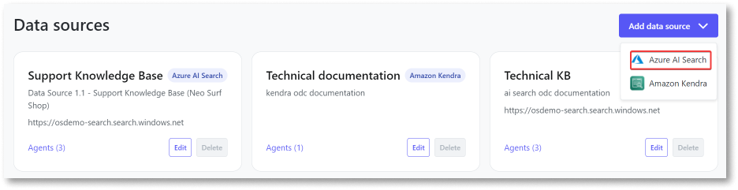

# Add Azure AI Search data source to the AI Agent Builder app

You can add an external data source to the AI Agent Builder app and use Azure AI Search with Azure OpenAI language models. This allows you to create search solutions using your data to generate responses. This article explains how to add a data source for Azure AI Search. It is intended for administrators and DevOps engineers responsible for setting up the AI Agent Builder app.

## Prerequisites

Before you add Azure AI Search data source, ensure you:

* [Configure Azure AI Search with blob storage in the Azure portal](configure-azure-data-source.md).

* Obtain the API key, endpoint URL, and index name.

* Gain access to the AI Agent Builder app with the **Configurator** role assigned in the ODC portal.

## Add Azure AI Search data source

To add Azure AI Search data source, follow these steps:

1. Log into the AI Agent Builder app.

1. Click **Configurations**.
A list of all the configured AI models and data sources is displayed.

1. Click **Add data source** and select **Azure AI Search**.
The **Add data source** page displays.

    

1. Enter the following details:

    * **Name** - An identifiable name for the data source.

    * **Description** - (Optional) Description of the data source.  

    * **URL** - REST API endpoint retrieved from the Azure portal.

    * **Index name** - Name of the index created in the Azure portal.

    * **API version** - (Read only) Identifies the Azure AI Search [Rest API](https://learn.microsoft.com/en-us/rest/api/searchservice/) version

    * **API key** - API key for use on every API request.

    For more information about retrieving the URL and the API key, refer to [Copy a key and URL](https://learn.microsoft.com/en-us/azure/search/search-get-started-rest#copy-a-key-and-url).

1. Click **Test connection and save**.

    Now, you can use the data source to create agents and improve the quality of responses by grounding the model on your data.

   Once you've added the data source, you are redirected to the **Configurations** page. A confirmation message is displayed confirming that the data source has been added successfully. You can also view the newly added data source on the **Configurations** page. If adding the data source fails, an error message is displayed.

    You can **edit** the fields of the data source and **delete** the data source from the AI Agent Builder app in case you no longer need the data source or have changed providers.

## Next steps

[Create an agent](../create-agent.md)

[Integrate the agent into your app](../integrate-agent.md)
