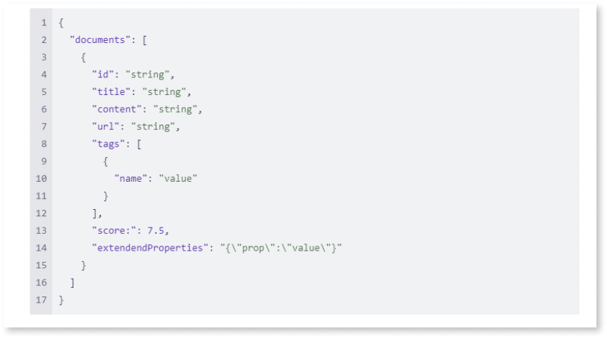

# Custom data source API contract

You can use the following API contract to implement your retrieval logic and integrate it with AI Agent Builder.

The API is a REST service available via POST method.

The following tables detail the input and output parameters.

## HTTP Parameters

| Parameter | Description | Mandatory/Optional |
|----------|----------|----------|
| endpoint    | Url to be called   | Mandatory  |
| HTTP Headers (List of key-value pairs)    | Allows support sending HTTP headers required by service. Example, authentication headers API Key: xxxx or Access-Key: xxxx Access Secret: xxxx   | Optional  |

## Input

| Parameter | Description | Mandatory/Optional |
|----------|----------|----------|
| index    | Allows to specify the index identifier   | Optional   |
| searchText    | The text to be searched   | Mandatory   |
| tags    | A list of key-value pairs to filter the results   | Optional   |
| pageSize    | Maximum number of results to return   | Optional   |
| pageNumber    | To support pagination.(initial page: 1)   | Optional  |
| scoreLimit    | The score below which the results are not considered.   | Optional   |
| extraBody   | JSON text that will be embedded into the upstream payload. This allows passing parameters unsupported by this service that the caller knows is supported by the upstream provider.   | Optional   |

## Output

| Parameter | Description | Mandatory/Optional |
|----------|----------|----------|
| documents    | list of documents   | Mandatory   |

## Output - Document

| Parameter | Description | Mandatory/Optional |
|----------|----------|----------|
| id    |    |    |
| title    |    |    |
| content    |    |    |
| url    |    |    |
| tags    | A list of key-value pairs   |    |
| score    |    |    |
| extraBody    | A JSON object that allows developers to include additional information that is relevant for their application when using this service.   |    |

## Request

## Response

## Errors

Errors are returned with a message and a HTTP status code.

| HTTP Status Code | Name | Details |
|----------|----------|----------|
| 400    | Access Denied   |    |
| 400    | Invalid Inputs   |    |
| 500    | Internal Failure   | Used for errors that weren't handled by the service.    |
