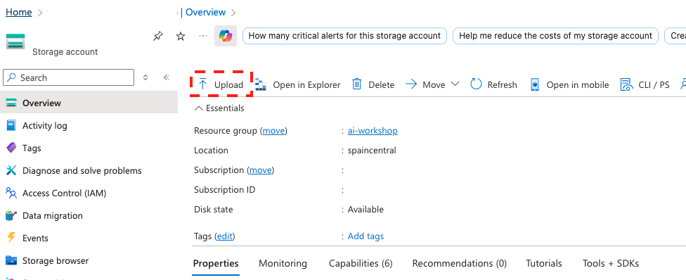
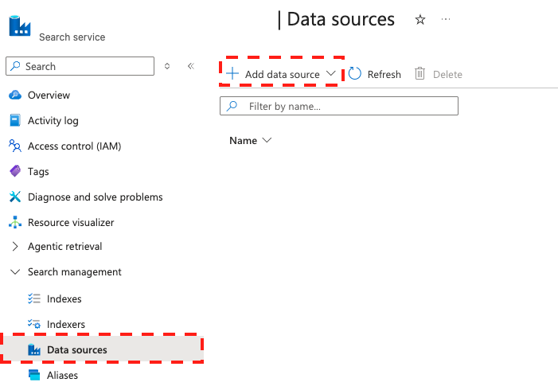
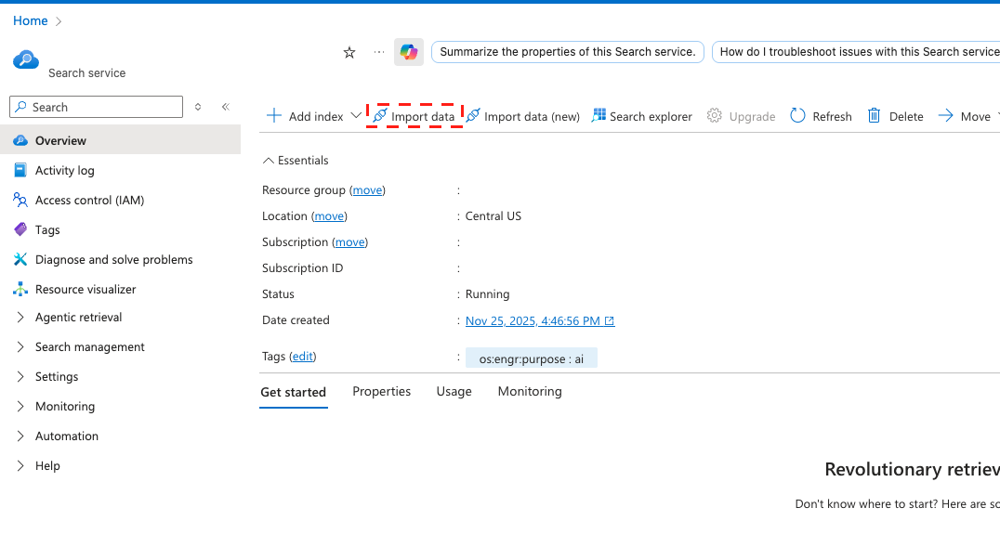

# Set up Azure AI search with blob storage

[Azure AI Search](https://learn.microsoft.com/en-us/azure/search/search-what-is-azure-search), an AI-powered information retrieval platform, helps you to build search experiences and generative AI apps that combine large language models with enterprise data. With Azure AI search, you can integrate an external data source, such as your internal knowledge base, to supplement the AI model's internal representation of information and improve the quality of the AI-generated response. This article explains how to configure Azure AI search with [Azure blob storage](https://learn.microsoft.com/en-us/azure/storage/blobs/storage-blobs-introduction#create-a-storage-account). It is intended for administrators and DevOps engineers with a good working knowledge of configuring search services using Azure OpenAI.

## Prerequisites

You must have an active Azure account subscription. if you don’t already have one, you can [sign up](https://azure.microsoft.com/en-us/free/) for an Azure account

## Configure Azure AI search service

To configure Azure AI search service, follow these steps:

1. Log into the Azure portal and sign in with your subscription username and password.

2. [Create](https://learn.microsoft.com/en-us/azure/search/search-create-service-portal) an Azure AI search service.

    **Note**: Once you create the AI search service, deploying it can take some time before you can proceed to the next step.

3. [Create](https://learn.microsoft.com/en-us/azure/storage/common/storage-account-create?tabs=azure-portal) an Azure BLOB storage account.

For more information about Azure BLOB storage, refer to [Introduction to Azure Blob Storage](https://learn.microsoft.com/en-us/azure/storage/blobs/storage-blobs-introduction#create-a-storage-account).

4. Upload your files.

5. From AI search service, add data source.

6. Choose existing connections and select the storage account and the container created on step 3 and save.

7. From AI search service, import data and select the data source you just added.

9. Follow the wizard.

    **Note**: Wait for few moments, and click the indexer to ensure that the run is finished with all the documents you added.

10. Go to the index, and validate that the content field can be retrieved.

    **Note**: The content index is mandatory. The content field must be of type string, and the field name must be in lowercase.

11. Retrieve the Azure AI search [service keys and the endpoint](https://learn.microsoft.com/en-us/azure/search/search-get-started-rest#copy-a-key-and-url).

12. Copy the name of the index.

13. Use the service key, endpoint, and index name to add an Azure AI data source in the AI Agent Builder.

## Next steps

[Add Azure AI search data source in the AI Agent Builder app](add-azure-data-source-to-aibuilder.md)
