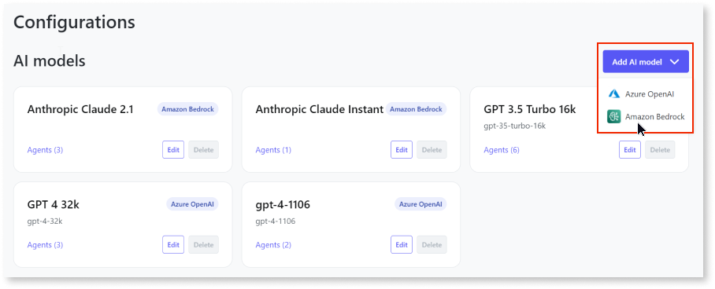

# Add Amazon Bedrock AI model to the AI Agent Builder app

To use Amazon Bedrock AI models, you must add the Bedrock AI models to the AI Agent Builder app. This article explains how to add the Amazon Bedrock AI model to your AI Agent Builder app. It is intended for administrators and DevOps engineers responsible for setting up the AI Agent Builder app.

## Prerequisites

Before you add an Amazon Bedrock AI model in the AI Agent Builder app, ensure that you:

* [Set up Amazon Bedrock foundation models](configure-aws-model.md).

* Obtain the secret key and access key from the AWS console.

* Gain access to the AI Agent Builder app with the **Configurator** role assigned in the ODC portal.

## Add Amazon Bedrock AI model

To add the Amazon Bedrock model to the AI Agent Builder, follow these steps:

1. Log into the AI Agent Builder app.

The first time you log into the AI Agent Builder, it’s mandatory to add a model. You can follow the instructions provided in the pop-up message. To add additional models, follow these steps:

1. Click **Configurations**.
A list of all configured AI models and data sources is displayed.

1. Click **Add AI model** and select **Amazon Bedrock**.
The Add AI model page displays.

    

1. Enter the following details:

    * **Name** - An identifiable name for the AI model.

    * **Description** - (Optional) Description of the AI model.

    * **Region**-  Choose the geographical[ AWS region](https://docs.aws.amazon.com/accounts/latest/reference/manage-acct-regions.html) the account can use.

        This region must match the region specified when creating the user in the AWS console.

    * **Model** - Choose the model you want to add to the app.\

    * **Access key** - The access key ID of the user created while setting up the Amazon Bedrock FMs.

    * **Secret key** - The secret key of the user created while setting up the Amazon Bedrock FMs.

    For more information about managing access keys, refer to [Managing access keys for IAM users](https://docs.aws.amazon.com/IAM/latest/UserGuide/id_credentials_access-keys.html).

1. Click **Test connection and save**.

Once you've added the model, you are redirected to the **Configurations** page. A confirmation message is displayed confirming that the AI model has been added successfully. You can also view the newly added model on the **Configurations** page. If adding the model fails, an error message is displayed.

You can **edit** the fields of the model and **delete** the model from the AI Agent Builder app in case you no longer need the AI model or have changed providers.

## Next steps

* [Create agent](../create-agent.md)

* [Configure data source](../configure-data-source/configure-aws-data-source.md)
