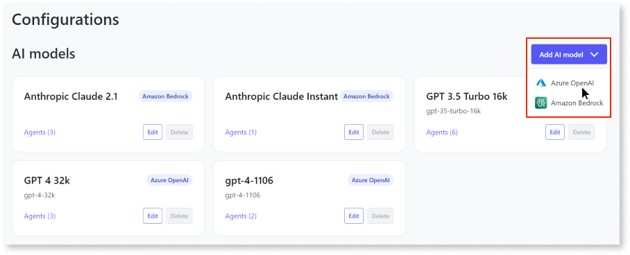

# Add Azure OpenAI model to AI Agent Builder app

You can add the Azure OpenAI model in your AI Agent Builder app to use OpenAI’s models to create agents and develop generative AI applications.  This article explains adding the Azure OpenAI model to your AI Agent Builder app. It is intended for administrators and DevOps engineers responsible for setting up the AI Agent Builder app.

## Prerequisites

Before you add an Azure OpenAI model to the AI Agent Builder app, ensure that you:

* Configure and deploy [Azure OpenAI service](./configure-azure-model.md). 

* Obtain the following from the Azure portal:
    * OpenAI registration keys.
    * Endpoint URL
    * Deployment name
    
* Gain access to the AI Agent Builder app with **Configurator** role in ODC portal.

## Add Azure OpenAI model

To add the Azure OpenAI model, follow these steps:

1. Log into the AI Agent Builder app. 

The first time you log into the AI Agent Builder, it’s mandatory to add a model. You can follow the instructions provided in the pop-up message. To add additional models, follow these steps:

1. Click **Configurations**. 
A list of all your configured AI models and data sources display.

1. Click **Add AI model** and select **Azure Open AI**. 
The Add AI model page displays.

1. Enter the following details:

    * **Name** - An identifiable name for the AI model.

    * **Description** - (Optional) Description of the AI model. 

    * **Endpoint** - Azure OpenAI Service endpoint retrieved from the Azure portal.

    * **Deployment name** - Azure OpenAI Service deployment name retrieved from the Azure portal.

    * **API version** - (Read only) Identifies the Azure OpenAI Service [Rest API](https://learn.microsoft.com/en-us/azure/ai-services/openai/reference) version

    * **API key** - Azure OpenAI API key retrieved from the Azure portal.

        You can use either one of the keys retrieved from the portal. 
        
        For more information about retrieving the endpoint, deployment name, and the API key, refer to Retrieve[ key and endpoint](https://learn.microsoft.com/en-us/azure/ai-services/openai/quickstart?tabs=command-line%2Cpython&pivots=programming-language-python#retrieve-key-and-endpoint).

1. Click **Test connection and save**.

Once you've added the model, you are redirected to the **Configurations** page. A confirmation message is displayed confirming that the AI model has been added successfully. You can also view the newly added model on the **Configurations** page. If adding the model fails, an error message is displayed. 

You can **edit** the fields of the model and **delete** the model from the AI Agent Builder app in case you no longer need the AI model or have changed providers.

## 	Next steps

* [Create agent](../create-agent.md)

* [Configure data source](../configure-data-source/add-azure-data-source-to-aibuilder.md)
