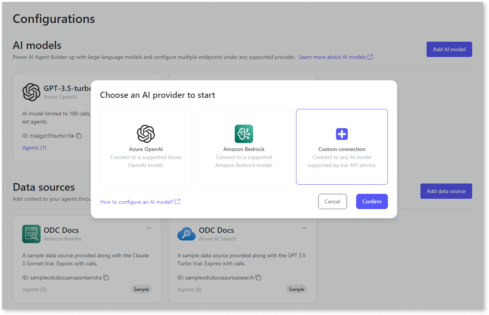

# Add a custom AI model 

You can add a custom AI model to the AI Agent Builder to support any Large Language Model (LLM). A custom model allows you to fine-tune and tailor the model's behavior. This customization can enhance performance and improve accuracy. 

## Prerequisites

To integrate a custom AI model, ensure you:

- Build an AI model connector in compliance with the [API contract](aiab-custom-model-api-contract.md) established by OutSystems.
- Gain access to the AI Agent Builder app with the Configurator role assigned in the ODC portal.

## Add a custom AI Model

To add a custom AI model, follow these steps:

1. Log into the AI Agent Builder app.
1. Go to the **Configurations** tab to display a list of all configured AI models and data sources.
1. Click **Add AI Model**.
1. Select **Custom connection**, and click **Confirm**.
  
1. Enter the AI model details. To learn more about parameters, refer to [AI model parameters.](#ai-model-parameters)
1. Click **Add endpoint**.
1. Enter the endpoint details. To learn more about parameters, refer to [AI model parameters.](#ai-model-parameters)
1. Click **Add header**.
1. Enter the authentication headers required for your custom-built AI model connector. To learn more about parameters, refer to [AI model parameters.](#ai-model-parameters)

You can add more endpoints and adjust their priority level order. You can edit the fields of the model and delete the model from the AI Agent Builder app if you no longer need the AI model or have changed providers.

## Build an AI model connector

To build an AI model connector, follow these steps:

1. Build the AI model connector for your LLM service according to the OutSystems API contract.
  * Set up the endpoints to be accessible via HTTP(S). You can either make the endpoint publicly discoverable or use a Private Gateway. To learn more, refer to [Configure a private gateway](../../../manage-platform-app-lifecycle/private-gateway.md)
  * Ensure that AI model endpoints are synchronous, as the AI Agent Builder does not support asynchronous requests (streaming).
  * Implement authentication schemes for your REST endpoints.
2. Authenticate and integrate your AI model connector with the AI Agent Builder.

For more information about the OutSystems API contract, refer to [OutSystems API Contract](aiab-custom-model-api-contract.md).

## AI model parameters

The following are the parameters to add a custom AI model,

| Parameter name| Description | Notes |
|--|----|--|
| Name(AI model)  | An identifiable name for the AI model. | |
| Id              | Identifier for the AI model, Auto-filled with the Name field without blank spaces. You can also edit the field. |  |
| Description     |  Description of the AI model. | Optional |
| Name (endpoint) | An identifiable name for the endpoint. |  |
| Endpoint URL    | URL of the custom-built AI model connector. | |
| Status          | The current state of the AI model.  | Optional |
| Priority        | The priority level of the endpoint determines the order in which the agent utilizes it. For example, A priority 1 endpoint is used first. If it experiences an outage, the priority 2 endpoint takes over to prevent downtime.  | The first endpoint you add is always assigned the first priority. |
| Name (header)   | The name of the header  | |
| Value           | The value of the header | |

## Next steps

* [Configure data source](../configure-data-source/intro.md)
* [Create an agent](../create-agent.md)
* [Integrate the agent into your app](../integrate-agent.md)
