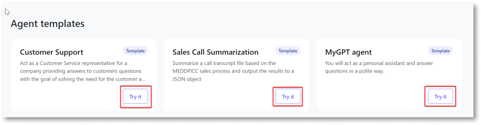
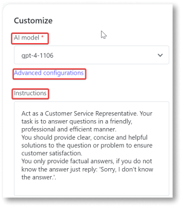
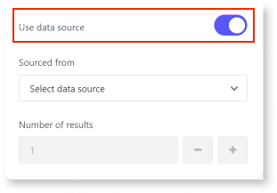
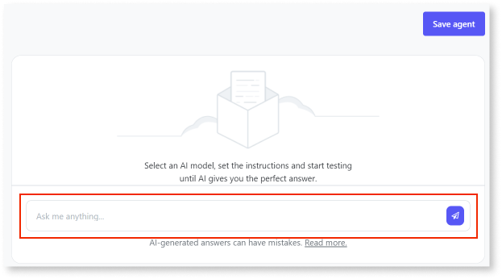
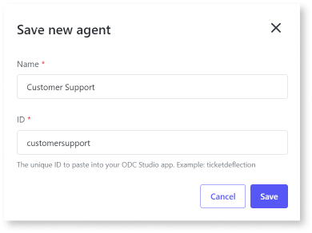
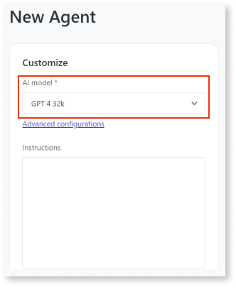
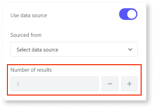

# Create an agent

With AI Agent Builder, you can create an agent from scratch or use the pre-built agent template with predefined instructions. This article explains how to create and customize an AI agent for your use case. It is intended for developers who want to create AI agents and integrate them into their existing apps.

## Prerequisites

Before you create an agent, ensure you have:

* An account in the ODC portal
* Access to the AI Agent Builder app
* At least one model was added to the AI Agent Builder app.
* (Optional) at least one data source was added to the AI Agent Builder app.

## Create an agent from agent templates

You can use pre-built agent templates to create agents for a specific use case. These templates have predefined instructions for the agents to create a desired response. You can choose an agent template that closely matches your specific use case and edit the configurations to customize the agent. For example, you can use the **Customer Support** agent template to create an agent that answers support questions. You can add an external data source, such as your internal knowledge base, to this agent template to supplement the AI model's internal representation of information and improve the quality of the AI-generated response.

To create an AI agent from pre-built agent templates, follow these steps:

1. Log into the AI Agent Builder app.

1. From the home page, choose the agent template that closely matches your use case.

1. Click **Try it**.

    

1. (Optional) Customize the agent.

    a. Choose a new AI model, modify the instructions, or add a new data source

    b. (Optional) To configure additional settings for the AI model. Click **Advanced configurations**  These settings vary depending on the AI model you choose. For detailed information about these advanced settings, refer to the respective AI model vendor documentation.

    

1. To specify an external data source:

    a. Toggle on **Use data source**.

    b. Choose a data source from the drop-down.

    

    The **Number of results** displays the total number of documents or pages used from the data source to generate a response.

1. To test your agent, enter sample queries in the playground. Modify your instructions based on the results until the AI generates the desired response.

    

1. Click **Save agent**. The Save new agent window pops up.

1. Enter a name for the agent. The agent ID automatically populates.

    

1. Click **Save**.

You can now use the agent ID to integrate the agent into your existing app.

## Create an agent from scratch

To create an AI agent from scratch, follow these steps:

1. Log into the AI Agent Builder app.
The home page displays.

1. From the homepage, click **Create agent**.

    

    The **New Agent** page displays.

1. Choose the **AI model** from the drop-down.

    

1. (Optional) Click **Advanced configurations** to configure additional settings for the AI model. These settings vary depending on the AI model you choose. For more information, refer to the respective AI model provider documentation.

1. Enter **Instructions** for the AI agent.

1. To specify an external data source:

    1. Toggle on **Use data source**.

    1. Choose a data source from the drop-down.

    The **Number of results** displays the total number of documents or pages used from the data source to generate a response.

    

1. To test your agent, enter sample queries in the playground. Modify your instructions based on the results until the AI generates a desired response.

1. Click **Save agent**. The Save new agent window pops up.

1. Enter a name for the agent. The agent ID automatically populates.

    

1. Click **Save**.

You can now use the agent ID to integrate the agent into your existing app.

Once the agent is successfully created, you can view the agent on the **My Agents** page.

At any point, you can:

* Search for an agent based on filters such as name, AI model, and data source.
* Copy the agent ID to integrate the agent into the app.
* Edit the agent's configurations. On editing the agent, the app integrated with the agent is automatically updated and the app's behavior is impacted.
* Delete the agent if you no longer use the agent. On deleting the agent, the app integrated with the agent throws an error message.

## Next steps

[Integrate the agent into your app](integrate-agent.md)
