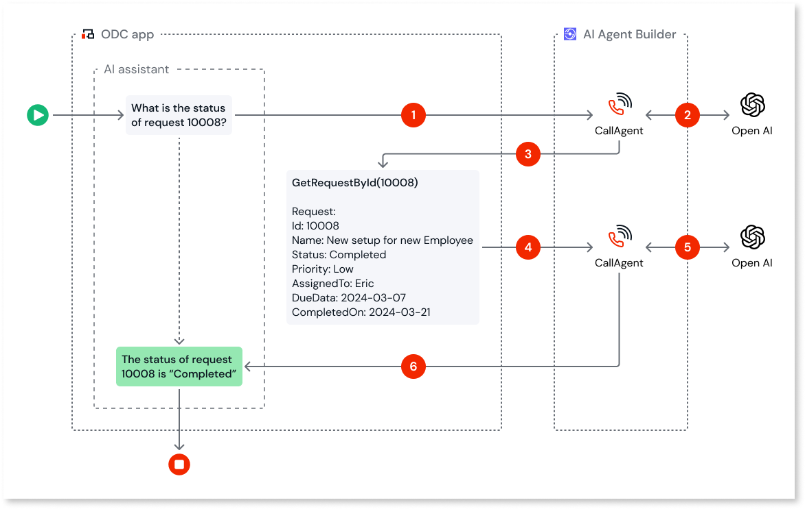

# Introduction to function calling

OutSystems supports function calling only on OpenAI models.

Function calling in AI refers to the capability of AI systems to interact with external functions or APIs to perform specific tasks. It involves invoking predefined functions or APIs from within the AI model. These functions can perform various operations, such as data retrieval, computations, or interfacing with other software systems. You can use function calling to define custom functions and provide these to an AI model. For example, you could define a function `get_flight_status` that takes a flight number parameter and returns the status of a specific flight using an airline API. You can pass this function to the AI model to generate natural language responses to airline status queries.

To use function calling, OutSystems enables you to define and declare functions in ODC Studio to perform specific tasks, such as querying over application data, and then pass these declarations to an AI model through CallAgent service action. This allows you to build an AI agent that can accept questions in natural language on data stored in the ODC app and receive responses in natural language. For example, you could ask a question about the company's sales database, “What's the average sale from last December?” and receive a summarization from an Agent. For detailed information, refer to [Use function calling in AI Agent Builder](use-function-calling.md).

## Use cases

With function calling, you can create AI agents that use OutSystems application runtime data as a data source and develop chatbots to do a variety of tasks such as:

* Get customer orders for meat or fish at the counter and translate them into supplier’s language.

* Provide call center agents with a summary of the call they had with a customer.

* Identify the most relevant resumes from a list of 460k resumes in an OutSystems database for a specific job description.

## How does function calling work

Here’s an overview of how function calling works in AI Agent Builder.

1. The AI assistant in the ODC app sends the user's question along with a list of all function declarations that the model can use to the AI Agent Builder via CallAgent service action.

1. The AI Agent Builder forwards the question and the function declarations to the AI model.

1.  The AI model identifies if any of the functions can be used to answer the user’s question and returns the function name and its parameters to the ODC app.

1. The ODC app invokes the respective function with its parameters, appends the function output to the user’s original question, and forwards the appended output to the AI Agent Builder via CallAgent service action.

1. The AI Agent Builder forwards appended output to the AI model to generate an answer.

1.  The AI model generates an answer in natural language and forwards it to the ODC app.

## Related resources

[Using function calling in AI Agent Builder](use-function-calling.md)
