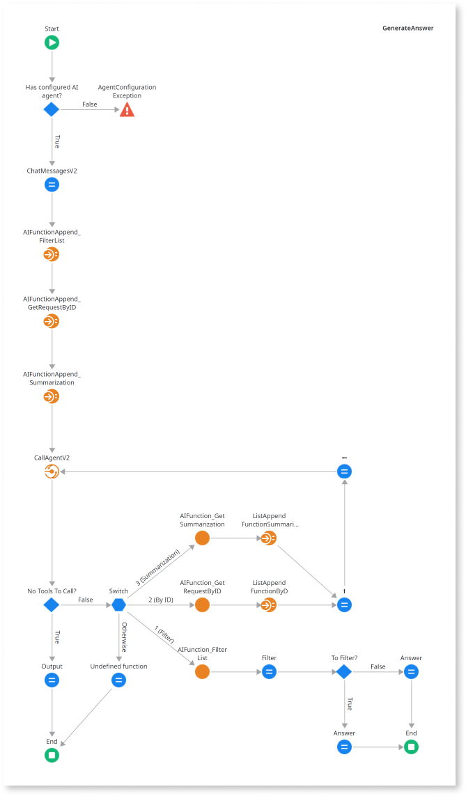

#  Use function calling in AI Agent Builder

Function calling support in AI Agent Builder allows you to create AI agents that can understand user's prompts in natural language, look up the necessary information from your application data or external data sources, and generate responses in natural language. 

Only agents configured with Azure OpenAI models support function calling.

## Prerequisites

Before you use function calling, ensure you have:

* Access to ODC Studio

* Access to AI Agent Builder

* Created an agent in the AI Agent Builder

* Identified a list of functions to be declared and passed on to the model

## Use function calling 

To use function calling support in AI Agent Builder, follow these steps in ODC Studio:

1. Define and declare a set of available functions using server action.

2. Pass the user's prompt, agent ID, and function declarations to the CallAgent V2 service action as input parameters. For detailed information, refer to [Input parameters](../../../reference/service-actions/call-agent-function-calling.md#input-parameters).

3. Invoke the specific function using the function name and parameters returned by the CallAgentV2 service action output parameters. For detailed information, refer to [Output parameters](../../../reference/service-actions/call-agent-function-calling.md#output-parameters).

4. Append the user’s prompt with the function output.

5. Pass the appended output to the CallAgentV2 service action so that the model can generate a natural-language response.

## Additional resources

* [Function calling overview](overview.md)

* [CallAgentV2 service action](../../../reference/service-actions/call-agent-function-calling.md)
