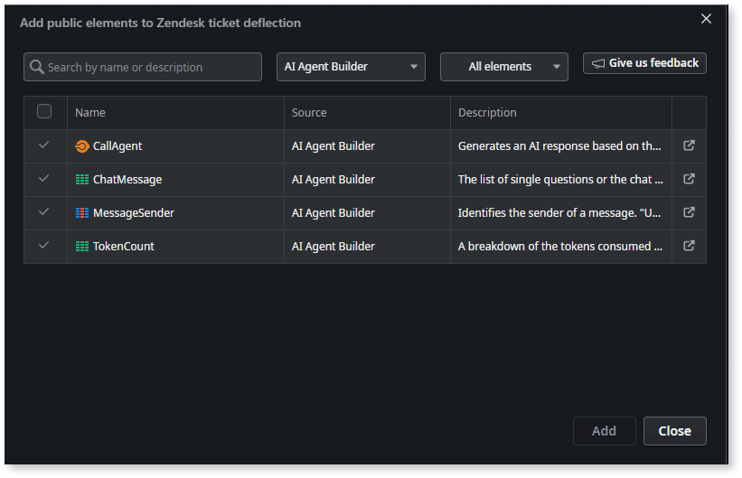
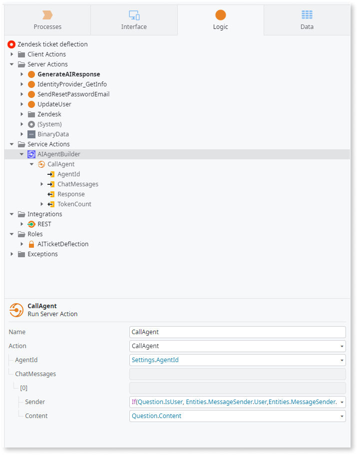
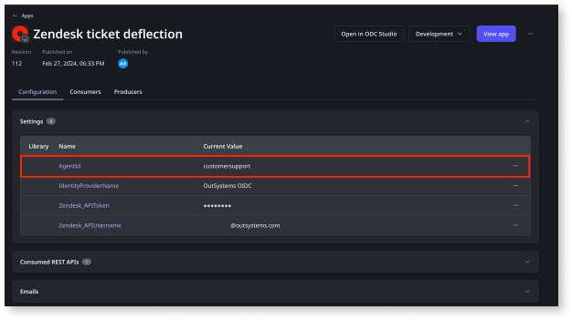

# Integrate agent into your app

You can create an agent in the AI Agent Builder and use that agent in your app by invoking the **CallAgent** [service action ](https://success.outsystems.com/documentation/11/developing_an_application/reuse_and_refactor/use_services_to_expose_functionality/)and configuring the agent ID. This article explains how to integrate the agent into your app.

## Prerequisites

Before you integrate the agent into your app, ensure you:

* [Create an agent](create-agent.md)
* Have access to the ODC portal.
* Create a setting in the ODC portal to store the AgentID. This setting is already created for the OutSystems’ sample apps. For detailed information, refer to [Configuration management](https://success.outsystems.com/documentation/outsystems_developer_cloud/configuration_management/).

## Integrate the agent

To integrate the agent into your app, follow these steps:

1. Access the app that you want to integrate the agent into.

1. Navigate to the **Add public elements** icon on the top toolbar of ODC Studio or use the **Ctrl+Q** shortcut.
The public elements page  displays.

1. Search for **AI Agent Builder** and add the **CallAgent** service action.

    

1. Configure the following information for the service action:

    **AgentId** - Identifier of the agent that AI uses to generate the response. OutSystems recommends creating a setting to hold this value, as you need different values in different stages. The AgentID is automatically populated from the app settings. 

    **ChatMessages** - A list of chat messages exchanged between the agent and the user from oldest to newest. The AI model uses these chat messages to generate the response.

    **TokenCount** - A breakdown of tokens consumed in the CallAgent request.

    The output response is stored in the **Response** output variable.

    

1. Copy the Agent ID from the AI Agent Builder app.

1. Go to **ODC Portal>Apps**, select the app you just built, and   then change the value of the AgentId setting (make sure you select the correct stage).

    
