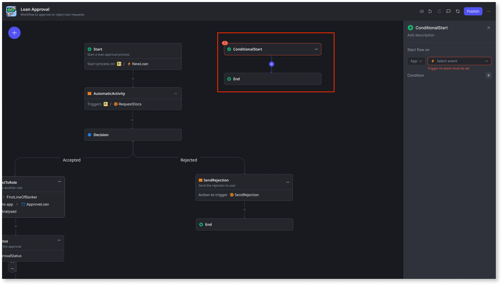

# Start a workflow based on specific conditions

When implementing your workflow, you can use a **Conditional Start** node to trigger a flow that only executes when certain events are triggered and defined conditions are met after the main workflow has started. For example, in a loan approval workflow, you can use a conditional start to trigger a flow for loan cancellation. You can add as many conditional start flows as you need to your workflow.

**Note**: As long as a workflow instance is running, the conditional start is always listening for the trigger event and any defined conditions.

When an **End** node is reached in a conditional start flow, the main workflow continues executing until it reaches an **End** or **Terminate** node, at which point the workflow instance status changes to **Done**.

When an **End** node in a main workflow is reached, but there are still active conditional start flows running, the workflow instance's status does not change to **Done** until each running conditional flow reaches an **End** node or at least one reaches a **Terminate** node.

When a **Terminate** node is reached in a conditional start flow:

1. Any **ongoing activities** (except automatic activities) are interrupted and their status changes to **Terminated**.

1. Any ongoing **automatic activities** are executed. Once finished, their status changes to either **Completed or Error**.

1. The **workflow instance** status changes to **Done**.

## Add conditional start

To include a **Conditional Start** in your workflow, follow these steps:

1. From the workflow editor, click the (+) icon and select **Conditional Start**.

    

    The conditional start flow always appears on the right side of the main flow.

    

1. Add the event and define any conditions that will trigger the conditional start flow.

    **Note**: Each conditional start only starts listening for events after the main flow starts its execution.

    

1. Add the necessary activities to your conditional start flow.

    You can add all activity types inside a conditional start flow except other conditional starts. Go-to nodes can only be added after a decision node. 

    

    The conditional flow ends with either an **End** or **Terminate** node. 

## Next steps

* [Add human activity](add-human-activity.md)

* [Add automatic activity](add-automatic-activity.md)

* [Add decisions](add-decisions.md)

* [Add wait](add-wait.md)

## Related resources

* [Start a workflow](start-workflow.md)

* [Troubleshooting workflows](troubleshooting-workflows.md)

* [Deploy workflows](../../deploying-apps/deploy-apps.md)
