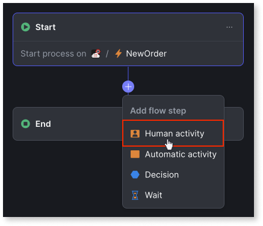
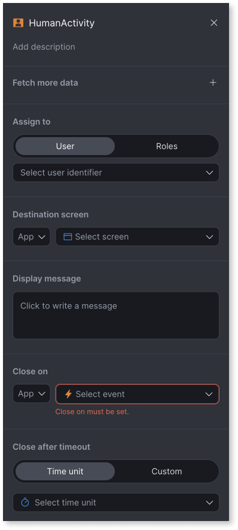

# Add human activity

When implementing your workflow, you can include tasks that need to be completed manually by an authorized person. This is accomplished by including an HumanActivity node in your workflow.

To include human activity in a workflow, follow these steps:

1. From the workflow editor, click the (+) icon between the two nodes and choose **Human activity**.

    

1. Enter the following details in the sidebar:

    

    a. **Add description**: (Optional) Brief description of the human activity task to be carried out.

    b. **Fetch more data**: (Optional) Select a service action from the ODC app. You can add multiple service actions from different apps. These service actions allow you to pass data from the app to the workflow and vice versa. For example, you can select a service action, GetUserDocs, from the Loans app and a service action GetManagerName from the Directory to pass the loan approval docs, and the loan approver manager name to the workflow. If the service action has one or more input parameters, enter values for the mandatory input parameters to execute the service action.

    c. **Assign to**: (Optional) Identifies who the human activity is assigned to. You can assign an activity to a **User ID** or a **Public role**. You can change the user ID programmatically at runtime using the [HumanActivityAssign](../../reference/system-actions/workflows.md#humanactivityassign) API to assign a task to a different user. For detailed information about roles in ODC, refer to [Roles](../../../eap/user-management/roles.md).
    
    d. **Destination screen:** (Optional) Select the public screen of your app where the assigned user must perform the human activity. If applicable, you can enter input parameters on this screen to pass context from the workflow to your app. For example, in a loan approval workflow, the destination screen can be form in an app where the manager verifies the loan documentation and approves or rejects the loan.

    **Note:** The destination screen is stored as a relative URL in the URL attribute of the system entity **HumanActivityInstance**. After the workflow revision is published, if the app name, screen name, or attributes of the destination screen are changed, the URL stored in the system entity becomes invalid. In such cases, you must re-publish the workflow and create a new revision.

    

     Your destination screen must provide clear instructions and the necessary UI elements for the user to perform the manual activity. The user's interaction on this screen, such as clicking a button or submitting a form, triggers the close on event that the workflow listens for to complete the human activity.

    

   
    e. **Display message**: (Optional) Use the expression editor to create a dynamic message that is displayed to the user on the destination screen or in their task list depending on how you build your UI. You can add more data using service actions so that more information and context is available for use within the scope of the expression editor. For example, you can set the Display message to `"Loan application to be approved by " + GetManagerName.name`. This message then appears on the destination screen where the manager is expected to review and approve the loan application.

    f. **Close on**: (Mandatory) Select the event and define the conditions that must be met for the human activity to be considered complete and for the workflow to proceed. This event is triggered in the ODC app when the human activity is completed by the user on the destination screen, for example, by clicking the Submit button. For detailed information about how to trigger an event in ODC, refer to [Trigger an event](../../building-apps/events/implement-events.md#trigger-an-event).

    For defining the conditions,
    
    * The left side of each condition is always one of the event's input parameters.
    * On the right side, you can select either a literal value or a value from a drop-down list.
    * The condition is considered true when the left side equals the right side.

     If the conditions are not defined, all human activities listening for the **Close on** event will end on the event's occurrence.

    If multiple conditions are defined, they are combined using the AND operator and evaluated together as True or False. For example, in a loan approval workflow, only when the event **LoanReview** occurs, and all conditions (DocsVerified=OK AND NumberDocsReviewed=NumberDocsSubmitted AND loanID=CustomerLoanID ) are simultaneously true, will the human activity be closed, and the workflow moves to the next step.

    g. **Close after timeout**: (Optional) Set a maximum duration for the human activity to remain open. If the **Close on** event and its conditions are not met within this timeframe, the human activity automatically closes, and the workflow proceeds. You can choose from predefined time units or define a custom expression. For detailed information, refer to [Implementing SLAs in workflows](sla-workflow.md)
    
    For scenarios where a human activity times out, you must implement error handling or alternative paths.

    Once the **Close on** event occurs and the conditions are met or the **Close after timeout** has reached whichever occurs first, the human activity status changes from **Waiting** or **Running** to **Completed**, and the workflow moves to the next step. For detailed information about different human activity states, refer to [Human activity status definitions](human-activity-states.md).

    You can use low-code APIs at runtime to open a human activity, assign a human activity to a different user, and release a human activity from a user. For detailed information refer to [Modify human activity at runtime](human-activity-states.md#modify-human-activity-at-runtime).

## Next steps

* [Build custom notifications](filter-workflows.md) 

**Implement workflows**

* [Add automatic activity](add-automatic-activity.md)

* [Add decisions](add-decisions.md)

* [Add wait](add-wait.md)

* [Implement SLAs in a workflow](sla-workflow.md)

## Related resources

**Online training**

* [How to add human activity to a workflow](https://learn.outsystems.com/training/journeys/building-workflows-in-odc-2690/how-to-add-human-activities-to-a-workflow/odc/7998)

**Troubleshooting**

* [Troubleshooting workflows](troubleshooting-workflows.md)
