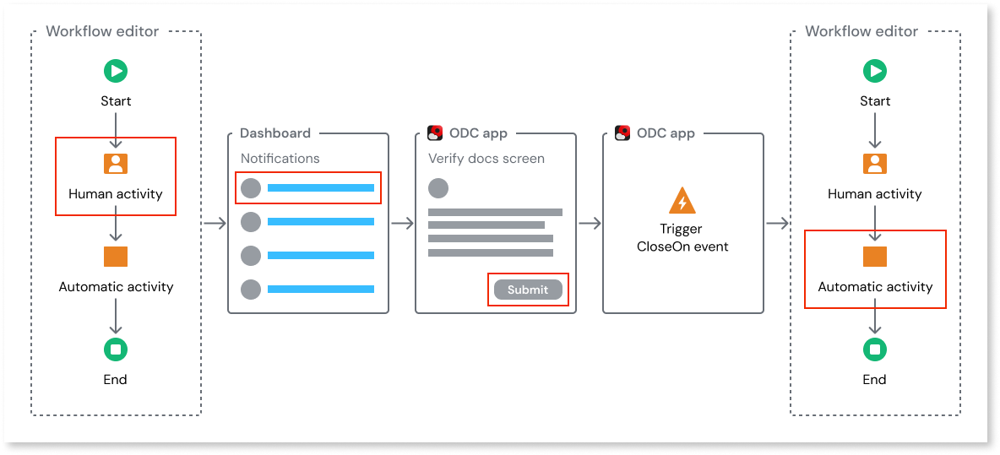

# Human activity in a workflow

When implementing your workflow, you'll encounter scenarios that require manual intervention from the users. Think of it as a designated point in your workflow where the app hands off a specific action to a person or a role within your organization. The user then completes the task through a form or screen in the app, and once it’s done, the app triggers an event to signal that the human activity is complete, allowing the workflow to move forward.

Here's the high-level process involved in completing a manual activity in a workflow:

1. The workflow reaches the human activity node in the workflow editor.

1. A custom notification is triggered and the app notifies the user of the pending manual task.

1. The user completes the manual task on the screen in the ODC app. Once the user completes the manual task, the close on event is triggered in the app.

1. On the trigger of the close-on event, the human activity node in the workflow editor is considered completed, and the workflow moves to the next step.

To integrate these manual tasks in your ODC workflow:

* Add the **HumanActivity** node in the workflow editor to include a manual task in your workflow.

* Configure  the **HumanActivity** node and select service actions from your app that can provide more context to the user and pass data to the workflow. For detailed information about how to add and configure **HumanActivity** node, refer to [Add human activity](add-human-activity-procedure.md).

* Develop the screen or form in your app where the user can perform the human activity.

* Develop custom notifications to remind users of the pending human activities. For more details, refer to [Build notifications to handle human activity](#build-notifications-to-handle-human-activity).

* From the screen, trigger the  event to close the human activity. For example, you can trigger the **Close on** event by clicking the Submit button on the screen. For detailed information about triggering events, refer to [Trigger an event](../../building-apps/events/implement-events.md#trigger-an-event).

Now, when the user completes the human activity on the screen, the **Close on** event is triggered, and the human activity in the workflow is considered completed, and the workflow proceeds to the next step. Optionally, you can configure a duration by which the human activity should be completed. For more details, refer to [Implement SLA's in human activity](#implement-slas-in-human-activity).

You can also use low-code APIs at runtime to open a human activity, assign a human activity to a different user, and release a human activity from a user. For detailed information, refer to [Modify human activity at runtime](human-activity-states.md#modify-human-activity-at-runtime).

## Build notifications to handle human activity

In ODC, you must develop your own custom notification system to remind users of the pending manual tasks. Here are some of the standard notification systems that can be implemented:

* Emails
* Interactive dashboards in apps
* In-app notifications
* Push notifications for mobile apps
* SMS/Text message notifications

ODC enables you to build these notifications using specific system entities. For example, you can build an interactive dashboard in your app that filters workflows by a specific human activity. For detailed information, refer to [Build UI components using workflow entities](filter-workflows.md).

## Implement SLAs in human activity

You can implement service level agreements (SLAs) for a human activity. For example, in your loan approval workflow, you can configure it so that the **DocumentReview** manual task is completed within the agreed-upon timeframe. For detailed information, refer to [Implementing SLAs in workflow](sla-workflow.md).

## Related resources

### Human activity states

* [Human activity status definitions](human-activity-states.md)

### Implement workflows

* [Add human activity](add-human-activity-procedure.md)
  
* [Implement SLAs in a workflow](sla-workflow.md)

* [Troubleshooting workflows](troubleshooting-workflows.md)

* [Deploy workflows](../../deploying-apps/deploy-apps.md)
