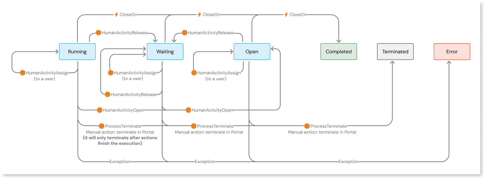

# Add human activity

When implementing your workflow, you can include tasks to be carried out by the end-user. This is accomplished by including a **HumanActivity** node in your workflow. 

In the workflow editor for **HumanActivityNode**:

* Specify a task and assign it to an end-user of your ODC app. You can change the user ID programmatically in ODC Studio using the [HumanActivityAssign](#programmatic-assign) API to assign a task to a different end-user. 

    **Note**: You must develop your own custom notifications using the **HumanActivityInstance** entity to remind users of pending tasks.

* Select the **Close on** event and set the conditions within the human activity. If the conditions are not set, all human activities listening for the **Close on** event will end on the event's occurrence.

After the human activity executes, its status remains Open, Running, or Waiting until the ODC app triggers the **Close on** event. In ODC Studio, you must build your own logic that triggers the **Close on** event to end the human activity. 

When the **Close on** event occurs, and conditions within the human activity are met, the human activity ends, and the workflow moves to the next step.

To include human activity in a workflow, follow these steps:

1. From the workflow editor, click the (+) icon between the two nodes and choose **Human activity**.

1. Enter the following details in the sidebar:

    a. **Add description**: (Optional) Brief description of the human activity task to be carried out.

    b. **Fetch more data**: (Optional) Select a service action from the ODC app. You can add multiple service actions from different apps. For example, you can select a service action, GetUserDocs, from the Loans app and a service action GetManagerName from the Directory app. If the service action has one or more input parameters, enter values for the mandatory input parameters to execute the service action. 

    c. **Assign to**: (Optional) Identifies who the activity is assigned to. You can assign an activity to a user ID or a Public role. 
    **Note:** You can change the User ID at runtime in ODC Studio using the **HumanActivityAssign** server action under **System**.

    d. **Destination screen:** (Optional) Select the public screen of your app where the user must perform the human activity. If applicable, you can enter input parameters in this screen to pass context from the workflow to your app.

    **Note:** The destination screen is stored as a relative URL in the URL attribute of the system entity **HumanActivityInstance**. After the workflow revision has been published, if the app name, screen name, or attributes of the destination screen are changed, the URL stored in the system entity becomes invalid. In such cases, you must create re-publish the workflow and create a new revision.
    
    e. **Display message**: (Optional) Click the text area to open the Expression Editor and edit the condition on the editor. You can add more data so that more information is available for use within the scope of the Expression editor.

    f. **Close on**: (Mandatory) Select the event and define the conditions within the human activity.  
    
    * The left side of each condition is always one of the event's input parameters.
    * On the right side, you can select either a literal value or a value from a drop-down list.
    * The condition is considered true when the left side equals the right side.
	
    If multiple conditions are defined, they are combined using the AND operator and evaluated together as True or False. For example, in a human document review scenario, only when the event **LoanReview** occurs, and both conditions (DocsVerified=OK AND NumberDocsReviewed=NumberDocsSubmitted) are simultaneously true, will the human activity be closed, and the workflow moves on to the next step.

    Once the event occurs and the conditions are met, **HumanActivityStatus** changes from **Waiting** or ****Running** to **Completed**, and the workflow moves on to the next step. 

## Modify human activity at runtime

At runtime from the ODC Studio, you can use the low-code APIs to do the following:
git 

* [Manually assign or re-assign human activity to a different user](../../reference/system-actions/workflows.md#humanactivityassign)

* [Open a human activity](../../reference/system-actions/workflows.md#humanactivityopen)

* [Release a human activity from a user](../../reference/system-actions/workflows.md#humanactivityrelease)

Here's the human activity status transition diagram that describes the status transitions of human activity node on execution of the low-code APIs.

For detailed information about different statuses, refer to [Statuses of workflow nodes](workflow-components.md#statuses-of-workflow-nodes).

## Human activity status definitions
 
At any given time, based on the progress of the human activity, the **HumanActivityNode** can be in one of the following statuses:

- **Running** - The human activity is currently being executed, such as when a service action is retrieving data.

- **Waiting** - The human activity is on hold, awaiting further action. For instance, it may be paused for manual intervention.

- **Completed** -  The human activity has finished, allowing the workflow to proceed to the next step.

- **Terminated** - The human activity and the entire workflow is terminated following the successful execution of the **ProcessTerminate** API.

- **Error** - The human activity encounters an issue, which can happen due to:
  * A failure in the service action it depends on.
  * Reaching the maximum number of retries without successful execution.
  * Temporary problems, such as a service being unavailable.

- **Open** - The human activity has been opened by an end-user but has not yet proceeded to execution.

## Next step

Create customized dashboards and screens where users can view and act on tasks assigned to them or their roles. For detailed information, refer to [Build UI components using workflow entities](filter-workflows.md).
