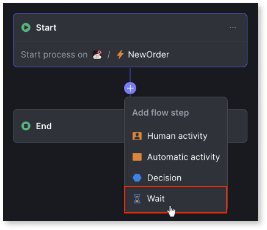
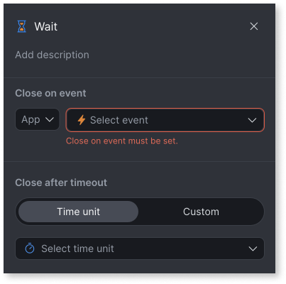

# Add wait

When implementing your workflow, you can include a **Wait** node in your workflow that puts your workflow execution on hold until the **Close on** event occurs and certain configured conditions are met  or the **Close after timeout** is reached.

When the **Close on** event occurs, and the configured conditions are met, the wait ends, and the workflow moves to the next step. For example, in a loan approval workflow, you can include a wait in a workflow until the credit score of a user is revised to a certain value and DocsVerified=OK. Once the credit score reaches a certain threshold and all documents are verified, the wait ends, and the workflow moves to the next step.

**Note**: A wait activity completes when either the Close On Event occurs or the Close after timeout is reached, whichever occurs first.

To include wait in a workflow, follow these steps:

1. From your workflow editor, click the (+) icon between two nodes and select the **Wait** process node.

    

1. Enter the following details in the sidebar:

    

    a. **Add description**: (Optional) Brief description of the wait and why it is needed in the workflow.

    b. **Close on**: (Mandatory) Select the event and define the conditions required to end the wait. You can specify one or more conditions for each event.

    * The left side of each condition is always one of the event's input parameters.

    * On the right side, you can select either a literal value or a value from a drop-down list.

    * The condition is considered true when the left side equals the right side.

    If multiple conditions are defined, they are combined using the AND operator and evaluated together as True or False.

    c. **Close after timeout**: (Optional) Set the timeout duration. You can choose from predefined time units (days, hours, minutes, and seconds), or you can define your own custom timeout expression.

Once the event occurs and the conditions are met or the **Close after timeout** is reached,, the wait ends, and the workflow moves on to the next step.

## Next steps

* [Add human activity](add-human-activity.md)

* [Add automatic activity](add-automatic-activity.md)

* [Add decisions](add-decisions.md)

## Related resources

* [Implement SLAs in a workflow](sla-workflow.md)

* [Troubleshooting workflows](troubleshooting-workflows.md)

* [Deploy workflows](../../deploying-apps/deploy-apps.md)
