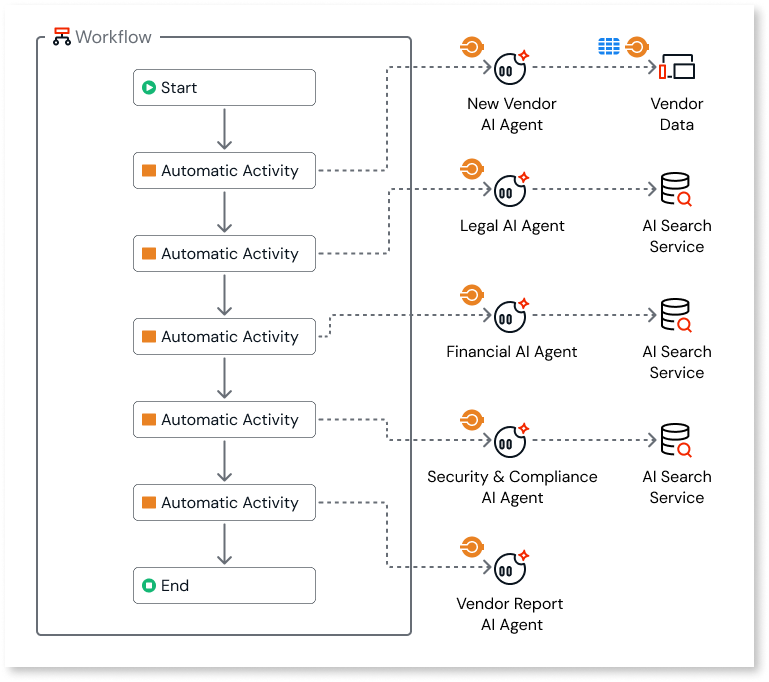
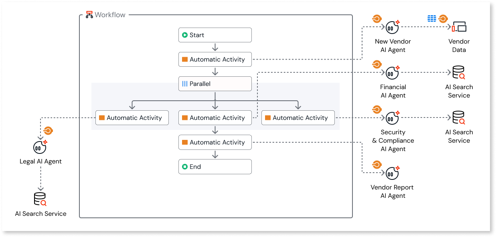
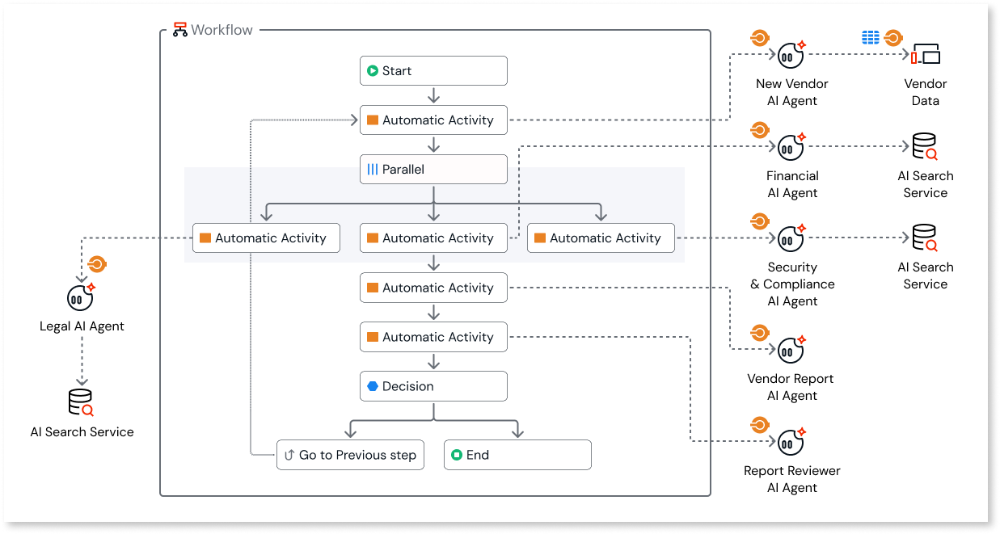
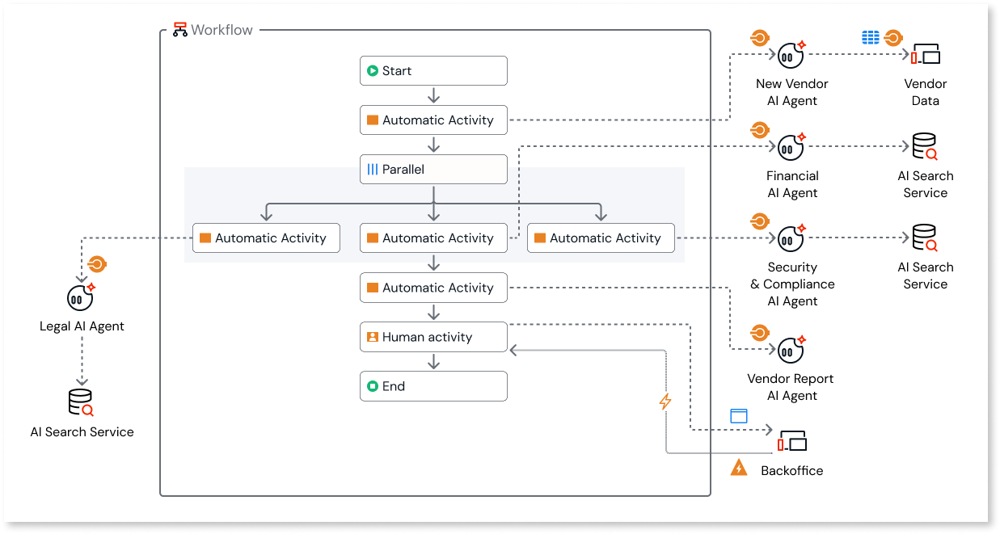

# Building agentic workflows

Combine the power of agents with ODC workflows to orchestrate complex, multi-step business processes. While agents provide reasoning and autonomy, workflows provide the structure, state management, and human oversight required for enterprise apps.

This document outlines the core patterns for integrating agents into your workflows to create intelligent, automated business processes.

## Call agents with automatic activities

In ODC, workflows interact with agents primarily through **automatic activities**. An automatic activity represents a step in the process that's completed by the system without human intervention.

To use an agent in a workflow, follow these steps:

1. Add an **automatic activity** to your flow.  
1. In the **Action to trigger**, call the specific **service action** for your agent app (for example, `CallVendorReviewAgent`).  
1. Pass the necessary inputs (such as a **SessionId**, document ID, or user query) to the service action.

Each agent has an independent lifecycle and can resort to action calling or RAG to complete tasks in each step of the workflow. With this pattern, you can chain multiple agents together sequentially. The output of one agent in an automatic activity becomes the input for the next, creating a linear pipeline of specialized tasks.

## Parallel workflow pattern

Use the **Parallel** flow element to execute multiple, non-dependent agent tasks simultaneously. This pattern significantly speeds up the overall process completion compared to running tasks sequentially.

For example, in a **New vendor contract review** process, you might need both a **Legal review** and a **Financial review**. These reviews don't depend on each other.

To implement this pattern, follow these steps:

1. Add a **parallel** element to your workflow.  
1. Create separate branches for each agent task (for example, one branch for the Legal Agent and another for the Financial Agent).  
1. Add an **automatic activity** to each branch to trigger the respective agent.  
1. The workflow waits for all branches to complete before proceeding to the next step.

## Loop workflow

Use a **Loop** pattern to iteratively refine an agent's output until it meets a specific quality standard. This is useful for tasks such as drafting content or generating code, where the initial result may require improvement.

To implement this pattern, follow these steps:

1. After the agent's automatic activity, add a **decision** node.
1. In the decision logic, evaluate the agent's output. For example, check if a Confidence Score is greater than 90% or if a validation check passes.
1. **If True (Valid):** The flow continues to the next step.
1. **If False (Invalid):** Connect the false branch back to a **previous step** (before the agent call). This reruns the agent, potentially with feedback or updated context, to generate a better result.

## Human-in-the-loop workflow

Agents may require human oversight for high-stakes decisions or when their confidence is low. You implement this using **human activity** blocks.

A human activity pauses the workflow until a specific user or group performs a task.

To implement this pattern, follow these steps:

1. Place a **Human activity** element in your workflow.
1. Assign the activity to a user or role (for example, `Vendor Manager`).
1. On the task screen, the human reviews the agent's output (for example, a generated report).
1. The human takes an action, such as clicking **Approve** or **Reject**.
1. This action triggers an event that closes the human activity, allowing the workflow to resume based on the human's decision.

## Related resources

For more information about workflows in ODC, refer to [Workflows in ODC](workflows-in-odc.md).

For more information about agentic capabilities in ODC, refer to [Agentic apps in ODC](../build-ai-powered-apps/agentic-apps.md).
