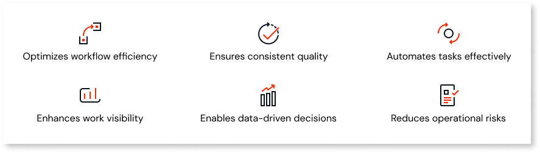

# About business processes

A business process is a series of structured activities or tasks that individuals or departments perform to achieve a specific goal. These activities are typically designed to produce a desired outcome, whether delivering a product, providing a service, or completing a project. 

For example, consider applying for a passport as a business process within a government agency. Just as a passport app involves several steps and interactions with different departments and officials, a business process in an organization comprises a series of tasks and procedures to accomplish a specific objective.

## Key benefits 

Business processes provide a systematic approach to managing work, ensuring tasks are completed consistently. Business processes help organizations adapt to change by providing a framework for managing and improving operations over time.

Here are some advantages of using a business process:

* Streamlines the workflow by defining clear steps and sequences for completing tasks, reducing redundancies, and eliminating bottlenecks. 

* Establishes standardized procedures, ensuring consistency and quality in outputs.

* Enables automation of repetitive tasks and notifications, leading to faster response times and increased cost savings.

* Provides visibility into the status of work, allowing for better monitoring and management.

* Generates data on business process performance, enabling informed decision-making for process optimization and improvement.

* Enables identifying and mitigating risks, reducing errors and operational failures.

## Use cases

Here are some use cases where you can implement business processes:

* **Expense approval:** Expense approval for an employee in an organization can be implemented as a business process that consists of a series of tasks, starting from raising a request, validating the documentation, approving or rejecting the expense request, and final reimbursement to the employee's bank account.

* **Order processing:** From receiving orders to shipping products, each step in the workflow can be systematically executed by implementing a business process to fulfill customer orders.

* **Customer support**: A customer support business process outlines the steps in addressing customer inquiries, from ticket creation to final resolution.

* **Invoice approval**: An invoice approval business process specifies the steps for reviewing and approving invoices, ensuring timely payment to vendors while maintaining financial controls.

* **Loan approval**: A loan approval business process identifies the tasks involved from the time a customer raises a loan request until the disbursement of the loan amount or rejection of the loan request.

## Related articles 

[Workflows in ODC](workflows-in-odc.md)

