# Compare workflow versions

In a real-world application, you are most likely ending up with multiple versions of a workflow as you and your make changes and improvements over time. Having the capacity to compare different versions of a workflow is crucial for maintaining the integrity of your application and ensuring that you can track changes effectively.

ODC lets you compare different versions of a workflow side by side. Use this to identify changes, understand how your workflow evolved, and confirm you're working with the correct version. You can do this comparison in three ways:

* **In the revision history**. Here you can compare any previous revision with your current work or the latest published version.
* **When opening a workflow**. Whenever you have unpublished changes that aren't based on the latest published revision, you can compare both versions before choosing which one to continue with.
* **When publishing a workflow**. If another user published a newer revision since you started editing, you can compare your changes with the new revision before publishing.

## Compare in the revision history

As long as your workflow has more than one revision, you can compare a previous revision with your current working state directly from the revision history panel. To do this:

1. Open the workflow in the Workflow Editor.

1. Open the revision history panel, by clicking **Ctrl + H** or by clicking the Open revisions history, available in the top right corner of the editor, under **More options**.

1. Select a previous revision from the revisions list.

1. Depending on your current working state, you see one of the following options:

    * **Compare with autosaved.** Available when you have unpublished changes. Compares the selected revision with your current unsaved work.
    * **Compare with the latest.** Available when you have no unpublished changes. Compares the selected revision with the latest published revision.

    **Note:** The latest published revision doesn't show a compare option because there is nothing newer to compare it with.

    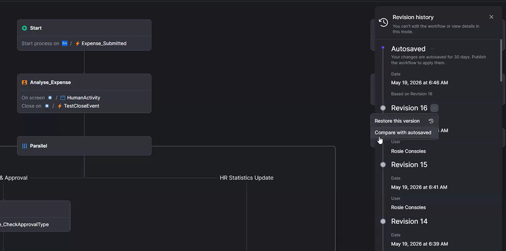

1. Click the **Compare with ...** option. The comparison view opens.

    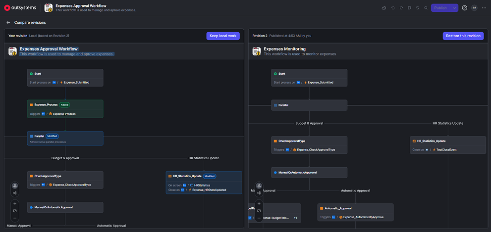

1. Review the differences between the two versions. See [Understanding the comparison view](#understanding-the-comparison-view).

1. Choose one of the available actions:

    * **Keep local work**. This closes the comparison view and returns you to editing your current version.
    * **Restore this revision**. This restores the selected revision, replacing your current working state.

## Compare revisions when opening a workflow

When you open a workflow with unpublished changes not based on the latest published revision, the editor shows a dialog. For example, a colleague published a new revision while you had unsaved work. The dialog asks you to choose which version to use. To do this:

1. Open the workflow from the ODC Portal. If that version as unpublished changes that aren't based on the latest published revision, the _Recover unpublished work?_ pops up. This pop up shows your autosaved version and the latest published revision.

1. Click Compare revisions to open the comparison view.

    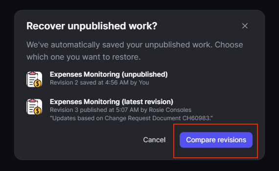

1. Review the differences between your autosaved version (left) and the latest published revision (right).

1. You must choose one of the following actions before you can continue, since you can't dismiss this dialog:
    * Click **Keep local work** above the left canvas to continue editing your autosaved version.
    * Click **Restore this revision** above the right canvas to open the latest published revision (this discards your unsaved changes).

    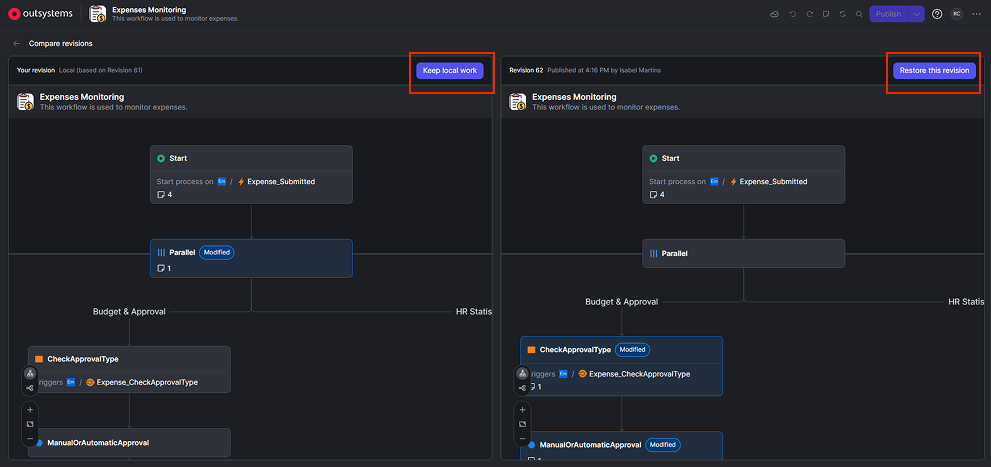

**Note:** This dialog only appears when both conditions are true: you have unpublished changes, and those changes build on an older revision (not the latest published one). If your unpublished changes already build on the latest published revision, the workflow opens normally.

## Compare revisions when publishing

When you try to publish a workflow and another user published a newer revision since you started editing, the publish dialog includes a Compare both versions option.
This lets you review the differences before deciding how to proceed. This happens when:

1. You click **Publish** in the Workflow Editor.

1. If a ODC detects a publish conflict, a pop up appears with the following options:

    * **Cancel**. Closes the dialog and returns you to editing your current version.
    * **Override with my version**. Publishes your current work, replacing the latest published revision.
    * **Compare both versions**. Opens the comparison view.

    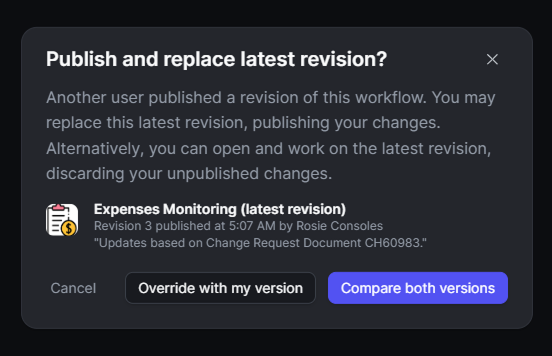

1. If you clicked Compare both versions, review the differences between your version (left) and the latest published revision (right). See [Understanding the comparison view](#understanding-the-comparison-view).

1. Then choose one of the following actions:

    * **Publish your work**. Publishes your version and returns you to the editor.
    * **Restore revision**. Discards your changes and restores the latest published revision.

    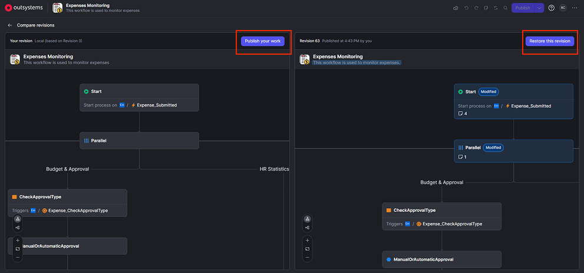

**Note:** This option only appears when your working session builds on an older revision than the latest published one.

## Understanding the comparison view

The comparison view shows two workflow canvases side by side:

* Left canvas. Always shows the newer or current version (your autosaved work or latest published revision, depending on the entry point).
* Right canvas. The latest published in case you are comparing to your autosaved or your selected revision.

The left canvas displays the local version (unsaved data) and the reference revision, which can be the latest published revision or an older restored one.

While the right canvas header displays the revision label, publication date, and the name of the person who published it.

If workflow metadata (title, icon, or description) differs between versions, the header highlights those differences.

### Color coding

Color coding highlights changes on nodes, connectors, and property values:

|Color|Meaning|
|--|--|
|Green|Added|
|Red|In Conflict|
|Blue|Modified/Deleted|

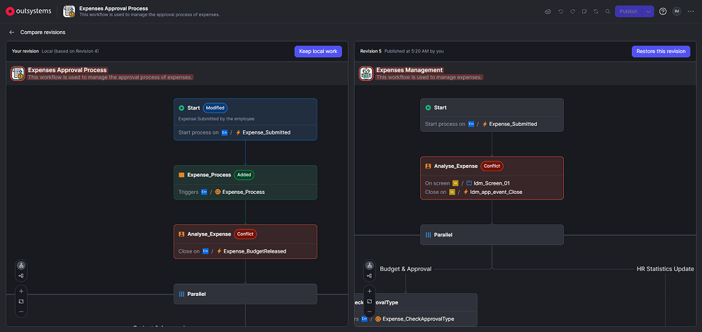

### Inspecting property-level changes

If you click in any highlighted node and see detailed property-level differences:

* For **modified nodes**, the properties pane opens and it  highlights the changed properties.
* For **added nodes**, the properties pane opens only on the side where the node exists.
* For **deleted nodes**, the properties pane opens only on the side where the node still appears.

In the example below, the start node appears in blue because it changed between revisions. When you click the node, the properties panel opens and highlights the changed properties in green.

In this case, the modifications added a description and an Instance label, even though the node already existed in the previous revision.

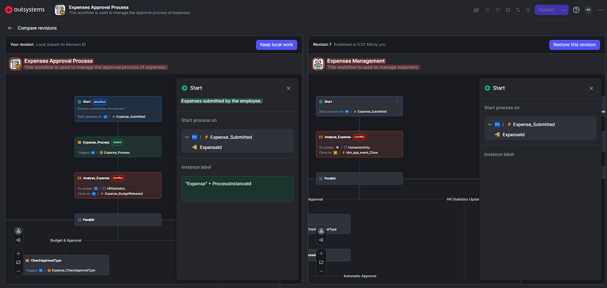

In the case below, the Human Activity “Analyse_Expense” is in red because there is a conflict since the Destination Screen and Close on Event are different in both revisions.

The same happens to the header, since the icon, name, and description of the workflow are different as well.

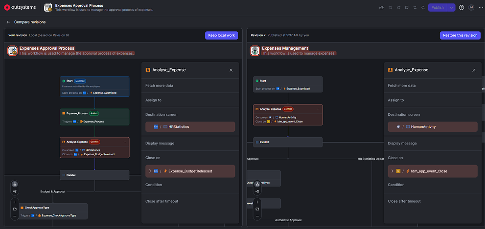

In this next example, the Automatic Activity “Expense_Process” appears in green on the left side because it’s an added node. When you open the properties panel, all properties appear in green because the activity only exists in the left canvas.

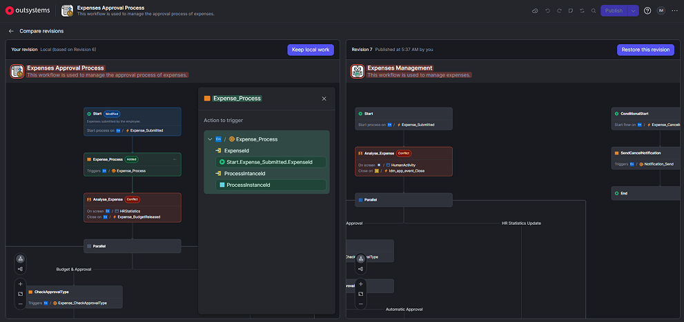

When you delete a node, the comparison view highlights its connector in blue. The deleted node itself disappears from the canvas.

In the example below, the Parallel Activity after “Analyse_Expense” no longer exists on the left canvas. Its connector appears in blue to mark the deletion. On the right canvas, the activity and its connector remain unchanged.

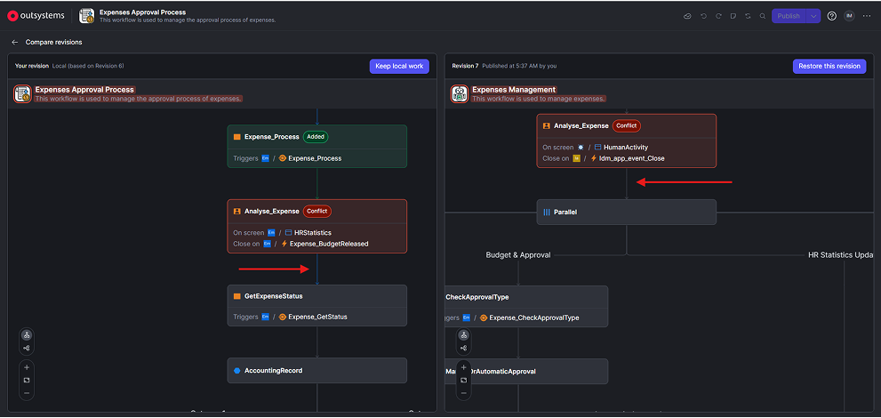

### Navigation

Both canvases are read-only. You can't edit, add, or delete nodes while in the comparison view.

Both canvases synchronize pan and zoom. When you scroll or zoom on one side, the other side moves in sync, making it easier to compare corresponding parts of the workflow.
