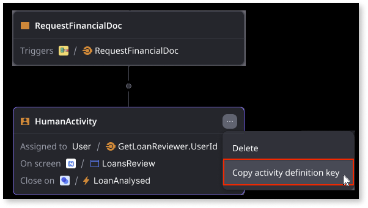

# Build UI components using workflow entities

By using aggregates to filter workflow activities, you can, for example, build responsive dashboards and tailored task boxes, which contribute to a more streamlined and productive app experience. For example, in a loan approval app, an aggregate could group all loan applications exceeding a certain amount, allowing a financial manager's dashboard to show only those that need their approval.

Before you can create an aggregate that filters activities in a specific workflow, you need to do the following:

* Add the necessary **system entities** to your ODC app as public elements.

    

* Copy the **ProcessDefinitionKey** - In the Workflow editor, click the ellipsis and select **Copy process definition key**. The process definition key identifies the specific workflow.

    

* Copy the **ActivityDefinitionId** - In the Workflow editor, go to a specific activity, click the ellipsis, and select **Copy activity definition key**. The activity definition key identifies the specific activity in a workflow.
    
    

The following is an example of how you can create an aggregate that filters a specific workflow process by a specific human activity.

1. Create the **GetHumanActivityInstances** aggregate using the **ActivityInstance**, **ActivityDefinition**, and **ProcessDefinition** entities.

    

1. Set the aggregate filter to the following:

    * **ActivityDefinition.Key** = the activity definition key of a specific human activity in the workflow

    * **ProcessDefinition.Key** = the definition process key of the workflow

    This returns all human activities with that key in that specific workflow. 
     
    
