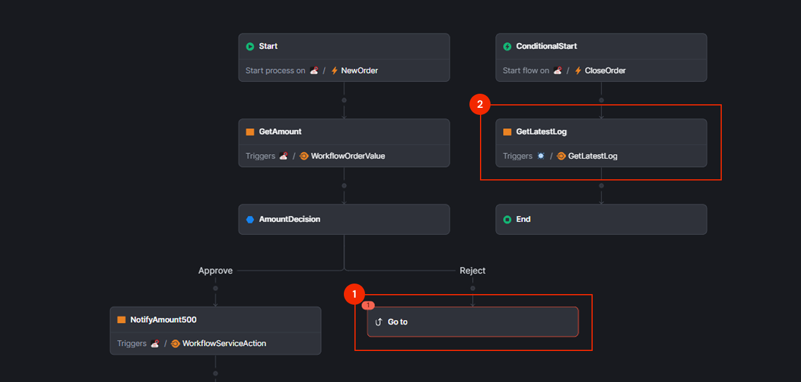
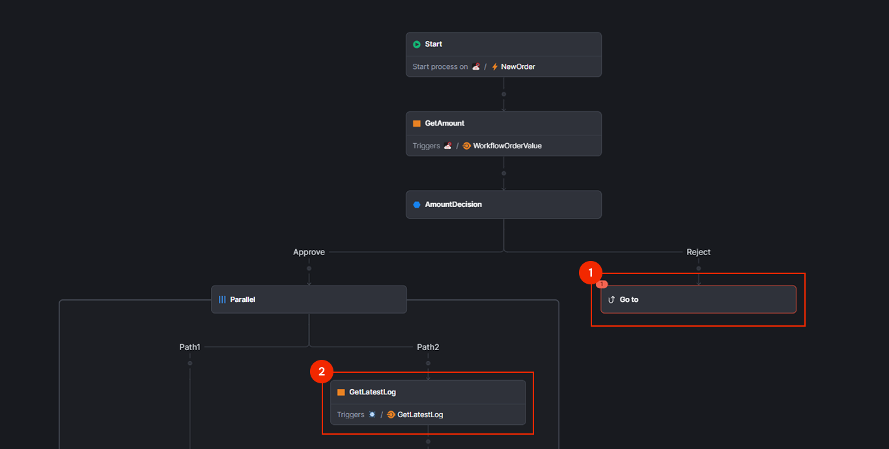
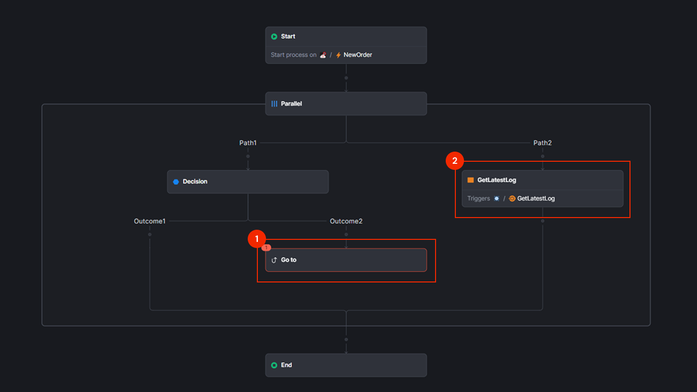
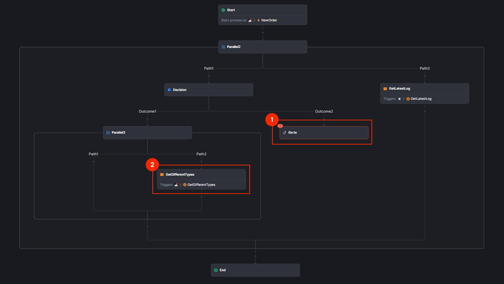
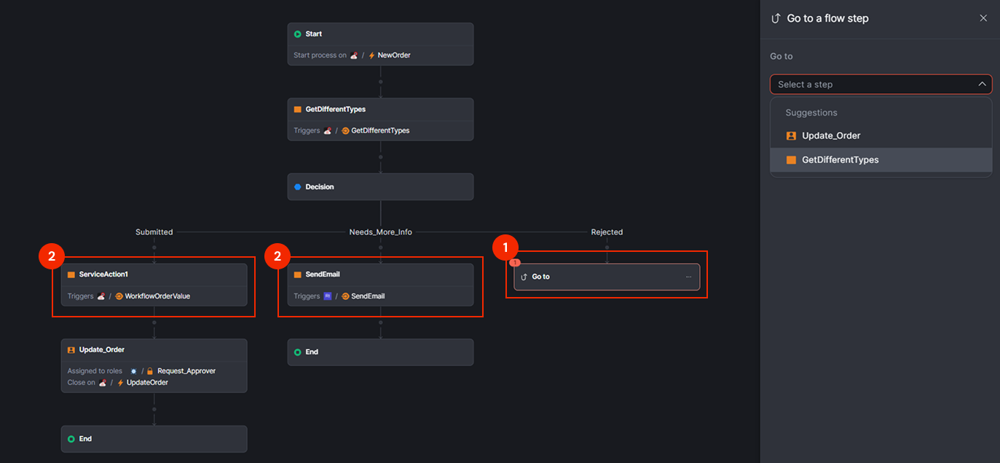
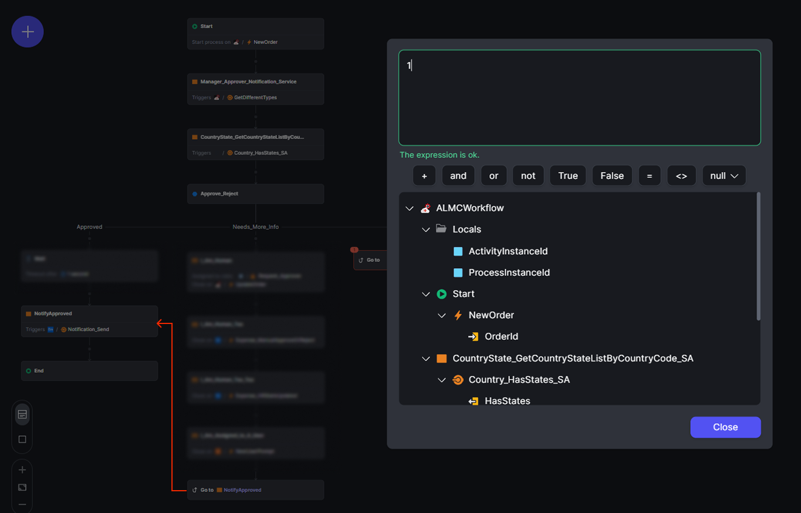

# Go to a flow step in workflows

When you implement your workflow, **Go to a flow step** allows you to redirect the workflow execution to a previous node in the workflow. This node provides flexibility in creating iterative processes and handling error scenarios by allowing the workflow to loop back to specific points.

You **can** add a **Go to a flow step** in the following places:

* After **End** or **Terminate** nodes (to create loops)
* Penultimate node before **End** or **Terminate** nodes (as a final decision point)
* After **Decision** nodes (to redirect based on outcomes)
* Inside parallel workflows (to loop within the same branch)

You **cannot** add a **Go to a flow step** in the following places:

* Between the main workflow (1) and conditional start events (2). This creates an invalid workflow structure.
    
* Between the main workflow (1) and a parallel flow (2). This can create runtime inconsistencies.
    
* Between parallel paths (1) and (2). Workflows cannot jump from one path to another.
    
* Between a parallel flow (1) and a nested parallel flow (2). This can create runtime inconsistencies.
    
* Immediately after an Outcome (1) to the first activity of a different decision path (2). This breaks decision logic flow.
    

## Variable access

When you use **Go to a flow step**, the target node only has access to the following variables:

* **Inputs from the start event**: Variables passed when the workflow is initially triggered
* **Outputs from activities common to all paths leading to that node**: Variables from nodes that are guaranteed to execute regardless of which path leads to the target
* **Outputs from the decision node**: Variables set by decision logic

And it doesn't have access to:

* **Outputs from activities that exist before in the target node path**: If a workflow execution ends up in a node via a **go to a flow step**, that node doesn't have visibility over the previous nodes of its own path.
* **Outputs from activities that happen before the source node if in a path different from the target**: These activities are executed within the path from the source node, and when the **go to a flow step** is added, the target node doesn't have context on what happened before on the source path.

## Example loan approval workflow

Here's a bank loan approval example showing **Go to a flow step** in action:

**Scenario**: A customer applies for a loan. If documents are incomplete, the application goes back for document review.

**Workflow steps**:

1. **Start**: Customer submits loan application (provides `CustomerId` and `LoanAmount`)
1. **Document Review**: Agent reviews loan documents.
1. **Decision**: Documents complete and valid?
   * **Yes**: Proceed to finance review step.
   * **No**: Trigger an email to the customer ``(SendInvalidDocsEmail)`` and end the workflow
1. **Finance Review**: Agent review financial documents.
1. **Decision**: Finance review approved?
    * **Yes**: Trigger loan approval email ``(SendApprovalEmail)`` to the customer and end the workflow.
    * **No**: Trigger loan rejected email ``(SendRejectionEmail)`` to the customer and end the workflow.
    * **Invalid Documents**: Loop back to the **Document Review** step.

In this example, when the workflow returns to **Document Review** via the **Go to a flow step**, the **Document Review** node still has access to the original inputs (`CustomerId` and `LoanAmount`) from the **Start** event. However, any additional customer details or document information that was retrieved during the first review cycle are lost. Therefore, the **Document Review** step must fetch this data again using the `CustomerId` to perform the review.

## Next steps

* [Add human activity](add-human-activity.md)

* [Add automatic activity](add-automatic-activity.md)

* [Add decisions](add-decisions.md)

* [Add wait](add-wait.md)

## Related resources

* [Troubleshooting workflows](troubleshooting-workflows.md)

* [Deploy workflows](../../deploying-apps/deploy-apps.md)
