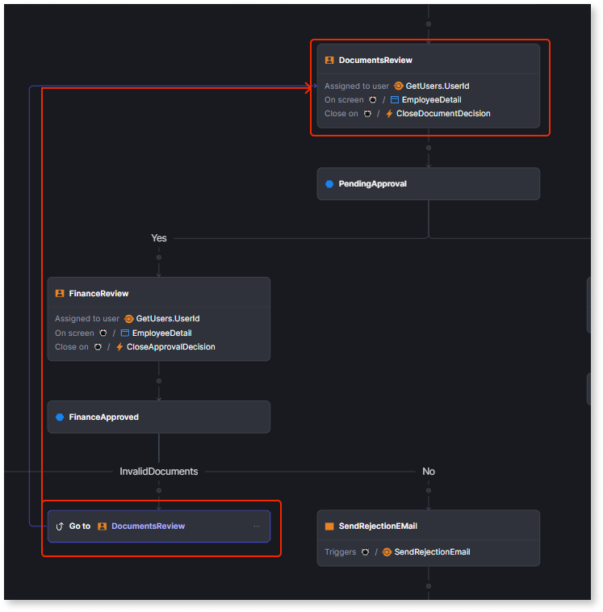

# Go to a previous step

When implementing your workflow, the **Go to a previous step** node allows you to return to a previous node in the workflow. This node mitigates the risk of infinite loops by restricting connections to previous nodes within the workflow, excluding the start node. The **Go to previous step** is only available when the next node is the **End** node, and there must be at least one **Decision** node preceding it.

For example, the workflows can return to a previous activity in a bank transaction. If the bank employee finds invalid user documents while approving the loan, they send them back for Document review validation.

