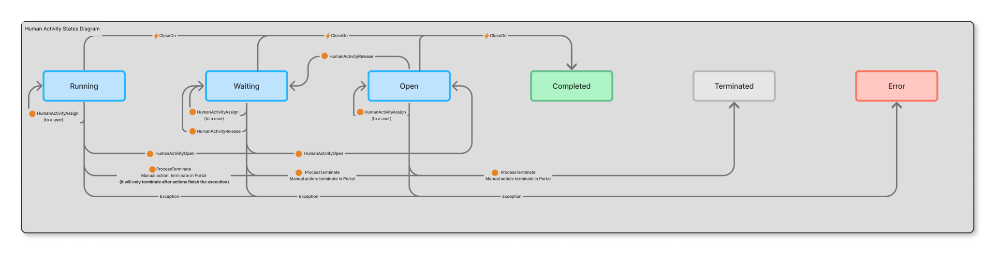

# Human activity status definitions

At any given time, based on the progress of the human activity, the **HumanActivityNode** can be in one of the following statuses:

**Running** - The human activity is currently being executed, such as when a service action is retrieving data.

**Waiting** - The human activity is on hold, awaiting further action. For instance, it may be paused for manual intervention.

**Completed** - The human activity has finished, allowing the workflow to proceed to the next step.

**Terminated** - The human activity and the entire workflow is terminated following the successful execution of the ProcessTerminate API.

**Error**- The human activity encounters an issue, which can happen due to:

* A failure in the service action it depends on.
* Reaching the maximum number of retries without successful execution.
* Temporary problems, such as a service being unavailable.

**Open** - The human activity has been opened by an end-user but has not yet proceeded to execution.
  
## Modify human activity at runtime

At runtime from the ODC Studio, you can use the low-code APIs to do the following:

* [Manually assign or re-assign human activity to a different user](../../reference/system-actions/workflows.md#humanactivityassign)

* [Open a human activity](../../reference/system-actions/workflows.md#humanactivityopen)

* [Release a human activity from a user](../../reference/system-actions/workflows.md#humanactivityrelease)

Here's the human activity status transition diagram that depicts the state transitions as you execute the different low-code APIs or terminate the workflow or close the human activity.

This diagram indicates the following: 

* You can execute **HumanActivityOpen** API when the human activity node is in either **Running** or **Waiting** state. On execution of the API, the status of human activity node changes to **Open**.

* You can execute **HumanActivityAssign** API when the human activity node is in either **Open**, **Running**, or **Waiting** state. On execution of the API, the status of human activity node remains unchanged.

* You can execute **HumanActivityRelease** API when the human activity node is in either **Open**, **Running**, or **Waiting** state. On execution of the API, the status of human activity node status changes to **Waiting**.

* You can terminate the workflow at any time using **ProcessTerminate** API or from the portal. On execution of the API, any ongoing activities (except automatic activities) are interrupted and their status changes to **Terminated**. For detailed information, refer to [Terminate a workflow](terminate-workflow.md).

* You can trigger the close on event at any time and the status of the human activity node changes to **Completed**.

## Related resources

* [Human activity in a workflow](add-human-activity.md)

* [Add human activity](add-human-activity-procedure.md)
