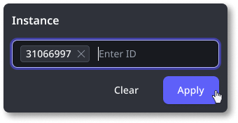

# Workflow logs

The ODC portal provides a centralized, detailed view of all activities within a workflow. Workflow logs allow business process owners (BPOs) and developers to analyze and troubleshoot workflows.

The following types of changes are logged automatically:

* When the process starts

* When a conditional start is initiated

* When the process ends

* Instance status transitions

* Activity status transitions

* When a human activity is opened

* When a human activity is released

* When a handled event closes a human activity or wait activity

* When a human activity is assigned to a user

* When a human activity is assigned to a role

* When a terminate instance operation is used

* When a retry operation is used

# Benefits of using logs

With workflow logs, you can:

* Access a chronological record of all significant changes in a workflow's execution. This allows you to track actions, identify who performed them, and understand when and where they occurred.

* Access information about a specific instance of a workflow or multiple workflow executions. This allows you to investigate anomalies, identify patterns, and respond to inquiries.

## Using workflow logs

Consider this example of a loan approval workflow. As a BPO, you are responsible for ensuring the workflow runs smoothly. The bank received a complaint from a client regarding a loan application that took an unusually long time to process. You must identify the cause of the delay to prevent similar issues in the future.

Note: To track the complaint, you must have the workflow instance number.

1. In ODC Portal, navigate to **Monitor** >  **Logs** > **Workflows**.

1. From the **Workflow** dropdown, select the workflow you want to examine.

    

1. In the **Instance ID** field, enter the instance ID.

    

    Note: Enter the IDs of the workflows you want to analyze. To identify patterns across specific workflow instances, provide multiple IDs. For example, this can help determine if an instance is part of a recurring pattern rather than an isolated case.

    

    When you apply at least one Instance ID, the **Date/Time** filter automatically changes to **Last 30 days.** The maximum log retention period is 30 days.

    

1. In the **Activity** dropdown, filter by the type of activity you want to investigate.

Applying these optional filters tailors the logs to better match your search.

The structure of a log includes:

* **Time**- The time the activity is performed.

* **Workflow**- The workflow in which the activity is performed.

* **Instance ID**- The unique identifier that represents a specific execution of the workflow process.

* **Activity**- The operation performed.

* **Message**- Provides a more granular look into the operation performed.

* **User**- The person who performs the operation.

## Troubleshooting instances

For more information about troubleshooting workflow instances, refer to [Troubleshooting workflows](./troubleshooting-workflows.md).
