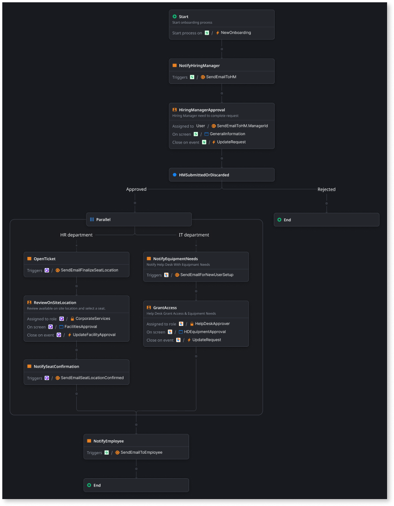

# Implement parallel paths

Parallel paths in a workflow allow you to organize tasks so that multiple tasks can be performed simultaneously rather than sequentially. You can use parallel paths in workflows where tasks don't need to be completed sequentially, for example, when onboarding a new employee. Traditionally, HR might handle paperwork, benefits, and company policies first, followed by IT setting up the computer and granting system access. Parallel paths allow these things to happen simultaneously, ensuring the new employee becomes productive more quickly.

You can gain the following benefits by implementing parallel paths in your workflows:

* **Faster task completion**: Running tasks in parallel reduces the time required to complete processes, boosting development speed and app performance.

* **Improved scalability**: Parallel paths in a workflow help your app handle more data or user requests by processing multiple tasks at once.

* **Better fault tolerance**: If one task fails, the others can continue without being affected, making your app more resilient.

## Add parallel node

The **Parallel** node in a workflow acts as a branching mechanism, splitting the main flow into multiple paths that run concurrently.

The following are some key considerations for **Parallel** node behavior:

* Parallel node names must be unique. The default name is Parallel.

* Nodes within parallel paths can access data from preceding steps, regardless of their location in the workflow. However, subsequent nodes outside of parallel flow cannot access outputs within parallel flows.

* When a **Go to a flow step** is within a parallel node, you do not have the **Change to End** or **Change to Terminate** options. You only have the **Reconnect with other paths** option.

* A **Go to a flow step** node can only go back to a previous node within the parallel flow and within that path. However, a **Go to a flow step** in the main workflow can target a **Parallel** node.

* A **Parallel** node has no **End** or **Terminate** node inside it. The **Parallel** node has no mandatory properties, and execution can pass through this node when it's empty.

* You can create a maximum of two nested parallel flows within a parallel path.

All paths in a parallel node must be completed before the workflow proceeds.

### Example: Onboarding a new employee

When implementing your onboarding workflow, you can use a **Parallel** node to split the process into separate paths for the HR and IT departments, allowing both to be handled simultaneously rather than sequentially. While the HR department manages tasks such as setting up building access and assigning the new employee a desk, the IT department simultaneously provisions a laptop and configures access to company systems. By running these tasks in parallel, the employee's workspace and digital tools are ready upon arrival, significantly reducing onboarding time and accelerating their time to productivity.

In the following example, once the hiring manager approves the new employee, the workflow branches into parallel paths, splitting the main flow into independent paths running simultaneously.

**HR department:** The HR department is notified about the new employee who needs a desk assigned to them.

**IT department path:** The IT department is notified about the new employee who needs equipment and access to company systems.

The workflow automatically proceeds once both paths are completed, and the employee is notified that everything is ready.

