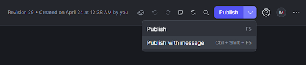
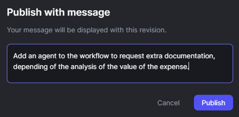
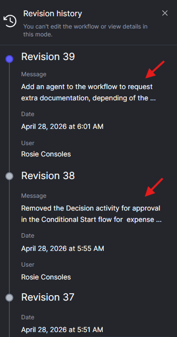
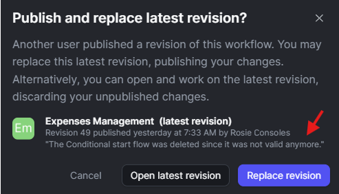
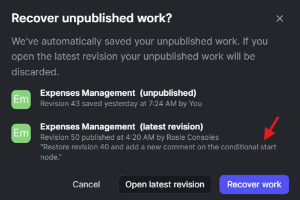

# Messages in workflows publishing

After you implement your workflow in the ODC workflow editor, you need to publish it to make it available for execution. Publishing a workflow validates its configuration and deploys it to the Development stage of your ODC tenant.

You can publish a workflow in two ways:

1. By clicking the **Publish** button in the top right corner of the Workflow editor. This action validates your workflow and, if there are no errors, publishes it to the Development stage.
1. By selecting the dropdown menu next to the **Publish** button and choosing the **Publish with message** option. This allows you to add a custom message to the publish action, which can be helpful for tracking changes and providing context for other developers.

After you click on the **Publish with message** button, you are prompted to enter a custom message:

Writing a clear and descriptive message can help you and your team understand the purpose of the changes made in that revision and click **Publish** to complete the action.

## Messages in revision history

When you publish a workflow, you are creating a new revision of that workflow. Each revision is stored in the workflow's revision history, allowing you to track changes over time and revert to previous versions if necessary.

If you have added a custom message during the publish action, this message will be displayed in the revision history alongside the revision details. This helps you and your team understand the purpose of each revision and the changes that were made.

## Messages in merge conflicts

When multiple developers are working on the same workflow, it's possible to encounter merge conflicts when trying to publish changes. If a conflict occurs, you will be prompted to resolve it before you can successfully publish your workflow.

Similarly, when you open a workflow that has a newer published revision than your last saved session, the open-workflow conflict dialog shows the message of that newer revision.

