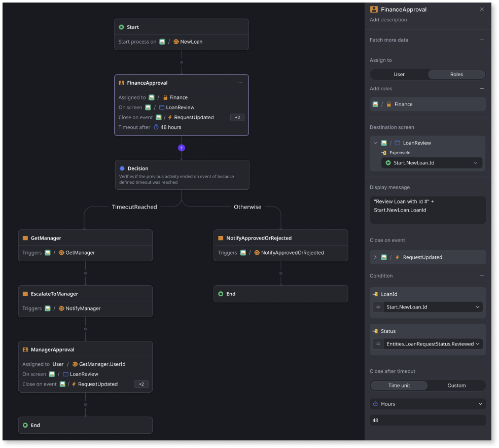
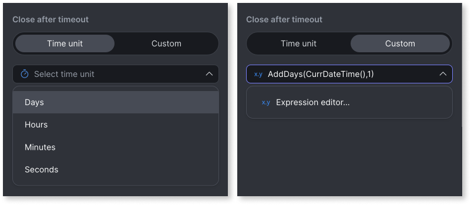
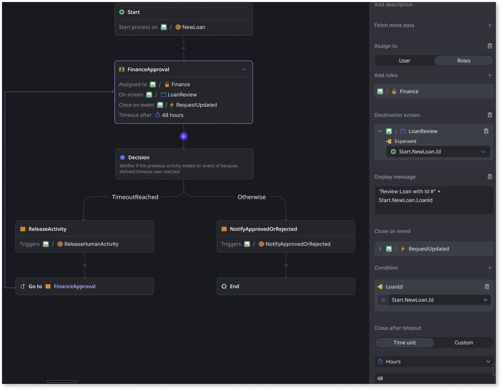

# Implementing SLAs in workflows

A service level agreement (SLA) in workflows involves applying SLA principles to establish, monitor, and enforce clear, measurable performance standards and deadlines within a workflow process. This ensures that specific tasks or processes are completed within agreed-upon timeframes or conditions while aligning with business goals and user expectations. Key SLA principles include defining achievable targets, assigning responsibility, and implementing effective monitoring, reporting, and escalation processes.

For example, in a **loan approval application workflow**:

* **SLA**: Complete the approval process for loan applications within 48 hours.

* **Workflow**: A customer submits a loan application, which is assigned to the finance team for approval.

* **SLA integration**: The workflow system tracks the time elapsed in a human or wait activity. If 48 hours pass without a decision, the activity is released for someone else to pick up.

* **Outcome**: The SLA ensures timely processing of loan applications, enhancing customer satisfaction and operational efficiency while reducing delays.

    

From the ODC Portal, you can implement an SLA in your workflow using the **Close after timeout** property. You can set this property in [human activities](add-human-activity.md) and [wait activities](add-wait.md). You can set the timeout duration using predefined time units (days, hours, minutes, and seconds), or you can define your own custom timeout expression.

A human activity or a wait completes when either the **Close on event** occurs or the **Close after timeout** is reached, whichever occurs first. You can check the completion status of the activity using the **HasExpired** runtime property.

**Note**: The system only allows you to set a maximum value of 6 months for the  Close after timeout property. After this, the activity automatically closes, and the workflow moves forward.

## Best practices for modeling an SLA in a workflow

When a human activity or wait activity in a workflow times out, it indicates that the activity didn't close on a configured event. Consequently, any input parameters defined in the **Close on** event of the human activity (or wait activity) are not available. If you try to reference these parameters, an error is thrown.

To mitigate this and to enable referencing the **Close on** event's input parameters of the human activity (or wait activity), OutSystems recommends designing SLA workflows to include a decision node that evaluates whether the activity was closed due to a time out or a close on event. You can evaluate this using the human (or wait) activity's **HasExpired** runtime property. Based on the decision results, you can model your workflow accordingly, for example, if the human activity ends due to a time out, you can add a **Go to** step.

## Related resources

* [Add human activity](add-human-activity.md)

* [Add wait](add-wait.md)

* [Troubleshooting workflows](troubleshooting-workflows.md)

* [Deploy workflows](../../deploying-apps/deploy-apps.md)
