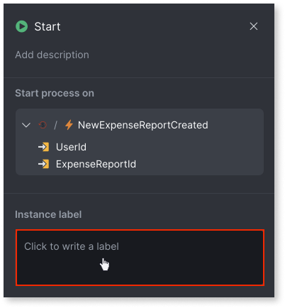
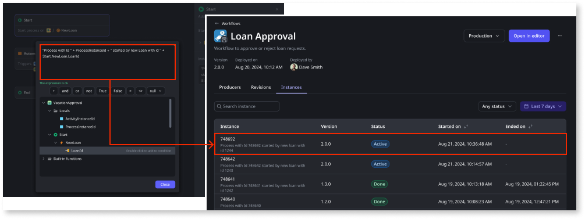

# Start a workflow

A workflow in the Workflow editor always begins with the **Start** node. To trigger the workflow execution, follow these steps:

1. Assign an event to the **Start** node.

    When this event is triggered, the workflow begins.

1. (Optional) Add an [Instance label](#instance-label).

    An instance label uniquely identifies an instance, making it useful when troubleshooting workflow instances and in workflow logs.

    

## Instance label { #instance-label }

You can define the **Instance label** from the **Start** node. The instance label is a descriptive custom identifier that you can assign to a workflow instance. It links a user-friendly business reference to the instance, making it easier to identify and track it. Each time a workflow is triggered, a new instance is created, and the instance label helps uniquely identify that specific instance.

Instance labels make it easier to track and manage individual workflow executions. The instance label is a dynamic expression that accepts values such as the start event's input parameters, runtime properties, and built-in functions. It has access to the **ActivityInstanceId**, **ProcessInstanceId**, and any values from the **Start** node.

Instance labels can help you filter your workflow instances and identify them in log reports. Additionally, if an error occurs in a workflow, the instance label helps pinpoint which specific workflow instance needs attention. For example, in a loan request approval, you might want a custom label that describes the instance ID and the ID of the loan that triggered that workflow. This way, when troubleshooting multiple instances, you can easily identify which instance corresponds to a certain loan request. In that case, you define the instance label as ``"Process with Id" + ProcessInstanceId + "started by a new loan with ID" + Start.NewLoan.LoanId.`` **Note**: The **Instance label** has a maximum length of 100 characters. If your expression is longer than the maximum, it will be truncated at runtime.

