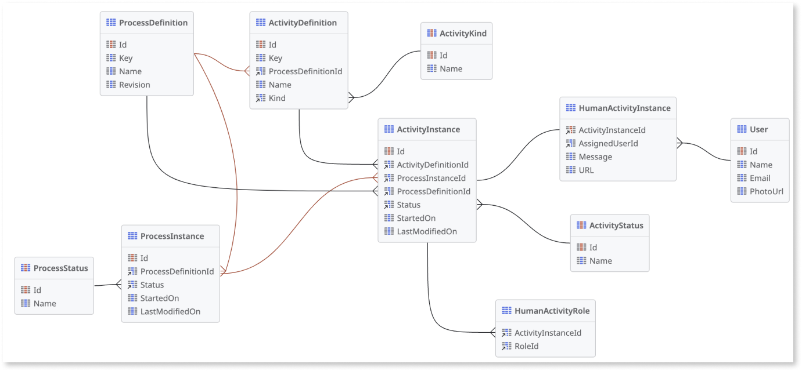

# Workflow entities

The following **system entities** are available in ODC Studio for workflows:

* **ActivityDefinition**: Stores the definition of each activity as specified in the workflow editor

* **ActivityInstance**: Stores a record for each activity that occurs while a process instance is active

* **HumanActivityInstance**: Stores a record for each human activity that occurs while a process instance is active
  
* **HumanActivityRole**: Stores the ActivityInstanceId and the RoleId each time a human activity is assigned to a role

* **ProcessDefinition**: Stores the definition of each process as specified in the workflow editor

* **ProcessInstance**: Stores a record for each active process instance

The following **static entities** are available in ODC Studio for workflows:

* **ActivityKind**: Types of activities that can be added to a workflow

* **ActivityStatus**: Status of an activity 

* **ProcessStatus**: Status of a process instance 

## Workflow entity relationships 

The following diagram illustrates the relationship between the entities that are available for workflows. 
                                                                       

## Related articles

* [Build UI components using workflow entities](filter-workflows.md)

