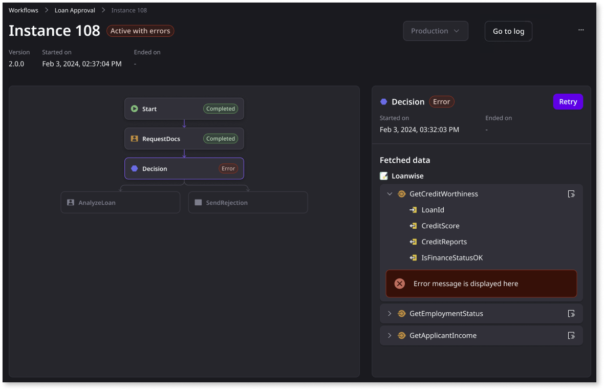

# Troubleshooting workflows

Troubleshooting workflow instances involves tracking and analyzing the progress, performance, and outcomes of specific instances of your workflows. It ensures that processes are running as expected and identifies potential bottlenecks, inefficiencies, or failures in real time.

After you deploy a workflow in a specific environment, an instance of that workflow can end up with one of the following statutes:

* **Active**: An instance is active when its start activity is triggered (for example, a loan approval request). It remains in an active status until all activities are completed or the instance is terminated.

* **Active with errors**: An instance is active with errors when an activity from that same instance has an error status.

* **Done**: An instance is done when it completes the last activity of the workflow.

* **Terminated**: An instance is terminated when a terminate instance operation is used (explicit operation) and can no longer continue its course. This ensures the instance doesn't remain in its active state forever. You can only terminate an instance that is in an **Active** or **Active with errors** state.

The status of a workflow instance can be viewed from the Portal on the **Instances** tab of the workflow detail.

The status of a workflow instance can be viewed from the Portal on the Instances tab of the workflow detail. You can select an instance and view its details, such as the executing activities, their status, activity inputs and outputs, and an overall view of the execution of the instance flow. Having all of this information helps you ensure that the workflow implementation is working as expected and helps you identify any potential issues.  

## Troubleshooting instance errors

A workflow can end up with an Active with errors status for one of the following reasons:

* App-side error
    * Error in a service action
* Process-side error
    * Service action in an error state
    * Activity timeout
    * Error in an expression

To investigate the error further, follow these steps:

1. Click the **Active with errors** instance.

    

1. Select the erroneous workflow activity to display the error details.

    

1. After fixing the error, you can **Retry** the activity.

   **Note**: You can only retry automatic activities, human activities, and decisions.

    

Additionally, for more information about the error, you can navigate to the related Trace or [log](logs.md), when available.

Workflows are automatically retried up to 10 times if an execution of a service action or the delivery of a back-end event fails. The following backoff policy applies to the automatic retries: 5s, 10s, 20s, 30s, 1m, 2m, 4m, 8m, 16m, 32m.

## Related resources

* [Workflow logs](logs.md)
