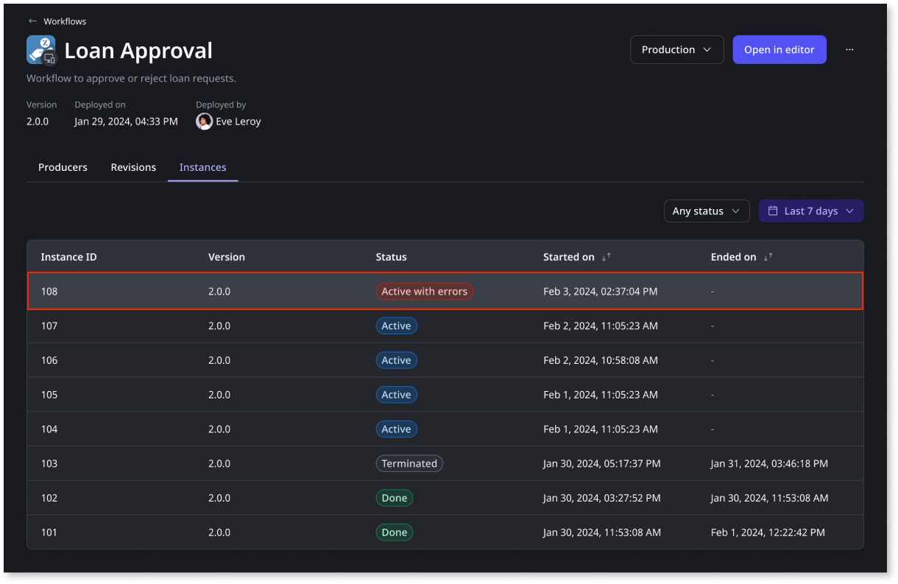

# Troubleshooting workflows

Workflows are automatically retried up to 10 times if an execution of a service action or the delivery of a back-end event fails. The following backoff policy applies to the automatic retries: 5s, 10s, 20s, 30s, 1m, 2m, 4m, 8m, 16m, 32m.

After you deploy a workflow in a specific environment, an instance of that  workflow can end up with an **Active with errors** status for one of the following reasons:

* **App-side error**

    * Error in a service action

* **Process-side error**

    * Service action in an error state

    * Activity timeout

    * Error in an expression

Any errors in a workflow can be viewed from the Portal on the **Instances** tab of the workflow detail. 

To investigate the error further, follow these steps:

1. Click the **Active with errors** instance.

    

1. Select the erroneous workflow activity to display the error details. 

    

1. After fixing the error, you can **Retry** the service action execution within the activity. 

   **Note**: You can only retry the execution of service actions used in automatic activities, human activities, and decisions.

    

Additionally, for more information about the error, you can navigate to the related Trace, when available. 
