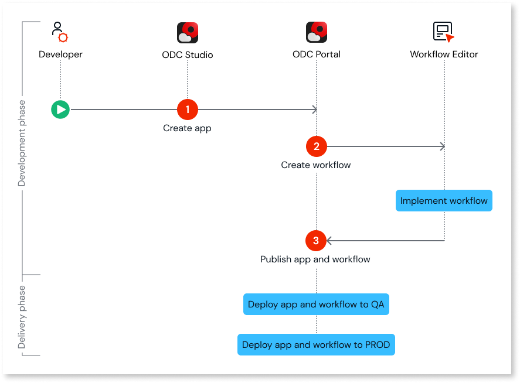

# Getting started

To implement your workflow, use the workflow editor, a web-based editor accessible from the ODC Portal, where you have access to a set of low-code nodes that will help you implement the workflow. You can integrate your workflows into your apps through events or service actions. Events start the workflow execution. Workflows can consume business logic from events or service actions to gather information for decision-making activities in the workflow.

**Note**: Workflows support [basic input parameters](../data/data-types.md) except binary data type. Parameters with the text data type support a maximum of 2000 characters. For more information about built-in functions available for Workflows, refer to, [Built-in functions for workflows](built-in-functions.md).

Workflows are always triggered by events. To start a workflow, you must always associate an event from the ODC app. For example, if you are implementing a loan approval workflow, you can trigger the workflow when you receive a new loan request by choosing the **NewLoanapplication** event from the ODC app for the **Start** node.

## High-level process for using workflows in your app

The following diagram shows the high-level process of integrating workflows into your ODC apps.

### Step 1: Implement a workflow

To implement a workflow, follow these steps:

1. Log into the ODC portal.

1. Go to **Workflows.**

1. Click **Create workflow.**

    You are brought to the web-based workflow editor.

1. Enter a name for the workflow.

    **Note:** The workflow name must be unique. It can't have the same name as another workflow or an app. 

1. From the workflow editor, beginning at the Start node, select the event that will trigger the workflow in your app.

1. Continue adding steps to the workflow until you reach the End node. 

    For each element in a workflow, select the service action or event implemented in the app.

1. Publish the workflow.

For detailed information on how to use different nodes in  your workflow, refer to the following:

* [Start a workflow](start-workflow.md)

* [End a workflow](end-workflow.md)

* [Add human activity](add-human-activity.md)

* [Add automatic activity](add-automatic-activity.md)

* [Add decisions](add-decisions.md)

* [Go to a previous step](go-to-previous-step.md)

### Step 2: Test the workflow 

Before deploying the workflow, you can test it by triggering its execution from the app. 

The workflow details, including any errors, can be viewed from the **Instances** tab in the Portal. 

**Note**: OutSystems recommends testing the workflow in a test app rather than in the production app to avoid disrupting the production app with changes made in the workflow.

### Step 3: Deploy the workflow and app

To deploy your workflow and app, follow these steps:

1. Deploy the app to the QA stage.

    **Note**: Before the app is deployed, an impact analysis is performed in the background. For more information, refer to [Understanding the impact analysis report](../../deploying-apps/deploy-apps.md#understanding-the-impact-analysis-report).

1. Deploy the workflow to the QA.

    **Note**: Before the workflow is deployed, an impact analysis is performed in the background. For more information, refer to [Understanding the impact analysis report](../../deploying-apps/deploy-apps.md#understanding-the-impact-analysis-report).

1. After acceptance testing, deploy the app and workflow to the Production stage.

## Next steps

* [Start a workflow](start-workflow.md)

* [Start a workflow based on specific conditions](add-conditional-start.md)

## Related resources

* [Workflows in ODC](workflows-in-odc.md)

* [Workflow nodes](workflow-components.md)

* [Troubleshooting workflows](troubleshooting-workflows.md)

* [Deploy workflows](../../deploying-apps/deploy-apps.md)

