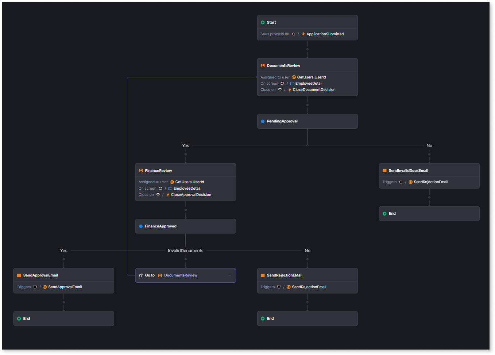

# Implement workflow

This article introduces the different components for building a workflow in the ODC workflow editor. You implement a workflow by arranging and connecting different nodes on a visual canvas in the ODC Portal. Each node represents a specific step in your process, such as an automatic task or a human decision. This page provides a reference for each available workflow node and its specific function. Use this information to select the correct components as you implement your workflow.

You can implement a workflow in the workflow editor using the following nodes:

* [Start](start-workflow.md) - Marks the beginning of your workflow. Every workflow must have only one Start node.

* [Conditional start](add-conditional-start.md) - Allows the workflow to start based on specific conditions.

* [Automatic activity](add-automatic-activity.md) - Represents an automated step that executes without any human intervention.

* [Human activity](add-human-activity.md) - Represents a step where a human user needs to perform an action and make a decision.

* [Decision](add-decisions.md) - Allows the workflow to branch into different paths based on conditions.

* [Go to a flow step](go-to-previous-step.md) - Allows the workflow to redirect execution to any previous node in the workflow. This is useful for iterative processes and error handling.

* [Parallel](parallel-workflow.md) - Allows the workflow to execute multiple tasks in parallel.

* [Terminate](terminate-workflow.md) - Allows stopping the workflow execution due to exception scenarios.

* [End](end-workflow.md) - Marks the conclusion of a workflow. A workflow can have multiple End nodes, allowing different paths to finish the process.

## Example loan approval workflow

Let's consider an example of a simple loan approval process and understand how it can be implemented in ODC using workflow editor.

**Scenario:** A customer applies for a loan. The application is reviewed by the customer relationship manager and the finance manager. Once the loan application is validated by both, the loan application is either approved or rejected and the customer is notified of the status via an automated email.

**Workflow representation:**

Here's the loan approval process:

1. **Start:** The workflow starts when a customer submits a loan application to the bank.
1. **Review background information (Human Activity):** A customer relationship manager manually validates the customer's background information.
    * **Decision: invalid**
        * **Automatic activity: send email** – A rejection email is sent to the customer.
        * **End:** The workflow ends.
    * **Decision: valid** If the user’s background details are valid, the loan application moves to the finance department.
        * **Review financial information (Human Activity):** Finance manager validates the customer's credit history and financial health.
            * **Decision: valid**
                * **Automatic activity: send email** – A loan approval email is sent to the customer.
                * **End:** The workflow ends.
            * **Decision: invalid**
                * **Automatic activity: send email** – A loan rejection email is sent to the customer.
                * **End:** The workflow ends.
            * **Decision: docs insufficient**
                * The finance department routes the application to the customer relationship manager to restart the document verification process.

    

For detailed step-by-step information about using workflows, refer to [Using workflows](using-workflows.md).

## How the workflow works

When a customer submits a loan application through your ODC app, it triggers an event that starts the workflow. A new workflow instance is created, and the load application data such as the customer’s name, loan amount, and credit score is passed to the workflow.

At each human activity step, the workflow assigns tasks to the appropriate users such as the customer relationship manager or finance manager, who complete their tasks using dedicated app screens. Service actions such as GetManagerID() can be used to determine the user for the task and pass data between the app and the workflow.

As users complete their assigned tasks, events are triggered in the app to signal the workflow to proceed to the next step or decision point. Automatic activities, such as sending emails, are executed by the workflow without human intervention. The workflow continues through its defined nodes and logic until it reaches an end node, completing the process.

## Statuses of workflow nodes

At any given time, based on the progress of the activity, the workflow node can be in one of the following statuses:

* **Running** - The activity is currently being executed, such as when a service action is retrieving data.

* **Waiting** - The activity is on hold, awaiting further action. For instance, the **HumanActivityNode** can be on stand-by for manual intervention or the **AutomaticActivityNode** can be waiting for a scheduled event.

* **Completed** -  The activity has finished, allowing the workflow to proceed to the next step.

* **Terminated** - The activity and the entire workflow is terminated following the successful execution of the **ProcessTerminate** API or any other unexpected terminate activity.

* **Error** - The activity encounters an issue, which can happen due to:
    * An error in the service action that the activity calls.
    * Reaching the maximum number of retries without successful execution.
    * Temporary problems, such as a service action being unavailable.

* **Open** - The human activity has been opened by an end-user but has not yet proceeded to execution.

The **Open** status applies only to human activity node.

## Related resources

### Introduction to workflows

* [Workflows in ODC](workflows-in-odc.md)

### Implement workflows

* [Getting started](using-workflows.md)

* [Troubleshooting workflows](troubleshooting-workflows.md)

* [Deploy workflows](../../deploying-apps/deploy-apps.md)
